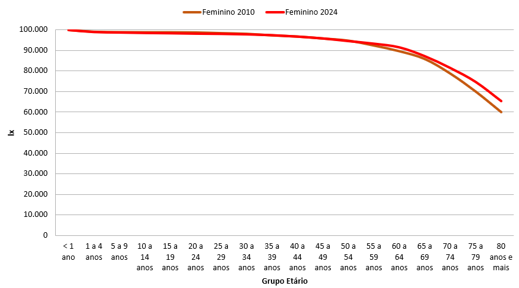
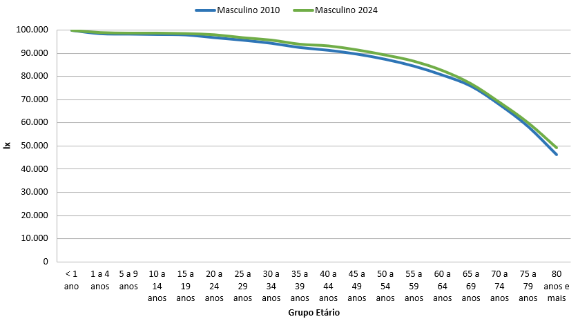
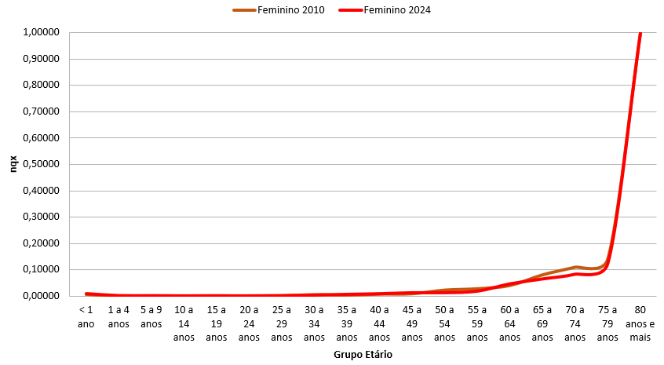
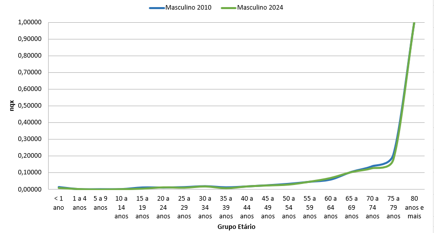

---
# Nome do arquivo PDF gerado na pasta resultado
output-file: "Nome do alocado - análise 1 e 2"
---

```{r setup}
source("rdocs/felipe.R")
```

# Objetivo

Esse template foi criado para o alocado conseguir observar como ficaria sua análise o arquivo principal. É daqui que o gerente de projetos irá copiar a análise e inserir no documento principal que gerará o relatório estatístico.

# Análises

## Questão 3

Essa análise tem como objetivo analisar a mortalidade na cidade de Ipatinga no período estudado dentro do material, com foco nos anos a serem citados em cada uma das introduções de cada análise. Para isso, serão utilizados dados do SIM, obtidos via Tabnet - Datasus.

Dessa maneira, será calculado $TBM$ (Taxa Bruta de Mortalidade), ${}_n M_x$ (Taxa específica de mortalidade entre $x$ e $x+n$ anos), $TMI$ (Taxa de Mortalidade Infantil) e outros componentes da mortalidade infantil.

É importante ser mencionado que, para os anos, sexo e faixas etárias:

- 2010 Feminino - 10 a 14 anos;
- 2021 Feminino - 1 a 4 anos;
- 2024 Masculino - 5 a 9 anos

Foram encontradas nenhuma observação, tanto no Tabnet - Datasus quanto no banco do microdatasus, sendo assim englobado com base nas faixas etárias utilizadas em cada uma das análises com a falta desses dados.

### Letra c

A fim de comparar as estruturas de mortalidade por causas entre os anos de 2010, 2021 e 2024, a seguinte análise utilizará os agrupamentos do CID-10, retirando os 20 grupos mais frequentes em seus respectivos anos. Assim, o estudo será analisado sobre os grupos etários (menor que 5; 5 a 14 anos; 15 a 39 anos; 40 a 59 anos; 60 anos e mais), dando foco para a Covid-19 nos anos em que ela existia sendo acrescentada um 21º grupo caso não apareça entre os 20 mais comuns.

Para melhor visualização dos dados o estudo será segmentado nos anos comentados anteriormente, a fim de comparar as diferentes estruturas entre os sexos feminino e masculino.

#### Análise por ano

##### 2010

::: {#tbl-f10 layout-align="center" tbl-pos="H"}
```{=latex}

\resizebox{\textwidth}{!}{
\begin{tabular}{l r r r r r r}
        \hline
        \textbf{Grupo CID-10} & \textbf{menor que 5} & \textbf{5 a 14 anos} & \textbf{15 a 39 anos} & \textbf{40 a 59 anos} & \textbf{60 anos e mais} & \textbf{Total} \\
        \hline
        Neoplasias malignas & 0 & 0 & 7 & 40 & 64 & 111 \\
        Doenças cerebrovasculares & 0 & 0 & 3 & 6 & 38 & 47 \\
        Influenza [gripe] e pneumonia & 1 & 0 & 2 & 3 & 29 & 35 \\
        \textit{Diabetes mellitus} & 0 & 0 & 0 & 2 & 31 & 33 \\
        Outras formas de doença do coração & 0 & 0 & 3 & 6 & 23 & 32 \\
        Doenças isquêmicas do coração & 0 & 0 & 1 & 5 & 23 & 29 \\
        Doenças crônicas das vias aéreas inferiores & 0 & 0 & 0 & 3 & 24 & 27 \\
        Doenças hipertensivas & 0 & 0 & 0 & 2 & 18 & 20 \\
        Acidentes & 1 & 0 & 8 & 4 & 4 & 17 \\
        Outras doenças bacterianas & 1 & 0 & 3 & 3 & 5 & 12 \\
        Insuficiência renal & 0 & 0 & 0 & 2 & 9 & 11 \\
        Distúrbios metabólicos & 0 & 0 & 0 & 0 & 9 & 9 \\
        Doenças das artérias, das arteríolas e capilares & 0 & 0 & 1 & 2 & 6 & 9 \\
        Doenças infecciosas intestinais & 0 & 1 & 0 & 2 & 4 & 7 \\
        Outras doenças respirat q afetam princ interstício & 0 & 0 & 0 & 3 & 4 & 7 \\
        Doenças do fígado & 0 & 0 & 1 & 4 & 2 & 7 \\
        Outras doenças do aparelho digestivo & 0 & 0 & 1 & 1 & 5 & 7 \\
        Doença pelo vírus da imunodeficiência humana [HIV] & 0 & 0 & 1 & 5 & 0 & 6 \\
        Outras doenças degenerativas do sistema nervoso & 0 & 0 & 0 & 0 & 6 & 6 \\
        Transt vesícula biliar, vias biliares e pâncreas & 0 & 0 & 0 & 3 & 3 & 6 \\
        \hline
        \textbf{Total} & \textbf{3} & \textbf{1} & \textbf{31} & \textbf{96} & \textbf{307} & \textbf{438} \\
        \hline
    \end{tabular}
}

```
Distribuição por Grupo CID-10 e faixa etária em mulheres no período de 2010
:::

::: {#tbl-m10 layout-align="center" tbl-pos="H"}
```{=latex}

\resizebox{\textwidth}{!}{
        \begin{tabular}{l r r r r r r}
            \hline
            \textbf{Grupo CID-10} & \textbf{menor que 5} & \textbf{5 a 14 anos} & \textbf{15 a 39 anos} & \textbf{40 a 59 anos} & \textbf{60 anos e mais} & \textbf{Total} \\
            \hline
            Neoplasias malignas & 0 & 0 & 8 & 32 & 72 & 112 \\
            Acidentes & 2 & 3 & 33 & 19 & 10 & 67 \\
            Doenças cerebrovasculares & 0 & 1 & 2 & 13 & 44 & 60 \\
            Doenças isquêmicas do coração & 0 & 0 & 4 & 20 & 34 & 58 \\
            Agressões & 0 & 3 & 47 & 6 & 1 & 57 \\
            Doenças crônicas das vias aéreas inferiores & 0 & 0 & 0 & 2 & 26 & 28 \\
            Doenças do fígado & 0 & 0 & 7 & 12 & 8 & 27 \\
            \textit{Diabetes mellitus} & 0 & 0 & 1 & 9 & 14 & 24 \\
            Outras formas de doença do coração & 0 & 0 & 1 & 6 & 16 & 23 \\
            Influenza [gripe] e pneumonia & 1 & 0 & 1 & 3 & 15 & 20 \\
            Eventos (fatos) cuja intenção é indeterminada & 0 & 0 & 12 & 3 & 2 & 17 \\
            Doenças hipertensivas & 0 & 0 & 0 & 1 & 15 & 16 \\
            Insuficiência renal & 0 & 0 & 3 & 2 & 8 & 13 \\
            Outras doenças bacterianas & 2 & 0 & 3 & 2 & 4 & 11 \\
            Transt ment e comport dev ao uso subst psicoativa & 0 & 0 & 3 & 5 & 3 & 11 \\
            Doenças das artérias, arteríolas e capilares & 0 & 0 & 0 & 1 & 8 & 9 \\
            Distúrbios metabólicos & 1 & 0 & 0 & 4 & 3 & 8 \\
            Outras doenças resp. afet. interstício & 0 & 0 & 0 & 6 & 2 & 8 \\
            Lesões autoprovocadas intencionalmente & 0 & 0 & 5 & 1 & 1 & 7 \\
            Transt vesícula biliar, vias biliares e pâncreas & 0 & 0 & 0 & 6 & 0 & 6 \\
            \hline
            \textbf{Total} & \textbf{6} & \textbf{7} & \textbf{130} & \textbf{153} & \textbf{286} & \textbf{582} \\
            \hline
        \end{tabular}
    }

```
Distribuição por Grupo CID-10 e faixa etária em homens no período de 2010
:::

Analisando a [@tbl-f10] e a [@tbl-m10] conjuntamente, é possível observar que em ambos os sexos a causa de fatalidade mais comum em 2010 foram as "Neoplasias malignas" que foram responsáveis por 223 óbitos neste ano. Vale a pena destacar também as "doenças cerebrovasculares" (107 óbitos) que, similarmente às neoplasias, aparecem nas 3 causas mais comuns, sendo a segunda no caso do sexo feminino. Outros grupos tais como "Acidentes" (84 óbitos); "_Diabetes mellitus_" (57 óbitos): "Transt vesícula biliar, vias biliares e pâncreas" aparecem" (12 óbitos) e outros agrupamentos, aparecem nos dois sexos, esse último sendo o 20ª grupo em ambos os casos.

Em contrapartida, os grupos "Doenças infecciosas intestinais" (7 óbitos), "Outras doenças do aparelho digestivo" (7 óbitos), "Doença pelo vírus da imunodeficiência humana [HIV]" (6 óbitos) e "Outras doenças degenerativas do sistema nervoso" (6 óbitos) somente aparecem entre os 20 mais comuns no caso do sexo feminino. De maneira semelhante, os grupos "Agressões" (57 óbitos), "Eventos (fatos) cuja intenção é indeterminada" (17 óbitos), "Transt ment e comport dev ao uso subst psicoativa" (11 óbitos) e "Lesões autoprovocadas intencionalmente" (7 óbitos) aparecem só nos indivíduos do sexo masculino.

Por fim, nota-se que em todas as faixas etárias analisadas, somente as mulheres com 60 ou mais anos faleceram mais que os homens, 307 a 286, respectivamente, no ano de 2010. Desse modo, os homens apresentaram 144 mortes daqueles 20 agrupamentos mais comuns durante todo o ano em análise.

##### 2021

::: {#tbl-f21 layout-align="center" tbl-pos="H"}
```{=latex}

\resizebox{\textwidth}{!}{
        \begin{tabular}{l r r r r r r}
            \hline
            \textbf{Grupo CID-10} & \textbf{menor que 5} & \textbf{5 a 14 anos} & \textbf{15 a 39 anos} & \textbf{40 a 59 anos} & \textbf{60 anos e mais} & \textbf{Total} \\
            \hline
            Outras doenças por vírus & 0 & 0 & 5 & 48 & 186 & 239 \\
            Neoplasias malignas & 0 & 3 & 11 & 24 & 99 & 137 \\
            Doenças cerebrovasculares & 0 & 0 & 0 & 7 & 52 & 59 \\
            Outras formas de doença do coração & 0 & 0 & 2 & 6 & 50 & 58 \\
            \textit{Diabetes mellitus} & 0 & 0 & 1 & 8 & 36 & 45 \\
            Influenza [gripe] e pneumonia & 0 & 0 & 0 & 3 & 36 & 39 \\
            Doenças isquêmicas do coração & 0 & 0 & 0 & 6 & 32 & 38 \\
            Doenças hipertensivas & 0 & 0 & 0 & 7 & 28 & 35 \\
            Acidentes & 0 & 0 & 2 & 4 & 18 & 24 \\
            Outras doenças do aparelho urinário & 0 & 0 & 0 & 0 & 16 & 16 \\
            Outras doenças degenerativas do sistema nervoso & 0 & 0 & 0 & 0 & 15 & 15 \\
            Outras doenças bacterianas & 0 & 0 & 0 & 2 & 10 & 12 \\
            Doenças crônicas das vias aéreas inferiores & 0 & 0 & 0 & 1 & 10 & 11 \\
            Outras doenças do aparelho digestivo & 0 & 0 & 1 & 1 & 8 & 10 \\
            Transt vesícula biliar, vias biliares e pâncreas & 0 & 0 & 0 & 1 & 8 & 9 \\
            Doenças do fígado & 0 & 0 & 0 & 3 & 5 & 8 \\
            Fet rec-nasc afet fat mat e compl grav, trab parto & 7 & 0 & 0 & 0 & 0 & 7 \\
            Obesidade e outras formas de hiperalimentação & 0 & 0 & 2 & 1 & 2 & 5 \\
            Doenças cardíaca pulmonar e da circulação pulmo & 0 & 0 & 1 & 1 & 3 & 5 \\
            Outras doenças do aparelho respiratório & 0 & 0 & 1 & 0 & 4 & 5 \\
            \hline
            \textbf{Total} & \textbf{7} & \textbf{3} & \textbf{26} & \textbf{123} & \textbf{618} & \textbf{777} \\
            \hline
        \end{tabular}
    }

```
Distribuição por Grupo CID-10 e faixa etária em mulheres no período de 2021
:::

::: {#tbl-m21 layout-align="center" tbl-pos="H"}
```{=latex}

\resizebox{\textwidth}{!}{
        \begin{tabular}{l r r r r r r}
            \hline
            \textbf{Grupo CID-10} & \textbf{menor que 5} & \textbf{5 a 14 anos} & \textbf{15 a 39 anos} & \textbf{40 a 59 anos} & \textbf{60 anos e mais} & \textbf{Total} \\
            \hline
            Outras doenças por vírus & 0 & 0 & 13 & 63 & 255 & 331 \\
            Neoplasias malignas & 0 & 1 & 7 & 23 & 99 & 130 \\
            Doenças cerebrovasculares & 0 & 0 & 2 & 6 & 54 & 62 \\
            Outras formas de doença do coração & 0 & 0 & 3 & 10 & 45 & 58 \\
            Acidentes & 1 & 0 & 14 & 12 & 24 & 51 \\
            \textit{Diabetes mellitus} & 0 & 0 & 0 & 11 & 38 & 49 \\
            Influenza [gripe] e pneumonia & 0 & 0 & 1 & 6 & 40 & 47 \\
            Doenças hipertensivas & 0 & 0 & 1 & 11 & 31 & 43 \\
            Doenças isquêmicas do coração & 0 & 0 & 0 & 7 & 25 & 32 \\
            Agressões & 0 & 0 & 20 & 8 & 0 & 28 \\
            Doenças do fígado & 0 & 0 & 0 & 8 & 12 & 20 \\
            Doenças crônicas das vias aéreas inferiores & 0 & 0 & 1 & 0 & 18 & 19 \\
            Outras doenças do aparelho urinário & 0 & 0 & 0 & 2 & 14 & 16 \\
            Outras doenças bacterianas & 0 & 0 & 0 & 2 & 10 & 12 \\
            Outras doenças degenerativas do sistema nervoso & 0 & 0 & 0 & 1 & 11 & 12 \\
            Doenças cardíaca pulmonar e da circulação pulmonar & 0 & 0 & 0 & 2 & 9 & 11 \\
            Infecções da pele e do tecido subcutâneo & 0 & 0 & 0 & 4 & 4 & 8 \\
            Lesões autoprovocadas intencionalmente & 0 & 0 & 4 & 3 & 1 & 8 \\
            Eventos (fatos) cuja intenção é indeterminada & 0 & 0 & 4 & 3 & 1 & 8 \\
            Outras doenças do aparelho digestivo & 0 & 0 & 0 & 1 & 6 & 7 \\
            \hline
            \textbf{Total} & \textbf{1} & \textbf{1} & \textbf{70} & \textbf{183} & \textbf{697} & \textbf{952} \\
            \hline
        \end{tabular}
    }

```
Distribuição por Grupo CID-10 e faixa etária em homens no período de 2021
:::

Observando a [@tbl-f21] e a [@tbl-m21], o grupo de morte mais comum foi "Outras doenças por vírus" que representa a Covid-19, totalizando 570 fatalidades somente no ano de 2021, se aproximando do número de óbitos para os homens em 2010 (582). Logo em sequência, "Neoplasias malignas" e "Doenças cerebrovasculares
", 267 e 121 mortes respectivamente, se mantiveram no top 3 grupos mais frequentes mesmo após 11 anos de diferença entre os anos em análise. Além disso, grupos como "Outras formas de doença do coração" (116 óbitos), "_Diabetes mellitus_" (94 óbitos), "Acidentes" (75 óbitos) e outros grupos apareceram em ambos sexos.

Entretanto, os grupos "Outras doenças do aparelho respiratório" (5 óbitos), "Transt vesícula biliar, vias biliares e pâncreas" (9 óbitos), "Fet rec-nasc afet fat mat e compl grav, trab parto" (7 óbitos), "Outras doenças degenerativas do sistema nervoso" (6 óbitos) e "Obesidade e outras formas de hiperalimentação" (5 óbitos) somente aparecem entre os 20 mais comuns no caso do sexo feminino. De maneira semelhante, os grupos "Agressões" (28 óbitos), "Eventos (fatos) cuja intenção é indeterminada" (8 óbitos), "Infecções da pele e do tecido subcutâneo" (8 óbitos) e "Lesões autoprovocadas intencionalmente" (8 óbitos) aparecem só nos indivíduos do sexo masculino.

Por fim, as meninas com idades menores que 5 anos e entre 5 a 14 anos de vida, 7 e 3 respectivamente, faleceram mais que os meninos na mesma faixa etária, 1 e 1 respectivamente, com as demais faixas os indivíduos do sexo masculino morreram com maior frequência, 70, 183 e 697 respectivamente. Há uma diferença de 175 homens falecendo a mais que as mulheres no ano em questão.

##### 2024

::: {#tbl-f24 layout-align="center" tbl-pos="H"}
```{=latex}

\resizebox{\textwidth}{!}{
        \begin{tabular}{l r r r r r r}
            \hline
            \textbf{Grupo CID-10} & \textbf{menor que 5} & \textbf{5 a 14 anos} & \textbf{15 a 39 anos} & \textbf{40 a 59 anos} & \textbf{60 anos e mais} & \textbf{Total} \\
            \hline
            Neoplasias malignas & 0 & 1 & 5 & 37 & 89 & 132 \\
            \textit{Diabetes mellitus} & 0 & 0 & 1 & 11 & 60 & 72 \\
            Influenza [gripe] e pneumonia & 0 & 1 & 0 & 2 & 62 & 65 \\
            Doenças hipertensivas & 0 & 0 & 0 & 1 & 57 & 58 \\
            Doenças isquêmicas do coração & 0 & 0 & 1 & 7 & 49 & 57 \\
            Doenças cerebrovasculares & 0 & 0 & 1 & 4 & 46 & 51 \\
            Outras doenças degenerativas do sistema nervoso & 0 & 0 & 0 & 0 & 27 & 27 \\
            Outras formas de doença do coração & 0 & 0 & 0 & 2 & 24 & 26 \\
            Acidentes & 3 & 1 & 0 & 8 & 13 & 25 \\
            Outras doenças do aparelho urinário & 0 & 0 & 0 & 0 & 24 & 24 \\
            Doenças crônicas das vias aéreas inferiores & 0 & 1 & 0 & 1 & 19 & 21 \\
            Outras doenças bacterianas & 0 & 0 & 0 & 1 & 17 & 18 \\
            Doenças do fígado & 0 & 0 & 0 & 3 & 9 & 12 \\
            Alguns transt q comprometem o mecanismo imunitário & 0 & 0 & 0 & 0 & 10 & 10 \\
            Outras doenças resp. afet. interstício & 0 & 0 & 0 & 1 & 7 & 8 \\
            Transt vesícula biliar, vias biliares e pâncreas & 0 & 0 & 1 & 0 & 7 & 8 \\
            Outras doenças do aparelho digestivo & 1 & 0 & 0 & 0 & 7 & 8 \\
            Insuficiência renal & 0 & 0 & 1 & 1 & 6 & 8 \\
            Agressões & 0 & 0 & 5 & 1 & 2 & 8 \\
            Causas mal def. e desconhecidas de mortalidade & 0 & 0 & 1 & 2 & 4 & 7 \\
            \hline
            \textbf{Total} & \textbf{4} & \textbf{4} & \textbf{16} & \textbf{82} & \textbf{539} & \textbf{645} \\
            \hline
        \end{tabular}
    }

```
Distribuição por Grupo CID-10 e faixa etária em mulheres no período de 2024
:::

::: {#tbl-m24 layout-align="center" tbl-pos="H"}
```{=latex}

\resizebox{\textwidth}{!}{
        \begin{tabular}{l r r r r r r}
            \hline
            \textbf{Grupo CID-10} & \textbf{menor que 5} & \textbf{5 a 14 anos} & \textbf{15 a 39 anos} & \textbf{40 a 59 anos} & \textbf{60 anos e mais} & \textbf{Total} \\
            \hline
            Neoplasias malignas & 0 & 0 & 5 & 37 & 146 & 188 \\
            Influenza [gripe] e pneumonia & 0 & 0 & 2 & 9 & 73 & 84 \\
            Acidentes & 0 & 2 & 16 & 17 & 29 & 64 \\
            Doenças cerebrovasculares & 0 & 0 & 2 & 9 & 50 & 61 \\
            Doenças isquêmicas do coração & 0 & 0 & 0 & 8 & 49 & 57 \\
            Doenças hipertensivas & 0 & 0 & 0 & 12 & 41 & 53 \\
            \textit{Diabetes mellitus} & 0 & 0 & 0 & 14 & 37 & 51 \\
            Agressões & 0 & 0 & 36 & 9 & 0 & 45 \\
            Outras formas de doença do coração & 0 & 0 & 2 & 5 & 24 & 31 \\
            Doenças do fígado & 0 & 0 & 1 & 8 & 16 & 25 \\
            Doenças crônicas das vias aéreas inferiores & 0 & 0 & 0 & 2 & 16 & 18 \\
            Febres por arbovírus e febres hemorrágicas virais & 0 & 0 & 1 & 2 & 12 & 15 \\
            Transt ment e comport dev ao uso subst psicoativa & 0 & 0 & 2 & 8 & 4 & 14 \\
            Outras doenças degenerativas do sistema nervoso & 0 & 0 & 1 & 0 & 13 & 14 \\
            Outras doenças do aparelho urinário & 0 & 0 & 0 & 2 & 12 & 14 \\
            Causas mal def. e desconhecidas de mortalidade & 0 & 0 & 1 & 7 & 6 & 14 \\
            Outras doenças bacterianas & 1 & 0 & 1 & 1 & 9 & 12 \\
            Doenças pulmonares devidas a agentes externos & 0 & 0 & 1 & 1 & 10 & 12 \\
            Lesões autoprovocadas intencionalmente & 0 & 0 & 8 & 4 & 0 & 12 \\
            Insuficiência renal & 0 & 0 & 0 & 1 & 10 & 11 \\
            Outras doenças por vírus & 0 & 0 & 0 & 1 & 2 & 3 \\
            \hline
            \textbf{Total} & \textbf{1} & \textbf{2} & \textbf{79} & \textbf{157} & \textbf{559} & \textbf{798} \\
            \hline
        \end{tabular}
    }

```
Distribuição por Grupo CID-10 e faixa etária em homens no período de 2024
:::

Observa-se pela [@tbl-f24] e pela [@tbl-m24] que a Covid-19 decaiu do primeiro lugar entre os dois sexos no ano de 2024, somente aparecendo para indivíduos do sexo masculino (3 óbitos) e não frequentando o top 20, sendo acrescentado posteriormente. Dessa maneira, as "Neoplasias malignas" retornaram ao primeiro lugar com 320 fatalidades entre ambos os sexos, com "Influenza [gripe] e pneumonia" aparecendo entre os 3 grupos mais comuns com 112 mortes.

Porém, os grupos "Alguns transt q comprometem o mecanismo imunitário" (10 óbitos), "Outras doenças respirat q afetam princ interstício" (8 óbitos), "Transt vesícula biliar, vias biliares e pâncreas" (8 óbitos), "Outras doenças do aparelho digestivo" (8 óbitos) somente aparecem entre os 20 mais comuns no caso do sexo feminino. De maneira semelhante, os grupos "Febres por arbovírus e febres hemorrágicas virais" (15 óbitos), "Transt ment e comport dev ao uso subst psicoativa" (14 óbitos), "Doenças pulmonares devidas a agentes externos" (12 óbitos) e "Lesões autoprovocadas intencionalmente" (12 óbitos) além do já mencionado "Outras doenças por vírus" (3 óbitos) que representa a Covid-19, aparecem só nos indivíduos do sexo masculino.

Por fim, como ocorrido no ano de 2021, as meninas com idades menores que 5 anos e entre 5 a 14 anos de vida, 4 e 4 respectivamente, faleceram mais que os meninos na mesma faixa etária, 1 e 2 respectivamente, com as demais faixas os indivíduos do sexo masculino morreram com maior frequência, 79, 157 e 559 respectivamente. Há uma diferença de 153 homens falecendo a mais que as mulheres no ano em questão.

##### Comparações entre os anos

Analisando as pessoas do sexo feminino utilizando a [@tbl-f10], a [@tbl-f21] e a [@tbl-f24], é notável que o ano de 2021 foi o que apresentou mais óbitos totalizando 777, sendo que senhoras com 60 ou mais anos somente nesse ano faleceram mais que as mulheres no ano de 2010 e próximo ao ano 2024, com 618. Além disso, as "Neoplasias malignas" sempre estando entre os grupos mais frequentes. O grupo que representa "Agressões" somente foi relatado entre os 20 mais comuns no ano de 2024 com 8 óbitos. Os agrupamentos "Obesidade e outras formas de hiperalimentação", "Doenças cardíaca pulmonar e da circulação pulmonar" e "Outras doenças do aparelho respiratório" entre aqueles que apareceram em algum dos anos, foram os menos frequentes em um ano específico, com 5 óbitos reportados no ano de 2021.

Ademais, estudando a [@tbl-m10], a [@tbl-m21] e a [@tbl-m24] que falam sobre os indivíduos do sexo masculino, semelhantemente aos grupos mais frequentes para as mulheres, o maior número de óbitos em um ano, com 952, foi no ano de 2021 e as "Neoplasias malignas" aparecendo sempre entre os grupos mais com maior número de mortes reportadas nos anos analisados. Diferentemente das mulheres, as "Agressões" apareceram em todos os anos em análise para os homens, com 130 ocorrências. Por fim, a Covid-19 apareceu em 2 anos como mencionado nas análises em cada ano individualmente somente para esse sexo, com 334 casos, mas somente 3 em 2024.

Comparando os resultados obtidos com o Bahia, Camila Alves et al. Feminicídios em Minas Gerais, Brasil: da caracterização dos eventos à análise espaço-temporal. [2026], é comentado sobre o valor de feminicídios em Ipatinga durante os anos de 2016 a 2020, com 60 óbitos nessa faixa, representando 8,60%. Contudo, durante a análise e obtenção das observações para construção desse material, nota-se que os crimes agrupados como "Agressões" somente aparece para indivíduos do sexo feminino no ano de 2024 (8 óbitos), não aparecendo entre os 20 grupos CID-10 mais comuns nos anos analisados.

#### Análise por faixa etária

##### $<$ 5 anos

::: {#tbl-f5 layout-align="center" tbl-pos="H"}
```{=latex}
\begin{table}
    \centering
    \scriptsize
        \begin{tabular}{l r r r r}
            \hline
            \textbf{Grupo CID-10} & \textbf{2010} & \textbf{2021} & \textbf{2024} & \textbf{Total} \\
            \hline
            Fet rec-nasc afet fat mat e compl grav, trab parto & 1 & 7 & 1 & 9 \\
            Malformações congênitas do aparelho circulatório & 2 & 1 & 1 & 4 \\
            Outras malformações congênitas & 2 & 0 & 2 & 4 \\
            Acidentes & 1 & 0 & 3 & 4 \\
            Outros transtornos originados no período perinatal & 2 & 0 & 1 & 3 \\
            Anomalias cromossômicas NCOP & 2 & 0 & 1 & 3 \\
            Infecções específicas do período perinatal & 1 & 1 & 0 & 2 \\
            Malformações congênitas do sistema nervoso & 1 & 0 & 1 & 2 \\
            Outras doenças bacterianas & 1 & 0 & 0 & 1 \\
            Outras doenças do sangue e órgãos hematopoéticos & 0 & 1 & 0 & 1 \\
            Desnutrição & 1 & 0 & 0 & 1 \\
            Doenças inflamatórias do sistema nervoso central & 1 & 0 & 0 & 1 \\
            Atrofias sistêm q afetam princ o sist nerv central & 0 & 0 & 1 & 1 \\
            Transtornos episódicos e paroxísticos & 0 & 0 & 1 & 1 \\
            Influenza [gripe] e pneumonia & 1 & 0 & 0 & 1 \\
            Outras doenças do aparelho digestivo & 0 & 0 & 1 & 1 \\
            Transt respirat e cardiovasc específ per perinatal & 0 & 0 & 1 & 1 \\
            Transt hemorrág e hematológ feto e recém-nascido & 1 & 0 & 0 & 1 \\
            Transt aparelho digestivo do feto ou recém-nascido & 0 & 0 & 1 & 1 \\
            Malformações congênitas do aparelho respiratório & 0 & 1 & 0 & 1 \\
            \hline
            \textbf{Total} & \textbf{17} & \textbf{11} & \textbf{15} & \textbf{43} \\
            \hline
        \end{tabular}
\end{table}
```
Distribuição por Grupo CID-10 nos anos de 2010, 2021 e 2024 em meninas < 5 anos
:::

::: {#tbl-m5 layout-align="center" tbl-pos="H"}
```{=latex}
\begin{table}
    \centering
    \scriptsize
        \begin{tabular}{l r r r r}
            \hline
            \textbf{Grupo CID-10} & \textbf{2010} & \textbf{2021} & \textbf{2024} & \textbf{Total} \\
            \hline
            Transt respirat e cardiovasc específ per perinatal & 5 & 3 & 0 & 8 \\
            Fet rec-nasc afet fat mat e compl grav, trab parto & 0 & 6 & 1 & 7 \\
            Infecções específicas do período perinatal & 3 & 1 & 1 & 5 \\
            Transt relac com a duração gestação e cresc fetal & 4 & 0 & 0 & 4 \\
            Malformações congênitas do aparelho circulatório & 0 & 2 & 2 & 4 \\
            Anomalias cromossômicas NCOP & 2 & 0 & 2 & 4 \\
            Outras doenças bacterianas & 2 & 0 & 1 & 3 \\
            Malformações congênitas do aparelho urinário & 2 & 0 & 1 & 3 \\
            Outras malformações congênitas & 2 & 0 & 1 & 3 \\
            Acidentes & 2 & 1 & 0 & 3 \\
            Outros transtornos do sistema nervoso & 1 & 0 & 1 & 2 \\
            Transt endócr e metaból trans espec fet e rec-nasc & 0 & 2 & 0 & 2 \\
            Transt aparelho digestivo do feto ou recém-nascido & 0 & 2 & 0 & 2 \\
            Malformações congênitas do aparelho respiratório & 0 & 0 & 2 & 2 \\
            Malform e deform congênit do sistema osteomuscular & 0 & 1 & 1 & 2 \\
            Anemias hemolíticas & 0 & 1 & 0 & 1 \\
            Distúrbios metabólicos & 1 & 0 & 0 & 1 \\
            Doenças inflamatórias do sistema nervoso central & 1 & 0 & 0 & 1 \\
            Paralisia cerebral e outras síndromes paralíticas & 0 & 0 & 1 & 1 \\
            Influenza [gripe] e pneumonia & 1 & 0 & 0 & 1 \\
            \hline
            \textbf{Total} & \textbf{26} & \textbf{19} & \textbf{14} & \textbf{59} \\
            \hline
        \end{tabular}
\end{table}

```
Distribuição por Grupo CID-10 nos anos de 2010, 2021 e 2024 em meninos < 5 anos
:::


::: {#tbl-f514 layout-align="center" tbl-pos="H"}
```{=latex}
\begin{table}
    \centering
    \scriptsize
        \begin{tabular}{l r r r r}
            \hline
            \textbf{Grupo CID-10} & \textbf{2010} & \textbf{2021} & \textbf{2024} & \textbf{Total} \\
            \hline
            Doenças infecciosas intestinais & 1 & 0 & 0 & 1 \\
            Febres por arbovírus e febres hemorrágicas virais & 0 & 0 & 1 & 1 \\
            Neoplasias malignas & 0 & 3 & 1 & 4 \\
            Influenza [gripe] e pneumonia & 0 & 0 & 1 & 1 \\
            Doenças crônicas das vias aéreas inferiores & 0 & 0 & 1 & 1 \\
            Acidentes & 0 & 0 & 1 & 1 \\
            \hline
            \textbf{Total} & \textbf{1} & \textbf{3} & \textbf{5} & \textbf{9} \\
            \hline
        \end{tabular}
\end{table}

```
Distribuição por Grupo CID-10 nos anos de 2010, 2021 e 2024 em meninas entre 5 e 14 anos
:::

::: {#tbl-m514 layout-align="center" tbl-pos="H"}
```{=latex}
\begin{table}
    \centering
    \scriptsize
        \begin{tabular}{l r r r r}
            \hline
            \textbf{Grupo CID-10} & \textbf{2010} & \textbf{2021} & \textbf{2024} & \textbf{Total} \\
            \hline
            Neoplasias malignas & 0 & 1 & 0 & 1 \\
            Doenças da junção mioneural e dos músculos & 0 & 1 & 0 & 1 \\
            Outros transtornos do sistema nervoso & 0 & 1 & 0 & 1 \\
            Doenças cerebrovasculares & 1 & 0 & 0 & 1 \\
            Malformações congênitas do aparelho circulatório & 0 & 0 & 1 & 1 \\
            Acidentes & 3 & 0 & 2 & 5 \\
            Agressões & 3 & 0 & 0 & 3 \\
            \hline
            \textbf{Total} & \textbf{7} & \textbf{3} & \textbf{3} & \textbf{13} \\
            \hline
        \end{tabular}
\end{table}

```
Distribuição por Grupo CID-10 nos anos de 2010, 2021 e 2024 em meninos entre 5 e 14 anos
:::


### Letra d

A seguinte análise tem como objetivo a confecção das Tábuas de Vida para os anos de 2010 e 2024, utilizando como base as $TMI$ (Taxa de Mortalidade Infantil) para os sexos masculino e feminino, obtendo os valores segundo a tabela a seguir. 

Além disso, para um maior aprofundamento e averiguação se os valores encontrados para o munícipio Ipatinga, será comparado os valores obtidos neste relatório utilizando as projeções do IBGE aliado com as estimativas encontradas pelo estudo GBD.

::: {#tbl-TMI layout-align="center" tbl-pos="H"}
```{=latex}

\begin{tabular}{l r}
  \hline
  \textbf{Sexo} & \textbf{TMI} \\
  \hline
  Masculino & 8,089460 \\
  Feminino  & 7,601163 \\
  \hline
\end{tabular}

```
Taxa de Mortalidade Infantil (TMI) por sexo em 2023
:::

Observa-se pela [@tbl-TMI] que a taxa de mortalidade infantil ($TMI$) em 2023 para o sexo masculino se encontra um pouco maior do que o sexo feminino, com uma diferença de 0,488297.

#### Tábuas de Vida

Com essa informação, aliado com as taxas de específicas de mortalidade calculadas (${}_n M_x$) no item a e que serão recordadas a seguir, as Tábuas de Vida forão confeccionadas separadas pelos anos em análise, 2010 e 2024, e por sexo, masculino e feminino. Ademais, para uma melhor visualização, as Tábuas de Vida serão separadas por ano.

::: {#tbl-nMxf layout-align="center" tbl-pos="H"}
```{=latex}

\begin{tabular}{l r r}
        \hline
        \textbf{Grupo Etário} & \textbf{2010} & \textbf{2024} \\
        \hline
        $<$ 1 ano & 0,00864 & 0,00959 \\
        1 a 4 anos & 0,00046 & 0,00060 \\
        5 a 9 anos & 0,00011 & 0,00043 \\
        10 a 14 anos & 0,00000 & 0,00028 \\
        15 a 19 anos & 0,00019 & 0,00040 \\
        20 a 24 anos & 0,00069 & 0,00024 \\
        25 a 29 anos & 0,00067 & 0,00045 \\
        30 a 34 anos & 0,00156 & 0,00082 \\
        35 a 39 anos & 0,00117 & 0,00144 \\
        40 a 44 anos & 0,00199 & 0,00189 \\
        45 a 49 anos & 0,00223 & 0,00267 \\
        50 a 54 anos & 0,00507 & 0,00269 \\
        55 a 59 anos & 0,00611 & 0,00388 \\
        60 a 64 anos & 0,00870 & 0,00963 \\
        65 a 69 anos & 0,01730 & 0,01358 \\
        70 a 74 anos & 0,02368 & 0,01744 \\
        75 a 79 anos & 0,03092 & 0,02656 \\
        80 anos e mais & 0,09271 & 0,09133 \\
        \hline
    \end{tabular}

```
Taxas Específicas de Mortalidade (${}_n M_x$) para o Sexo Masculino - 2010 e 2024
:::

::: {#tbl-nMxm layout-align="center" tbl-pos="H"}
```{=latex}

\begin{tabular}{l r r}
        \hline
        \textbf{Grupo Etário} & \textbf{2010} & \textbf{2024} \\
        \hline
        $<$ 1 ano & 0,01464 & 0,00928 \\
        1 a 4 anos & 0,00044 & 0,00058 \\
        5 a 9 anos & 0,00033 & 0,00000 \\
        10 a 14 anos & 0,00040 & 0,00041 \\
        15 a 19 anos & 0,00240 & 0,00103 \\
        20 a 24 anos & 0,00229 & 0,00261 \\
        25 a 29 anos & 0,00281 & 0,00216 \\
        30 a 34 anos & 0,00393 & 0,00374 \\
        35 a 39 anos & 0,00258 & 0,00156 \\
        40 a 44 anos & 0,00366 & 0,00371 \\
        45 a 49 anos & 0,00510 & 0,00495 \\
        50 a 54 anos & 0,00685 & 0,00602 \\
        55 a 59 anos & 0,00941 & 0,00956 \\
        60 a 64 anos & 0,01218 & 0,01424 \\
        65 a 69 anos & 0,02225 & 0,02198 \\
        70 a 74 anos & 0,02996 & 0,02730 \\
        75 a 79 anos & 0,04647 & 0,03939 \\
        80 anos e mais & 0,09830 & 0,10557 \\
        \hline
    \end{tabular}

```
Taxas Específicas de Mortalidade (${}_n M_x$) para o Sexo Masculino - 2010 e 2024
:::

##### 2010

::: {#tbl-tvf10 layout-align="center" tbl-pos="H"} 
```{=latex}

\resizebox{\textwidth}{!}{
\begin{tabular}{l r r r r r r r r r r}
            \hline
            \textbf{Grupo Etário} & \textbf{$n$} & \textbf{${}_n M_x$} & \textbf{${}_n A_x$} & \textbf{${}_n q_x$} & \textbf{${}_n p_x$} & \textbf{$l_x$} & \textbf{${}_n d_x$} & \textbf{${}_n L_x$} & \textbf{$T_x$} & \textbf{$e_x$} \\
            \hline
            $<$ 1 ano & 1 & 0,00866 & 0,100 & 0,00858 & 0,99142 & 100000 & 858 & 99228 & 8010774 & 80,11 \\
            1 a 4 anos & 4 & 0,00046 & 1,500 & 0,00185 & 0,99815 & 99142 & 183 & 396110 & 7911546 & 79,80 \\
            5 a 9 anos & 5 & 0,00011 & 2,500 & 0,00057 & 0,99943 & 98959 & 57 & 494653 & 7515435 & 75,95 \\
            10 a 14 anos & 5 & 0,00000 & 2,500 & 0,00000 & 1,00000 & 98902 & 0 & 494511 & 7020783 & 70,99 \\
            15 a 19 anos & 5 & 0,00019 & 2,500 & 0,00095 & 0,99905 & 98902 & 94 & 494276 & 6526272 & 65,99 \\
            20 a 24 anos & 5 & 0,00069 & 2,500 & 0,00343 & 0,99657 & 98808 & 339 & 493195 & 6031995 & 61,05 \\
            25 a 29 anos & 5 & 0,00067 & 2,500 & 0,00335 & 0,99665 & 98470 & 330 & 491523 & 5538801 & 56,25 \\
            30 a 34 anos & 5 & 0,00156 & 2,500 & 0,00779 & 0,99221 & 98140 & 764 & 488788 & 5047277 & 51,43 \\
            35 a 39 anos & 5 & 0,00117 & 2,500 & 0,00584 & 0,99416 & 97376 & 569 & 485455 & 4558489 & 46,81 \\
            40 a 44 anos & 5 & 0,00199 & 2,500 & 0,00989 & 0,99011 & 96806 & 957 & 481640 & 4073034 & 42,07 \\
            45 a 49 anos & 5 & 0,00223 & 2,500 & 0,01111 & 0,98889 & 95849 & 1065 & 476585 & 3591394 & 37,47 \\
            50 a 54 anos & 5 & 0,00507 & 2,500 & 0,02503 & 0,97497 & 94785 & 2372 & 467993 & 3114809 & 32,86 \\
            55 a 59 anos & 5 & 0,00611 & 2,500 & 0,03008 & 0,96992 & 92413 & 2780 & 455114 & 2646816 & 28,64 \\
            60 a 64 anos & 5 & 0,00870 & 2,500 & 0,04256 & 0,95744 & 89633 & 3815 & 438627 & 2191702 & 24,45 \\
            65 a 69 anos & 5 & 0,01730 & 2,500 & 0,08293 & 0,91707 & 85818 & 7117 & 411297 & 1753075 & 20,43 \\
            70 a 74 anos & 5 & 0,02368 & 2,500 & 0,11177 & 0,88823 & 78701 & 8796 & 371515 & 1341778 & 17,05 \\
            75 a 79 anos & 5 & 0,03092 & 2,500 & 0,14349 & 0,85651 & 69905 & 10031 & 324448 & 970263 & 13,88 \\
            80 anos e mais & $\omega$ & 0,09271 & 10,786 & 1,00000 & 0,00000 & 59874 & 59874 & 645815 & 645815 & 10,79 \\
            \hline
        \end{tabular}
    } 

```
Tábua de Vida - Sexo Feminino (2010)
:::

::: {#tbl-tvm10 layout-align="center" tbl-pos="H"} 
```{=latex}

\resizebox{\textwidth}{!}{
\begin{tabular}{l r r r r r r r r r r}
            \hline
            \textbf{Grupo Etário} & \textbf{$n$} & \textbf{${}_n M_x$} & \textbf{${}_n A_x$} & \textbf{${}_n q_x$} & \textbf{${}_n p_x$} & \textbf{$l_x$} & \textbf{${}_n d_x$} & \textbf{${}_n L_x$} & \textbf{$T_x$} & \textbf{$e_x$} \\
            \hline
            $<$ 1 ano & 1 & 0,01463 & 0,100 & 0,01445 & 0,98555 & 100000 & 1445 & 98700 & 7383632 & 73,84 \\
            1 a 4 anos & 4 & 0,00044 & 1,500 & 0,00175 & 0,99825 & 98555 & 173 & 393790 & 7284932 & 73,92 \\
            5 a 9 anos & 5 & 0,00033 & 2,500 & 0,00164 & 0,99836 & 98383 & 161 & 491510 & 6891142 & 70,04 \\
            10 a 14 anos & 5 & 0,00040 & 2,500 & 0,00202 & 0,99798 & 98222 & 199 & 490612 & 6399632 & 65,16 \\
            15 a 19 anos & 5 & 0,00240 & 2,500 & 0,01191 & 0,98809 & 98023 & 1168 & 487196 & 5909020 & 60,28 \\
            20 a 24 anos & 5 & 0,00229 & 2,500 & 0,01140 & 0,98860 & 96855 & 1104 & 481517 & 5421825 & 55,98 \\
            25 a 29 anos & 5 & 0,00281 & 2,500 & 0,01394 & 0,98606 & 95751 & 1334 & 475421 & 4940308 & 51,60 \\
            30 a 34 anos & 5 & 0,00393 & 2,500 & 0,01948 & 0,98052 & 94417 & 1839 & 467487 & 4464887 & 47,29 \\
            35 a 39 anos & 5 & 0,00258 & 2,500 & 0,01282 & 0,98718 & 92578 & 1187 & 459922 & 3997400 & 43,18 \\
            40 a 44 anos & 5 & 0,00366 & 2,500 & 0,01813 & 0,98187 & 91391 & 1657 & 452813 & 3537477 & 38,71 \\
            45 a 49 anos & 5 & 0,00510 & 2,500 & 0,02519 & 0,97481 & 89734 & 2260 & 443021 & 3084664 & 34,38 \\
            50 a 54 anos & 5 & 0,00685 & 2,500 & 0,03368 & 0,96632 & 87474 & 2946 & 430006 & 2641643 & 30,20 \\
            55 a 59 anos & 5 & 0,00941 & 2,500 & 0,04599 & 0,95401 & 84528 & 3887 & 412923 & 2211636 & 26,16 \\
            60 a 64 anos & 5 & 0,01218 & 2,500 & 0,05908 & 0,94092 & 80641 & 4764 & 391295 & 1798713 & 22,31 \\
            65 a 69 anos & 5 & 0,02225 & 2,500 & 0,10538 & 0,89462 & 75877 & 7996 & 359394 & 1407419 & 18,55 \\
            70 a 74 anos & 5 & 0,02996 & 2,500 & 0,13937 & 0,86063 & 67881 & 9461 & 315753 & 1048024 & 15,44 \\
            75 a 79 anos & 5 & 0,04647 & 2,500 & 0,20818 & 0,79182 & 58420 & 12162 & 261697 & 732271 & 12,53 \\
            80 anos e mais & $\omega$ & 0,09830 & 10,173 & 1,00000 & 0,00000 & 46258 & 46258 & 470574 & 470574 & 10,17 \\
            \hline
        \end{tabular}
    }

```
Tábua de Vida - Sexo Masculino (2010)
:::

::: {#tbl-est2010 layout-align="center" tbl-pos="H"}
```{=latex}

\begin{tabular}{l c r r}
        \hline
        \textbf{Sexo} & \textbf{Idade (anos)} & \textbf{IBGE} & \textbf{GBD} \\
        \hline
        Mulheres & 0  & 78,33 & 79,52 \\
        Homens   & 0  & 71,34 & 72,84 \\
        Mulheres & 60 & 23,37 & 24,03 \\
        Homens   & 60 & 20,05 & 20,86 \\
        \hline
    \end{tabular}

```
Esperança de Vida por Sexo e Idade em Minas Gerais (IBGE x GBD) - 2010
:::

A partir da [@tbl-est2010], esta que contém os dados sobre as projeções realizadas pelo IBGE em 2024 e o estudo GBD com valores de esperança de vida para as idades exatas 0 e 60, ambos para o estado de Minas Gerais. Apesar dos valores encontrados para o estado como um todo, eles serão utilizados como uma estimativa para os valores obtidos para o município de Ipatinga. 

Dessa maneira, a [@tbl-tvf10] e a [@tbl-tvm10] é possível observar que para idade simples 0 são encontrados os valores 73,84 para homens e 80,11 para mulheres e, analisando sobre a ótica do estudo confeccionado pelo GBD e pelas Projeções, se assemelham com o do município de Ipatinga.

Já para a idade simples 60, indivíduos do sexo masculino apresentam uma esperança da vida igual a 22,31 e 24,45 para o sexo feminino. Semelhantemente ao ocorrido para a idade simples 0, as estimativas encontradas na Tábua de Vida estão próximas aos valores de esperança de vida dos estudos do GBD e IBGE estão, mas com os homens apresentando 2 unidades acima dos estudos aproximadamente.

Analisando as Tábuas mais especificamente, é notável que para as mulheres a probabilidade de sobreviver entre a idade $x$ e $x+n$ somente abaixa de 0,91 para pessoas com idade entre 70 a 74 anos, decaindo de 0,99 após a faixa de 40 a 44 anos da vida. Em contrapartida, as pessoas do sexo masculino já decaem de 0,90 na faixa de 65 a 69 anos adiante, com um valor abaixo à 0,80 na faixa entre 75 a 79 anos.

Nesse último caso vale a pena ser mencionado que, por não ter ocorrido mortes relatadas em 2010 para a faixa etária 10 a 14 anos no sexo feminino, as probabilidades calculadas após essa faixa podem não condizer completamente com a realidade. 

##### 2024

::: {#tbl-tvf24 layout-align="center" tbl-pos="H"} 
```{=latex}

\resizebox{\textwidth}{!}{
        \begin{tabular}{l r r r r r r r r r r}
            \hline
            \textbf{Grupo Etário} & \textbf{$n$} & \textbf{${}_n M_x$} & \textbf{${}_n A_x$} & \textbf{${}_n q_x$} & \textbf{${}_n p_x$} & \textbf{$l_x$} & \textbf{${}_n d_x$} & \textbf{${}_n L_x$} & \textbf{$T_x$} & \textbf{$e_x$} \\
            \hline
            $<$ 1 ano & 1 & 0,00995 & 0,100 & 0,00951 & 0,99049 & 100000 & 951 & 99144 & 8145444 & 81,45 \\
            1 a 4 anos & 4 & 0,00059 & 1,500 & 0,00239 & 0,99761 & 99049 & 237 & 395604 & 8046299 & 81,24 \\
            5 a 9 anos & 5 & 0,00043 & 2,500 & 0,00217 & 0,99783 & 98812 & 215 & 493524 & 7650695 & 77,43 \\
            10 a 14 anos & 5 & 0,00028 & 2,500 & 0,00142 & 0,99858 & 98598 & 140 & 492637 & 7157171 & 72,59 \\
            15 a 19 anos & 5 & 0,00040 & 2,500 & 0,00199 & 0,99801 & 98457 & 196 & 491798 & 6664533 & 67,69 \\
            20 a 24 anos & 5 & 0,00024 & 2,500 & 0,00118 & 0,99882 & 98262 & 116 & 491020 & 6172735 & 62,82 \\
            25 a 29 anos & 5 & 0,00045 & 2,500 & 0,00227 & 0,99773 & 98146 & 223 & 490173 & 5681716 & 57,89 \\
            30 a 34 anos & 5 & 0,00082 & 2,500 & 0,00410 & 0,99590 & 97923 & 401 & 488614 & 5191542 & 53,02 \\
            35 a 39 anos & 5 & 0,00144 & 2,500 & 0,00718 & 0,99282 & 97522 & 700 & 485861 & 4702929 & 48,22 \\
            40 a 44 anos & 5 & 0,00189 & 2,500 & 0,00939 & 0,99061 & 96822 & 909 & 481838 & 4217067 & 43,55 \\
            45 a 49 anos & 5 & 0,00267 & 2,500 & 0,01328 & 0,98672 & 95913 & 1273 & 476381 & 3735230 & 38,94 \\
            50 a 54 anos & 5 & 0,00269 & 2,500 & 0,01338 & 0,98662 & 94639 & 1266 & 470031 & 3258849 & 34,43 \\
            55 a 59 anos & 5 & 0,00388 & 2,500 & 0,01922 & 0,98078 & 93373 & 1795 & 462378 & 2788818 & 29,87 \\
            60 a 64 anos & 5 & 0,00963 & 2,500 & 0,04704 & 0,95296 & 91578 & 4308 & 447122 & 2326439 & 25,40 \\
            65 a 69 anos & 5 & 0,01358 & 2,500 & 0,06567 & 0,93433 & 87270 & 5731 & 422024 & 1879318 & 21,53 \\
            70 a 74 anos & 5 & 0,01744 & 2,500 & 0,08357 & 0,91643 & 81539 & 6814 & 390662 & 1457293 & 17,87 \\
            75 a 79 anos & 5 & 0,02656 & 2,500 & 0,12454 & 0,87546 & 74725 & 9306 & 350362 & 1066632 & 14,27 \\
            80 anos e mais & $\omega$ & 0,09133 & 10,949 & 1,00000 & 0,00000 & 65419 & 65419 & 716270 & 716270 & 10,95 \\
            \hline
        \end{tabular}
    }

```
Tábua de Vida - Sexo Feminino (2024)
:::

::: {#tbl-tvm24 layout-align="center" tbl-pos="H"} 
```{=latex}

\resizebox{\textwidth}{!}{
        \begin{tabular}{l r r r r r r r r r r}
            \hline
            \textbf{Grupo Etário} & \textbf{$n$} & \textbf{${}_n M_x$} & \textbf{${}_n A_x$} & \textbf{${}_n q_x$} & \textbf{${}_n p_x$} & \textbf{$l_x$} & \textbf{${}_n d_x$} & \textbf{${}_n L_x$} & \textbf{$T_x$} & \textbf{$e_x$} \\
            \hline
            $<$ 1 ano & 1 & 0,00962 & 0,100 & 0,00920 & 0,99080 & 100000 & 920 & 99172 & 7494262 & 74,94 \\
            1 a 4 anos & 4 & 0,00057 & 1,500 & 0,00232 & 0,99768 & 99080 & 230 & 395745 & 7395091 & 74,64 \\
            5 a 9 anos & 5 & 0,00000 & 2,500 & 0,00000 & 1,00000 & 98850 & 0 & 494251 & 6999345 & 70,81 \\
            10 a 14 anos & 5 & 0,00041 & 2,500 & 0,00204 & 0,99796 & 98850 & 202 & 493747 & 6505094 & 65,81 \\
            15 a 19 anos & 5 & 0,00103 & 2,500 & 0,00512 & 0,99488 & 98649 & 505 & 491981 & 6011347 & 60,94 \\
            20 a 24 anos & 5 & 0,00261 & 2,500 & 0,01297 & 0,98703 & 98144 & 1273 & 487537 & 5519366 & 56,24 \\
            25 a 29 anos & 5 & 0,00216 & 2,500 & 0,01074 & 0,98926 & 96871 & 1041 & 481751 & 5031829 & 51,94 \\
            30 a 34 anos & 5 & 0,00374 & 2,500 & 0,01850 & 0,98150 & 95830 & 1773 & 474716 & 4550078 & 47,48 \\
            35 a 39 anos & 5 & 0,00156 & 2,500 & 0,00776 & 0,99224 & 94057 & 730 & 468460 & 4075362 & 43,33 \\
            40 a 44 anos & 5 & 0,00371 & 2,500 & 0,01837 & 0,98163 & 93327 & 1714 & 462350 & 3606902 & 38,65 \\
            45 a 49 anos & 5 & 0,00495 & 2,500 & 0,02445 & 0,97555 & 91613 & 2240 & 452466 & 3144552 & 34,32 \\
            50 a 54 anos & 5 & 0,00602 & 2,500 & 0,02967 & 0,97033 & 89373 & 2652 & 440237 & 2692086 & 30,12 \\
            55 a 59 anos & 5 & 0,00956 & 2,500 & 0,04666 & 0,95334 & 86722 & 4047 & 423492 & 2251848 & 25,97 \\
            60 a 64 anos & 5 & 0,01424 & 2,500 & 0,06875 & 0,93125 & 82675 & 5684 & 399166 & 1828356 & 22,11 \\
            65 a 69 anos & 5 & 0,02198 & 2,500 & 0,10418 & 0,89582 & 76991 & 8021 & 364905 & 1429190 & 18,56 \\
            70 a 74 anos & 5 & 0,02730 & 2,500 & 0,12779 & 0,87221 & 68971 & 8814 & 322820 & 1064285 & 15,43 \\
            75 a 79 anos & 5 & 0,03939 & 2,500 & 0,17929 & 0,82071 & 60157 & 10786 & 273821 & 741465 & 12,33 \\
            80 anos e mais & $\omega$ & 0,10557 & 9,472 & 1,00000 & 0,00000 & 49371 & 49371 & 467645 & 467645 & 9,47 \\
            \hline
        \end{tabular}
    }

```
Tábua de Vida - Sexo Masculino (2024)
:::

::: {#tbl-est2024 layout-align="center" tbl-pos="H"}
```{=latex}

\begin{tabular}{l c r r}
        \hline
        \textbf{Sexo} & \textbf{Idade (anos)} & \textbf{IBGE} & \textbf{GBD} \\
        \hline
        Mulheres & 0  & 80,55 & 81,14 \\
        Mulheres & 60 & 24,65 & 25,00 \\
        Homens   & 0  & 74,49 & 75,05 \\
        Homens   & 60 & 21,51 & 21,86 \\
        \hline
    \end{tabular}

```
Esperança de Vida por Sexo e Idade em Minas Gerais (IBGE x GBD) - 2024
:::

A [@tbl-tvf24] mostra um aumento em comparação ao ano de 2010, saltando uma unidade, chegando à 81,45 para idade menor que 1 e se mantendo acima dos 81 de esperança de para a faixa de 1 a 4 anos para as mulheres que vivem em Ipatinga. Agregado a isso, nota-se que a probabilidade de morte entre a idade $x$ e $x+n$ ultrapassa 0,1 somente na faixa etária entre 75 a 79 anos.

Além disso, a [@tbl-tvm24] mostra um aumento de 1 unidade de esperança de vida para a menores que 1 ano de vida, com valor próximo aos 75 anos, com um valor de 74,64 para a faixa etária entre 1 a 4 anos, decaindo 0,3 só quando comparados aos de idade simples 0. Aliado a esse decrescimento, a probabilidade de sobreviver entre a idade $x$ e $x+n$ cai para um valor abaixo de 0,90 após a faixa de 60 a 64 anos, mas se mantendo acima dos 0,80 na faixa de 75 a 79 anos, diferentemente do valor obtido em 2010.

Quando comparado aos valores obtidos na [@tbl-est2024] para a idade simples 0, as estimativas para os municípios se assemelham a aquelas encontradas no estudo GBD e na Projeção realizada pelo IBGE, com as mulheres ultrapassando ambos valores encontrados para os estudos. De maneira semelhante, os valores encontrados para pessoas do sexo masculino são próximos aos estudos, mas nessa ocasião, o estudo GBD aponta um valor de 75,05 de esperança de vida, enquanto o valor da estimativa fica um pouco abaixo de 75.

Analisando sobre a perspectiva da idade simples 60, as senhoras moradoras da Ipatinga apresentam uma esperança de vida maior do que os estudos apontam para o estado de Minas Gerais, com esperança de vida de 25,40. Já para os homens, o mesmo ocorre, com valor da estimativa para a faixa de 60 a 64 maiores do que aquelas apresentadas em ambos os estudos.

#### Análise do $l_x$

{#fig-lxfem fig-align="center"}

{#fig-lxmasc fig-align="center"}

Analisando a $\ref{fig-lxfem}$ é possível notar que, para as mulheres ipatinguenses, o valor encontrado para $l_x$, estre representando o número de pessoas que chegam à idade exata $x$ é bastante similar entre os dois anos em análise, 2010 e 2024, que o comportamento da função é bastante similar durante todas as faixas etárias, com uma pequena diferença entre 60 e 64 anos e a partir dos 65+, a diferença vai aumentando, com uma diferença 5.545 de 2024 para 2010.

Já para o sexo masculino, representado pela $\ref{fig-lxmasc}$, é notável que, apesar do comportamento semelhante entre os anos, com valores um pouco abaixo para o ano de 2010, com uma maior amplitude para as faixas: 40 a 44 anos; 50 a 54 anos; 80 anos e mais.

#### Análise de ${}_n q_x$

{#fig-nqxfem fig-align="center"}

{#fig-nqxmasc fig-align="center"}

Observando a $\ref{fig-nqxfem}$, as probabilidades de morte representado por ${}_n q_x$, com ambos possuindo um comportamento crescente entre os anos 50 e 54, com um valor de 2010 levemente maior quando comparado com 2024. Contudo, a maior diferença entre as probabilidades se encontra na faixa de 70 a 74 anos de vida, com o valor de 2010 maior que o ano de 2024.

Já a $\ref{fig-nqxmasc}$, o comportamento de ambas as probabilidades é semelhante quando comparado um com o outro, mas com uma leve diferença na faixa de 60 a 64 anos e entre 75 a 79 anos, essa última com o ano de 2010 prevalecendo o de 2024.