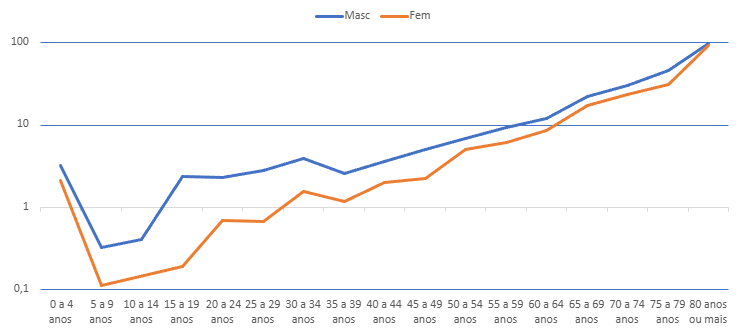
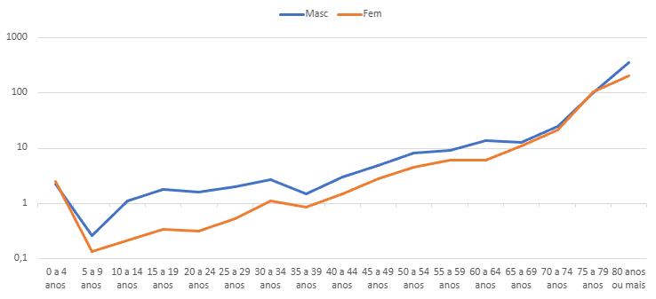
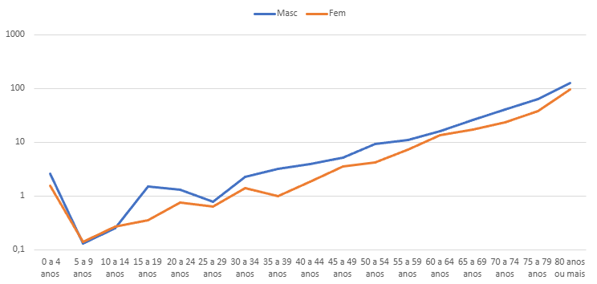
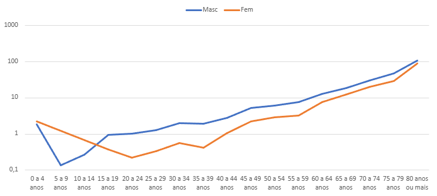
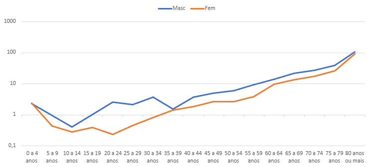

```{r}
#| include: false
source("rdocs/source/packages.R")
source("rdocs/felipe.R")
source("rdocs/Demog.R")
```

# Introdução

Ipatinga é um município de Minas Gerais com população de 227.731 pessoas (Censo 2022) localizada no "Vale do Aço".  Esse trabalho teve como objetivo entender as dinâmicas populacionais da população de Ipatinga durante o período de 2000 até 2024. Para isso, foram utilizadas várias técnicas aprendidas no curso de Demografia no primeiro semestre de 2026 tais como o Diagrama de Lexis, Tábua de Vida e outras estatísticas vitais, essenciais para a compreensão do cenário populacional do munícipio mineiro.

Os bancos de dados para nascimentos e mortalidade foram obtidos por meio do Datasus e, por meio do pacote microdatasus desenvolvido por  Raphael de Freitas Saldanha. As estimativas populacionais foram obtidas do site da Ripsa.

As bases de dados utilizadas para os nascimentos (SINASC) e para a mortalidade (SIM) foram obtidas utilizando o tabnet do Datasus em conjunto com o pacote "microdatasus" desenvolvido por Raphael de Freitas Saldanha. Além disso, as estimativas populacionais utilizadas neste estudo foram obtidas via site da Ripsa.

Para o tratamento e análise de dados, foram utilizados o software R em sua versão 4.5.1. ambientado em sua interface gráfica Rstudio, ambos sendo gratuitos para tratamento de dados e confecção dos gráficos presentes neste material. Ademais, foi utilizado também o Excel para melhor visualização e manipulação dos dados utilizados no software comentado anteriormente.

# Referencial Teórico

- Alves & Cavenaghi (2012); Berquó & Cavenaghi (2014); Potter et al. (2010); Silva et al. (2022); Adhikari (2023).

- Bahia, Camila Alves et al. Feminicídios em Minas Gerais, Brasil: da caracterização dos eventos à análise espaço-temporal. Cadernos de Saúde Pública [online]. v. 41, n. 1 [Acessado 11 Maio 2026] , e00015224. Disponível em: <https://doi.org/10.1590/0102-311XPT015224>. ISSN 1678-4464. https://doi.org/10.1590/0102-311XPT015224.

- Faria R, Santana P. Variações espaciais e desigualdades regionais no indicador de mortalidade infantil do estado de Minas Gerais, Brasil. Saude soc [Internet]. 2016Jul;25(3):736–49. Available from: https://doi.org/10.1590/S0104-12902016147609

- Gonçalves GQ, Carvalho JAM de, Wong LLR, Turra CM. A transição da fecundidade no Brasil ao longo do século XX – uma perspectiva regional. Rev bras estud popul [Internet]. 2019;36:e0098. Available from: https://doi.org/10.20947/S0102-3098a0098

- Caldas, Aline Diniz Rodrigues, Santos, Ricardo Ventura.e.Cardoso, Andrey MoreiraIniquidades étnico-raciais na mortalidade infantil: implicações de mudanças do registro de cor/raça nos sistemas nacionais de informação em saúde no Brasil. Cadernos de Saúde Pública [online]. v. 38, n. 4 [Acessado.12 Maio 2026] , e00101721. Disponível em: <https://doi.org/10.1590/0102-311X00101721>. ISSN 1678-4464. https://doi.org/10.1590/0102-311X00101721.


# Análises

## Questão 1

Essa análise foi feita com o intuito de entender os nascimentos e óbitos durante o período de 2000 até 2024 em Ipatingana na faixa etária de 0 a 5 anos completos, obtendo assim uma noção da probabilidade de sobrevivência. Para isso, foi feito um diagrama de Lexis e as probabilidades de sobrevivência foram calculadas utilizando os microdados do SIM obtidos por meio do pacote microdatasus. 


```{r}
#| label: fig-R1
#| fig-cap: "Diagrama de Lexis dos nascimentos e óbitos na faixa etária de 0-5 anos"

Diagrama

```


::: {#tbl-R1 layout-align="center" tbl-pos="H"}
```{=latex}
\begin{tabular}{l c}
\toprule
\textbf{Indicador} & \textbf{Probabilidade} \\
\midrule
Probabilidade de sobreviver até 1 ano de idade (2000-2019)  & 0,9885962 \\
Probabilidade de sobreviver até 5 anos de idade (2000-2023) & 0,9865832 \\
\bottomrule
\end{tabular}
```
Probabilidades de sobrevivência por faixa etária
:::

::: {#tbl-R2 layout-align="center" tbl-pos="H"}
```{=latex}
\begin{tabular}{l c}
\toprule
\textbf{Raça/Cor} & \textbf{Valor} \\
\midrule
Branca & 0,006419753 \\
Parda & 0,009003215 \\
\bottomrule
\end{tabular}
```
Probabilidade de morrer antes do 1° aniversário segundo Raça/Cor para os anos 2022 e 2023
:::

Observa-se pela $\ref{fig-R1}$ que grande parte das mortes estão concentradas no 1° ano de vida. Isso também fica claro por meio das probabilidades de sobrevivência mostradas na [@tbl-R1], a adição de 4 anos só diminui em 0.002 a probabilidade de sobrevivência. A probabilidade de sobrevivência infantil observada assume valores um pouco maiores que os obtidos por Faria, R. & Santana, P. (2016) no período de 2003-2012: De 2003-2007 a probabilidade foi de 0,9835 e de 2008-2012 foi de 0,9865.  

Observou-se também a probabilidade de se sobreviver ao primeiro aniversário segundo raça/cor para  2022 e 2023. Nesse período, apenas houve óbitos de crianças brancas e pardas e 2 "ignorados", o que restringe a análise. Com o que foi observado, a probabilidade de morte antes do 1° ano de vida é maior nas crianças pardas, como mostrado na [@tbl-R2]. Esse resultado destoa dos obtidos por Caldas (2021), que mostrou uma mortalidade maior nas crianças brancas no Brasil.

Ademais, observa-se uma gradual diminuição do número de nascimentos, indo de 3952 no ano 2000 para 2606 em 2024, que vai de acordo com a diminuição da natalidade no Brasil descrita por Gonçalves GQ (2019). 

## Questão 2

Esta análise tem como objetivo examinar a dinâmica reprodutiva e o comportamento da fecundidade na Unidade da Federação (município de Ipatinga/MG) nos anos de 2010, 2019, 2021, 2022 e 2024. Para isso, serão utilizados dados de nascidos vivos provenientes do Tabnet -Datasus e estimativas populacionais do IBGE (Revisão 2024).

Dessa forma, serão construídos os seguintes indicadores: $TBN$ (Taxa Bruta de Natalidade),$TFG$ (Taxa de Fecundidade Geral), ${}_n f_x$ (Taxas Específicas de Fecundidade) – com respectivo gráfico, ${}_n f_x$ (Taxas Específicas de Fecundidade feminina), $TFT$ (Taxa de Fecundidade Total), $TBR$ (Taxa Bruta de Reprodução) e $TLR$ (Taxa Líquida de Reprodução), esta última utilizando a função Lx da tábua de vida.

### Letra A

#### Indicadores

Os cálculos foram realizados a partir dos nascidos vivos informados pelo SINASC e das populações projetadas pelo IBGE para Ipatinga. Os resultados estão sumarizados na tabela abaixo.

::: {#tbl-ind layout-align="center" tbl-pos="H"}
```{=latex}

\begin{tabular}{l r r r r r}
        \hline
        \textbf{Indicador} & \textbf{2010} & \textbf{2019} & \textbf{2021} & \textbf{2022} & \textbf{2024} \\
        \hline
        TBN & 13,94 & 12,39 & 12,15 & 11,64 & 11,07 \\
        TFG & 47 & 45,08 & 44,95 & 43,44 & 42,17 \\
        TFT & 1,53 & 1,55 & 1,57 & 1,53 & 1,5 \\
        TBR & 0,732 & 0,764 & 0,752 & 0,738 & 0,741 \\
        TLR & 0,87 & 0,88 & 0,88 & 0,86 & 0,73 \\
        \hline
    \end{tabular}


```
Tabela dos indicadores
:::

::: {#tbl-nfx layout-align="center" tbl-pos="H"}
```{=latex}

\begin{tabular}{l r r r r r}
        \hline
        \textbf{Faixa Etária} & \textbf{2010} & \textbf{2019} & \textbf{2021} & \textbf{2022} & \textbf{2024} \\
        \hline
        15 a 19 anos & 0,03627 & 0,02865 & 0,02819 & 0,02846 & 0,02573 \\
        20 a 24 anos & 0,07093 & 0,06346 & 0,06255 & 0,0594  & 0,06328 \\
        25 a 29 anos & 0,0832  & 0,07574 & 0,0799  & 0,07336 & 0,08091 \\
        30 a 34 anos & 0,07008 & 0,07756 & 0,08055 & 0,07803 & 0,07    \\
        35 a 39 anos & 0,03645 & 0,05072 & 0,04755 & 0,05188 & 0,04721 \\
        40 a 44 anos & 0,00872 & 0,01276 & 0,0135  & 0,0138  & 0,01311 \\
        45 a 49 anos & 0,00034 & 0,00047 & 0,00137 & 0,00101 & 0,00053 \\
        \hline
    \end{tabular}


```
Tabela de ${}_n f_x$
:::

::: {#tbl-nfxf layout-align="center" tbl-pos="H"}
```{=latex}

\begin{tabular}{l r r r r r}
        \hline
        \textbf{Faixa Etária} & \textbf{2010} & \textbf{2019} & \textbf{2021} & \textbf{2022} & \textbf{2024} \\
        \hline
        15 a 19 anos & 0,01833 & 0,01421 & 0,01167 & 0,01354 & 0,01326 \\
        20 a 24 anos & 0,03357 & 0,03183 & 0,03036 & 0,03009 & 0,03017 \\
        25 a 29 anos & 0,03959 & 0,03798 & 0,03706 & 0,03718 & 0,03886 \\
        30 a 34 anos & 0,03311 & 0,03852 & 0,04138 & 0,03585 & 0,03283 \\
        35 a 39 anos & 0,01748 & 0,02478 & 0,02311 & 0,02406 & 0,02538 \\
        40 a 44 anos & 0,00419 & 0,00521 & 0,00606 & 0,00661 & 0,00745 \\
        45 a 49 anos & 0,00022 & 0,00023 & 0,0008  & 0,00034 & 0,00032 \\
        \hline
    \end{tabular}


```
Tabela de ${}_n f_x$ feminino
:::

Analisando a [@tbl-ind], observa-se uma trajetória de declínio. A Taxa Bruta de Natalidade reduziu-se de 13,94 para 11,07 entre 2010 e 2024, indicando que o número de nascimentos em relação à população total está diminuindo progressivamente. Além disso, o comportamento da Taxa de Fecundidade Total (TFT), que se manteve sistematicamente abaixo do nível de reposição populacional (2,1 filhos por mulher). Ao atingir o patamar de 1,50 em 2024, a região consolida-se em um regime de baixa fecundidade, o que implica, no longo prazo, estreitamento da base da pirâmide etária e acelerado processo de envelhecimento populacional.

A Taxa Bruta de Reprodução (apenas nascimentos femininos) variou entre 0,73 e 0,76, sempre inferior a 1. A Taxa Líquida de Reprodução, que incorpora a mortalidade feminina até o final do período reprodutivo, apresentou valores próximos a 0,85 – 0,88 nos primeiros anos, mas caiu para 0,73 em 2024. Esse comportamento sinaliza que a população local não possui capacidade de auto reposição natural nas condições atuais.

#### Análise das Taxas Específicas de Fecundidade 

Com base nos valores de taxas específicas de fecundidade por grupo etário (filhos por mulher, para nascidos vivos totais), foi construído o gráfico de linhas apresentado na figura abaixo. As curvas representam a intensidade da fecundidade em cada idade materna para os cinco anos analisados.

{#fig-nfx fig-align="center"}

::: {#tbl-ibge layout-align="center" tbl-pos="H"}
```{=latex}

\begin{tabular}{l r r}
        \hline
        \textbf{Indicador} & \textbf{Base: Projeção} & \textbf{Censo 2022} \\
        \hline
        População Total & 237.501 & 227.731 \\
        Mulheres (15-49 anos) & 63.625 & 58.914 \\
        Nascidos Vivos (SINASC) & 2.764 & 2.764 \\
        Taxa Bruta de Natalidade & 11,64 & 12,13 \\
        Taxa Fecundidade Geral (TFG) & 43,44 & 46,91 \\
        Taxa de Fecundidade Total (TFT) & 1,83 & 1,65 \\
        Taxa Bruta de Reprodução (TBR) & 0,88 & 0,80 \\
        \hline
    \end{tabular}


```
Tabela de ${}_n f_x$ feminino
:::

As projeções, estas presentes na [@tbl-ibge], superestimaram a população em cerca de 4,3%, levando a uma subestimativa das taxas. Com a população real menor, a TBN sobe para 12,13 e a TFT para 1,65 filhos por mulher – ainda abaixo do nível de reposição, mas mais elevada do que as projeções indicavam. Esse achado reforça a importância de utilizar dados censitários sempre que disponíveis.

Os resultados revelam queda sustentada da fecundidade em Ipatinga, com TFT abaixo de 2,1 filhos por mulher e TLR inferior a 1, indicando tendência ao crescimento vegetativo negativo. A redução da TBN (13,94 para 11,07) e da TFG (47,00 para 42,17) alinha - se à “fase muito baixa da fecundidade” descrita por Alves & Cavenaghi (2012), cujos determinantes são a anticoncepção, a escolaridade e a inserção feminina no trabalho (Potter et al., 2010).

A $\ref{fig-nfx}$ mostra deslocamento do pico etário: em 2010, o pico era entre os 20 e 24 anos (0,0709); a partir de 2019, desloca-se para 25 - 29 anos (0,0809 em 2024), evidenciando o adiamento da maternidade (Berquó & Cavenaghi, 2014). A fecundidade adolescente (15 a 19 anos) caiu 29% (0,0363 para 0,0257), enquanto a fecundidade após os 30 anos aumentou, especialmente no grupo 35 - 39 anos (crescimento de 29%), refletindo postergação associada à maior escolaridade e profissionalização (Adhikari, 2023). Em 2021, observa-se leve inflexão pandêmica (pico mais tardio aos 30-34 anos), compatível com o “efeito incerteza” da COVID-19 (Silva et al., 2022). A fecundidade tardia (40-49 anos) permanece marginal (≤0,0135). A TFT recuou de 1,53 para 1,50, mas o calendário reprodutivo alterou-se profundamente.

A TBR (0,73 e 0,76) e a TLR (0,87 e 0,73) são inferiores a 1. A pequena diferença entre elas (0,741 contra 0,73 em 2024) mostra que a mortalidade feminina jovem é baixa, e a queda na reprodução deve-se principalmente ao comportamento reprodutivo. Desse modo, Ipatinga já se encontra em regime de fecundidade abaixo da reposição.

### Letra D

Para o ano de 2024, utilizando os dados do SINASC para Ipatinga/MG, foram analisadas duas associações:

1. entre idade da mãe (em grupos) e escolaridade;

2. entre tipo de parto e escolaridade da mãe.

As tabelas de contingência, frequências relativas, gráficos e medidas de associação são apresentados a seguir.

#### Idade da mãe X Escolaridade

{#fig-esc1 fig-align="center"}

{#fig-esc2 fig-align="center"}

::: {#tbl-cont1 layout-align="center" tbl-pos="H"}
```{=latex}

\resizebox{\textwidth}{!}{
        \begin{tabular}{l r r r r r r}
            \hline
            \textbf{Idade da Mãe} & \textbf{Nenhuma} & \textbf{1-3 anos} & \textbf{4-7 anos} & \textbf{8-11 anos} & \textbf{12+ anos} & \textbf{Total} \\
            \hline
            10-14 anos & 0  & 5     & 251    & 403     & 3      & 662    \\
            15-19 anos & 27 & 99    & 1.732  & 17.186  & 326    & 19.370 \\
            20-24 anos & 30 & 165   & 2.532  & 39.964  & 4.822  & 47.513 \\
            25-29 anos & 52 & 193   & 3.017  & 38.316  & 15.060 & 56.638 \\
            30-34 anos & 31 & 202   & 3.056  & 26.430  & 20.640 & 50.359 \\
            35-39 anos & 34 & 219   & 2.301  & 15.442  & 15.518 & 33.514 \\
            40-44 anos & 30 & 170   & 983    & 4.526   & 4.256  & 9.965  \\
            45-49 anos & 5  & 30    & 85     & 260     & 260    & 640    \\
            50+ anos   & 0  & 0     & 3      & 12      & 27     & 42     \\
            \hline
            \textbf{Total} & \textbf{209} & \textbf{1.083} & \textbf{13.960} & \textbf{142.539} & \textbf{60.912} & \textbf{218.703} \\
            \hline
        \end{tabular}
}

```
Contingência da idade da mãe pela escolaridade
:::

::: {#tbl-fq1 layout-align="center" tbl-pos="H"}
```{=latex}

\resizebox{\textwidth}{!}{
        \begin{tabular}{l r r r r r r}
            \hline
            \textbf{Idade da Mãe} & \textbf{Nenhuma} & \textbf{1-3 anos} & \textbf{4-7 anos} & \textbf{8-11 anos} & \textbf{12+ anos} & \textbf{Total} \\
            \hline
            10-14 anos & 0  & 5     & 251    & 403     & 3      & 662    \\
            15-19 anos & 27 & 99    & 1.732  & 17.186  & 326    & 19.370 \\
            20-24 anos & 30 & 165   & 2.532  & 39.964  & 4.822  & 47.513 \\
            25-29 anos & 52 & 193   & 3.017  & 38.316  & 15.060 & 56.638 \\
            30-34 anos & 31 & 202   & 3.056  & 26.430  & 20.640 & 50.359 \\
            35-39 anos & 34 & 219   & 2.301  & 15.442  & 15.518 & 33.514 \\
            40-44 anos & 30 & 170   & 983    & 4.526   & 4.256  & 9.965  \\
            45-49 anos & 5  & 30    & 85     & 260     & 260    & 640    \\
            50+ anos   & 0  & 0     & 3      & 12      & 27     & 42     \\
            \hline
            \textbf{Total} & \textbf{209} & \textbf{1.083} & \textbf{13.960} & \textbf{142.539} & \textbf{60.912} & \textbf{218.703} \\
            \hline
        \end{tabular}
}

```
Frequência Relativa das idades da mãe pela escolaridade
:::

A [@tbl-cont1] em conjunto com a $\ref{fig-esc1}$ e a $\ref{fig-esc2}$ mostram a relação entre idade materna e escolaridade. Mães adolescentes (10 a 19 anos) concentram-se nos níveis 4 a 7 e 8 a 11 anos, com menos de 2% tendo 12+ anos. A proporção de ensino superior cresce com a idade: 10,1% aos 20 - 24 anos, 26,6% aos 25 a 29, 41,0% aos 30 a 34 e 46,3% aos 35-39 anos. Acima de 40 anos, o percentual de 12+ anos recua (42,7% aos 40 a 44, 40,6% aos 45 a 49), e aumentam as categorias de baixa escolaridade. O Qui-Quadrado é $\chi^2$ = 4.116,5 (gl=32, p<0,001) e o coeficiente de contingência C = 0,341, indicando associação moderada – a idade explica cerca de 10% da variação educacional.

#### Tipo de Parto X Escolaridade

::: {#tbl-cont2 layout-align="center" tbl-pos="H"}
```{=latex}

\resizebox{\textwidth}{!}{
        \begin{tabular}{l r r r r r r}
            \hline
            \textbf{Tipo de Parto} & \textbf{Nenhuma} & \textbf{1-3 anos} & \textbf{4-7 anos} & \textbf{8-11 anos} & \textbf{12+ anos} & \textbf{Total} \\
            \hline
            Vaginal  & 109 & 516   & 6.966  & 62.951  & 18.295 & 88.837  \\
            Cesário  & 100 & 564   & 6.977  & 79.492  & 42.591 & 129.724 \\
            Ignorado & 0   & 3     & 17     & 96      & 26     & 142     \\
            \hline
            \textbf{Total} & \textbf{209} & \textbf{1.083} & \textbf{13.960} & \textbf{142.539} & \textbf{60.912} & \textbf{218.703} \\
            \hline
        \end{tabular}
    }

```
Contingência do tipo de parto pela escolaridade
:::

::: {#tbl-fq2 layout-align="center" tbl-pos="H"}
```{=latex}

\resizebox{\textwidth}{!}{
        \begin{tabular}{l r r r r r r}
            \hline
            \textbf{Tipo de Parto} & \textbf{Nenhuma} & \textbf{1-3 anos} & \textbf{4-7 anos} & \textbf{8-11 anos} & \textbf{12+ anos} & \textbf{Total} \\
            \hline
            Vaginal  & 109 & 516   & 6.966  & 62.951  & 18.295 & 88.837  \\
            Cesário  & 100 & 564   & 6.977  & 79.492  & 42.591 & 129.724 \\
            Ignorado & 0   & 3     & 17     & 96      & 26     & 142     \\
            \hline
            \textbf{Total} & \textbf{209} & \textbf{1.083} & \textbf{13.960} & \textbf{142.539} & \textbf{60.912} & \textbf{218.703} \\
            \hline
        \end{tabular}
    }

```
Frequência Relativa dos tipos de parto pela escolaridade
:::

{#fig-parto fig-align="center"}

Para avaliar corretamente a associação, calculam-se as proporções de parto vaginal e cesáreo dentro de cada nível de escolaridade [@tbl-cont2]. A $\ref{fig-parto}$ evidencia que, quanto maior a escolaridade, maior a frequência de cesarianas. Entre mães sem instrução, 47,8% tiveram cesárea; entre as com nível superior, 70,0%. A razão de chances (superior vs. sem instrução) é de aproximadamente 2,55. O Qui-Quadrado (excluindo ignorados) é $\chi^2$ ≈ 2.870,4 (gl=4, p<0,001) e o coeficiente de contingência C = 0,114, indicando associação fraca, isto é, a escolaridade explica apenas 1,3% da variação do tipo de parto.

## Questão 3

Essa análise tem como objetivo analisar a mortalidade na cidade de Ipatinga no período estudado dentro do material, com foco nos anos a serem citados em cada uma das introduções de cada análise. Para isso, serão utilizados dados do SIM, obtidos via Tabnet - Datasus.

Dessa maneira, será calculado $TBM$ (Taxa Bruta de Mortalidade), ${}_n M_x$ (Taxa específica de mortalidade entre $x$ e $x+n$ anos), $TMI$ (Taxa de Mortalidade Infantil) e outros componentes da mortalidade infantil.

É importante ser mencionado que, para os anos, sexo e faixas etárias:

- 2010 Feminino - 10 a 14 anos;
- 2021 Feminino - 1 a 4 anos;
- 2024 Masculino - 5 a 9 anos

Foram encontradas nenhuma observação, tanto no Tabnet - Datasus quanto no banco do microdatasus, sendo assim englobado com base nas faixas etárias utilizadas em cada uma das análises com a falta desses dados.

### Letra a

Essa análise tem como objetivo calcular e analisar a Taxa Bruta de Mortalidade (TBM) e as Taxas Específicas de Mortalidade (${n}M{x}$) para o município de Ipatinga nos anos de 2010, 2019, 2021, 2022 e 2024, desagregadas por sexo e faixa etária quinquenal. Para isso, foram utilizados os dados de óbitos provenientes do Sistema de Informações sobre Mortalidade (SIM), obtidos via Tabnet/Datasus, em conjunto com as estimativas populacionais da RIPSA/CGIAE/MS, disponibilizadas pelo mesmo sistema.

A TBM será apresentada de forma comparativa entre os sexos masculino e feminino ao longo do período analisado, permitindo identificar tendências e variações no padrão de mortalidade do município, com destaque para o impacto da pandemia de Covid-19 no ano de 2021. As taxas específicas de mortalidade, por sua vez, serão calculadas para cada faixa etária e visualizadas em gráficos de escala logarítmica.

É importante mencionar que, para os anos, sexos e faixas etárias a seguir, não foram encontradas observações de óbitos, tanto no Tabnet/Datasus quanto no banco do microdatasus: 2010, sexo feminino, 10 a 14 anos; 2021, sexo feminino, 1 a 4 anos; e 2024, sexo masculino, 5 a 9 anos. Esses casos foram tratados como zero nos cálculos, refletindo a real ausência de óbitos registrados nessas categorias durante os respectivos anos, e não necessariamente a ausência de risco.


::: {#tbl-tbm layout-align="center" tbl-pos="H"}
```{=latex}
\begin{table}
    \centering
    \scriptsize
    \begin{tabular}{l r r r r r r r}
        \hline
        \textbf{Ano} & \textbf{Óbitos} & \textbf{Óbitos} & \textbf{Óbitos} & \textbf{Pop.} & \textbf{TBM} & \textbf{TBM} & \textbf{TBM} \\
                     & \textbf{Masc.}  & \textbf{Fem.}   & \textbf{Total}  & \textbf{Total} & \textbf{Masc.} & \textbf{Fem.} & \textbf{Total} \\
        \hline
        2010 & 678 & 529 & 1.207 & 243.934 & 5,73 & 4,21 & 4,95 \\
        2019 & 693 & 580 & 1.273 & 240.252 & 5,99 & 4,65 & 5,30 \\
        2021 & 1.078 & 876 & 1.955 & 238.688 & 9,41 & 7,06 & 8,19 \\
        2022 & 847 & 687 & 1.535 & 237.501 & 7,44 & 5,56 & 6,46 \\
        2024 & 942 & 776 & 1.718 & 235.445 & 8,36 & 6,32 & 7,30 \\
        \hline
    \end{tabular}
\end{table}
```
Taxa Bruta de Mortalidade (por 1.000 hab.) por sexo - 2010--2024
:::

{#fig-nmx2010 fig-align="center"}

{#fig-nmx2019 fig-align="center"}

{#fig-nmx2021 fig-align="center"}

{#fig-nmx2022 fig-align="center"}

{#fig-nmx2024 fig-align="center"}

::: {#tbl-nmx-fem layout-align="center" tbl-pos="H"}
```{=latex}
\begin{table}
    \centering
    \scriptsize
    \begin{tabular}{l r r r r r}
        \hline
        \textbf{Faixa Etária} & \textbf{2010} & \textbf{2019} & \textbf{2021} & \textbf{2022} & \textbf{2024} \\
        \hline
        0 a 4 anos       & 2,0993 & 2,5105 & 1,5802 & 2,2030 & 2,3973 \\
        5 a 9 anos       & 0,1145 & 0,1389 & 0,1414 & \textemdash & 0,4350 \\
        10 a 14 anos     & \textemdash & \textemdash & 0,2717 & \textemdash & 0,2843 \\
        15 a 19 anos     & 0,1899 & 0,3438 & 0,3646 & 0,3762 & 0,3979 \\
        20 a 24 anos     & 0,6869 & 0,3152 & 0,7589 & 0,2221 & 0,2357 \\
        25 a 29 anos     & 0,6710 & 0,5289 & 0,6540 & 0,3319 & 0,4545 \\
        30 a 34 anos     & 1,5635 & 1,1360 & 1,4306 & 0,5654 & 0,8207 \\
        35 a 39 anos     & 1,1722 & 0,8746 & 1,0182 & 0,4184 & 1,4408 \\
        40 a 44 anos     & 1,9870 & 1,5315 & 1,8586 & 1,0687 & 1,8874 \\
        45 a 49 anos     & 2,2344 & 2,8014 & 3,6567 & 2,2449 & 2,6729 \\
        50 a 54 anos     & 5,0684 & 4,6330 & 4,3333 & 2,8554 & 2,6944 \\
        55 a 59 anos     & 6,1076 & 6,0991 & 7,3068 & 3,2254 & 3,8815 \\
        60 a 64 anos     & 8,6978 & 6,0958 & 13,8122 & 7,7530 & 9,6347 \\
        65 a 69 anos     & 17,3035 & 10,9718 & 17,4368 & 12,6351 & 13,5802 \\
        70 a 74 anos     & 23,6763 & 21,5478 & 23,6842 & 20,3831 & 17,4419 \\
        75 a 79 anos     & 30,9156 & 104,1943 & 38,0165 & 29,6443 & 26,5609 \\
        80 anos e mais   & 92,7114 & 202,7972 & 96,3154 & 89,5382 & 91,3335 \\
        \hline
    \end{tabular}
\end{table}
```
Taxa Específica de Mortalidade Feminina ($_{n}m_{x}$ × 1.000 hab.) por faixa etária - 2010--2024
:::

::: {#tbl-nmx-masc layout-align="center" tbl-pos="H"}
```{=latex}
\begin{table}
    \centering
    \scriptsize
    \begin{tabular}{l r r r r r}
        \hline
        \textbf{Faixa Etária} & \textbf{2010} & \textbf{2019} & \textbf{2021} & \textbf{2022} & \textbf{2024} \\
        \hline
        0 a 4 anos       & 3,2783 & 2,2794 & 2,6485 & 1,8577 & 2,3198 \\
        5 a 9 anos       & 0,3276 & 0,2637 & 0,1342 & 0,1364 & \textemdash \\
        10 a 14 anos     & 0,4047 & 1,1118 & 0,2603 & 0,2646 & 0,4084 \\
        15 a 19 anos     & 2,3972 & 1,7931 & 1,5255 & 0,9667 & 1,0258 \\
        20 a 24 anos     & 2,2922 & 1,6297 & 1,3382 & 1,0231 & 2,6116 \\
        25 a 29 anos     & 2,8068 & 1,9965 & 0,8039 & 1,2849 & 2,1606 \\
        30 a 34 anos     & 3,9343 & 2,7307 & 2,3232 & 2,0296 & 3,7351 \\
        35 a 39 anos     & 2,5803 & 1,4898 & 3,2105 & 1,9281 & 1,5574 \\
        40 a 44 anos     & 3,6588 & 2,9902 & 4,0027 & 2,7649 & 3,7074 \\
        45 a 49 anos     & 5,1013 & 4,9764 & 5,2363 & 5,2777 & 4,9499 \\
        50 a 54 anos     & 6,8512 & 8,2299 & 9,3377 & 6,0026 & 6,0233 \\
        55 a 59 anos     & 9,4137 & 9,3662 & 11,3208 & 7,5746 & 9,5551 \\
        60 a 64 anos     & 12,1758 & 13,6801 & 16,3962 & 12,7213 & 14,2391 \\
        65 a 69 anos     & 22,2478 & 12,6991 & 26,5677 & 18,9645 & 21,9801 \\
        70 a 74 anos     & 29,9625 & 24,7732 & 41,2926 & 30,4469 & 27,3021 \\
        75 a 79 anos     & 46,4730 & 103,3520 & 65,1603 & 46,7337 & 39,3901 \\
        80 anos e mais   & 98,3021 & 360,7496 & 126,7806 & 108,3066 & 105,5743 \\
        \hline
    \end{tabular}
\end{table}
```
Taxa Específica de Mortalidade Masculina ($_{n}m_{x}$ × 1.000 hab.) por faixa etária - 2010--2024
:::

Analisando a [@tbl-tbm], que apresenta a Taxa Bruta de Mortalidade (TBM) por sexo para Ipatinga entre os anos de 2010 e 2024, é possível observar que a mortalidade masculina supera consistentemente a feminina em todos os anos analisados. Em 2010, a TBM masculina foi de 5,73 óbitos por 1.000 habitantes, contra 4,21 no sexo feminino, resultando em uma taxa total de 4,95. Já em 2024, esses valores subiram para 8,36 para homens, 6,32 para mulheres e 7,30 total, evidenciando um aumento expressivo ao longo do período. 

Destaca-se, nesse contexto, o ano de 2021, que concentra os maiores valores de TBM entre todos os anos em análise, com 9,41 para o sexo masculino, 7,06 para o feminino e 8,19 no total. Esse pico é amplamente explicado pela sobremortalidade associada à pandemia de Covid-19, que elevou de forma significativa o número de óbitos registrados naquele ano, o que será aprofundado na análise das causas de morte. 

Após o pico de 2021, verifica-se uma redução da TBM em 2022 para os três estratos analisados, com total de 6,46, seguida de uma nova elevação em 2024. Ainda que esse retorno ao aumento pós-pandemia mereça atenção, os valores de 2024 permanecem abaixo do observado em 2021, sugerindo uma normalização parcial do padrão de mortalidade no município. 

No que se refere às taxas específicas de mortalidade (nMx), expostas nas [@tbl-nmx-fem] e [@tbl-nmx-masc] e visualizadas nas  $\ref{fig-nmx2010}$, $\ref{fig-nmx2019}$, $\ref{fig-nmx2021}$, $\ref{fig-nmx2022}$ e $\ref{fig-nmx2024}$, o padrão observado em todos os anos segue o formato em "J" característico das tábuas de mortalidade: mortalidade relativamente elevada nas faixas mais jovens, queda expressiva a partir dos 5 anos de vida e crescimento progressivo e acelerado a partir dos 40-50 anos, com pico no grupo de 80 anos e mais. 

Para o sexo masculino, nota-se uma elevação pronunciada nas faixas de 15 a 29 anos em todos os anos, reflexo direto da sobremortalidade por causas externas, especialmente acidentes e agressões, fenômeno típico da mortalidade masculina jovem no Brasil. Essa característica é especialmente visível em 2010, quando a nMx masculina de 15 a 19 anos atingiu 2,3972 por 1.000 habitantes, valor substancialmente superior ao feminino de 0,1899. Em 2024, observa-se uma redução relativa dessa diferença, com os valores masculinos para essa faixa caindo para 1,0258, enquanto o feminino sobe ligeiramente para 0,3979, ainda assim mantendo a sobremortalidade masculina. 

Para o sexo feminino, a progressão das nMx nas faixas adultas é mais suave e regular, sem o pico observado na juventude masculina. Os valores femininos começam a se aproximar dos masculinos apenas a partir dos 50 anos de idade, e na faixa de 80 anos e mais, as taxas de ambos os sexos convergem para patamares elevados, com a masculina superando a feminina em 2024. 

Por fim, cabe ressaltar que os valores de nMx para as faixas com ausência de observações em 2010 Feminino 10 a 14 anos, 2021 Feminino 1 a 4 anos e 2024 Masculino 5 a 9 anos em que foram tratados como zero nos cálculos, refletindo a real ausência de óbitos registrados nessas categorias durante os respectivos anos, e não necessariamente ausência de risco. 


### Letra b

A seguinte análise tem como objetivo o cálculo da Taxa de Mortalidade Infantil (TMI) e de seus componentes para o município de Ipatinga, com base nos microdados do SIM referentes ao triênio 2022–2024, desagregados por sexo.

A TMI será decomposta em seus componentes neonatal precoce (0 a 6 dias), neonatal tardio (7 a 27 dias) e pós-neonatal (28 a 364 dias), tanto para ambos os sexos em conjunto quanto de forma separada para os sexos feminino e masculino. Essa decomposição permite identificar quais etapas do primeiro ano de vida concentram maior risco de morte, fornecendo subsídios para a interpretação das causas subjacentes e para o direcionamento de políticas de saúde materno-infantil. Os nascidos vivos de referência utilizados para o cálculo correspondem ao registro do ano de 2023, obtido via Tabnet/Datasus (SINASC).

::: {#tbl-tmi-total-obitos layout-align="center" tbl-pos="H"}
```{=latex}
\begin{table}
    \centering
    \scriptsize
    \begin{tabular}{l r r r r}
        \hline
        \textbf{Ano} & \textbf{Neonatal Precoce (0--6 d)} & \textbf{Neonatal Tardio (7--27 d)} & \textbf{Pós-Neonatal (28--364 d)} & \textbf{Total} \\
        \hline
        2022 & 11 & 2 &  9 & 22 \\
        2023 &  7 & 3 & 12 & 22 \\
        2024 &  8 & 5 & 11 & 24 \\
        \textbf{Total} & \textbf{26} & \textbf{10} & \textbf{32} & \textbf{68} \\
        \hline
    \end{tabular}
\end{table}
```
Óbitos infantis totais por componente 2022--2024
:::

::: {#tbl-tmi-total-ind layout-align="center" tbl-pos="H"}
```{=latex}
\begin{table}
    \centering
    \scriptsize
    \begin{tabular}{l r r}
        \hline
        \textbf{Indicador} & \textbf{Valor (‰)} & \textbf{Valor (prop.)} \\
        \hline
        Óbitos médios anuais                                    & \multicolumn{2}{r}{22,6667} \\
        Nascidos vivos (ref.\ 2023)                             & \multicolumn{2}{r}{2.893} \\
        \hline
        TMI --- Taxa de Mortalidade Infantil (\textperthousand) & 7,835004 & 0,007835 \\
        TMI Neonatal (\textperthousand)                         & 4,147943 & 0,004148 \\
        \quad TMI Neonatal Precoce (\textperthousand)           & 2,995737 & 0,002996 \\
        \quad TMI Neonatal Tardia (\textperthousand)            & 1,152206 & 0,001152 \\
        TMI Pós-Neonatal (\textperthousand)                     & 3,687061 & 0,003687 \\
        \hline
    \end{tabular}
\end{table}
```
Indicadores total de mortalidade infantil  2022--2024
:::

::: {#tbl-tmi-fem-obitos layout-align="center" tbl-pos="H"}
```{=latex}
\begin{table}
    \centering
    \scriptsize
    \begin{tabular}{l r r r r}
        \hline
        \textbf{Ano} & \textbf{Neonatal Precoce (0--6 d)} & \textbf{Neonatal Tardio (7--27 d)} & \textbf{Pós-Neonatal (28--364 d)} & \textbf{Total} \\
        \hline
        2022 & 6 & 1 & 4 & 11 \\
        2023 & 2 & 2 & 7 & 11 \\
        2024 & 3 & 3 & 6 & 12 \\
        \textbf{Total} & \textbf{11} & \textbf{6} & \textbf{17} & \textbf{34} \\
        \hline
    \end{tabular}
\end{table}
```
Óbitos infantis por componente - Sexo feminino - 2022--2024
:::

::: {#tbl-tmi-fem-ind layout-align="center" tbl-pos="H"}
```{=latex}
\begin{table}
    \centering
    \scriptsize
    \begin{tabular}{l r r}
        \hline
        \textbf{Indicador} & \textbf{Valor (‰)} & \textbf{Valor (prop.)} \\
        \hline
        Óbitos médios anuais                                    & \multicolumn{2}{r}{11,3333} \\
        Nascidos vivos (ref.\ 2023)                             & \multicolumn{2}{r}{1.401} \\
        \hline
        TMI --- Taxa de Mortalidade Infantil (\textperthousand) & 8,089460 & 0,008089 \\
        \hline
    \end{tabular}
\end{table}
```
Indicadores de mortalidade infantil - Sexo feminino - 2022--2024
:::

::: {#tbl-tmi-masc-obitos layout-align="center" tbl-pos="H"}
```{=latex}
\begin{table}
    \centering
    \scriptsize
    \begin{tabular}{l r r r r}
        \hline
        \textbf{Ano} & \textbf{Neonatal Precoce (0--6 d)} & \textbf{Neonatal Tardio (7--27 d)} & \textbf{Pós-Neonatal (28--364 d)} & \textbf{Total} \\
        \hline
        2022 & 5 & 1 & 5 & 11 \\
        2023 & 5 & 1 & 5 & 11 \\
        2024 & 5 & 2 & 5 & 12 \\
        \textbf{Total} & \textbf{15} & \textbf{4} & \textbf{15} & \textbf{34} \\
        \hline
    \end{tabular}
\end{table}
```
Óbitos infantis por componente - Sexo masculino - 2022--2024
:::

::: {#tbl-tmi-masc-ind layout-align="center" tbl-pos="H"}
```{=latex}
\begin{table}
    \centering
    \scriptsize
    \begin{tabular}{l r r}
        \hline
        \textbf{Indicador} & \textbf{Valor (‰)} & \textbf{Valor (prop.)} \\
        \hline
        Óbitos médios anuais                                    & \multicolumn{2}{r}{11,3333} \\
        Nascidos vivos (ref.\ 2023)                             & \multicolumn{2}{r}{1.491} \\
        \hline
        TMI --- Taxa de Mortalidade Infantil (\textperthousand) & 7,601163 & 0,007601 \\
        \hline
    \end{tabular}
\end{table}
```
Indicadores de mortalidade infantil - Sexo masculino - 2022--2024
:::

Observando a [@tbl-tmi-total-obitos], que apresenta os óbitos infantis por componente para ambos os sexos no período de 2022 a 2024, nota-se que o total de óbitos infantis ao longo do triênio foi de 68, distribuídos entre os componentes neonatal precoce, com 26 casos; neonatal tardio, com 10 casos; e pós-neonatal, com 32 casos. O componente pós-neonatal, portanto, foi o mais frequente, representando 47,1% do total de óbitos infantis no período analisado.

A partir da [@tbl-tmi-total-ind], que apresenta os indicadores derivados para ambos os sexos, verifica-se que a Taxa de Mortalidade Infantil (TMI) geral do município foi de 7,835 por 1.000 nascidos vivos no triênio. Desse total, a TMI neonatal correspondeu a 4,148‰, sendo subdividida em neonatal precoce (2,996‰) e neonatal tardia (1,152‰), enquanto a TMI pós-neonatal foi de 3,687‰. O fato de a mortalidade pós-neonatal superar a neonatal tardia sugere que fatores ambientais, socioeconômicos e relacionados à assistência à saúde ainda exercem papel relevante na mortalidade infantil de Ipatinga, uma vez que os óbitos pós-neonatais são, em maior medida, evitáveis por intervenções externas ao período perinatal.

Desagregando os dados por sexo, as [@tbl-tmi-fem-obitos] e [@tbl-tmi-fem-ind] mostram que, para o sexo feminino, foram registrados 34 óbitos infantis no triênio, com média de 11,33 óbitos anuais e TMI de 8,089‰ em relação aos 1.401 nascidos vivos femininos de referência. Já para o sexo masculino, as [@tbl-tmi-masc-obitos] e [@tbl-tmi-masc-ind] revelam igual número absoluto de óbitos de 34 casos, porém com TMI ligeiramente inferior, de 7,601‰, em razão do maior contingente de nascidos vivos masculinos no período de referência, totalizando 1.491. Essa inversão entre os sexos, com a TMI feminina superando a masculina, constitui um resultado atípico em relação ao padrão nacional, no qual a mortalidade infantil masculina costuma ser maior, podendo estar associada ao tamanho reduzido do município e à variabilidade estatística inerente a populações pequenas.

No que se refere à composição por componente para o sexo masculino, verifica-se uma distribuição relativamente estável ao longo dos três anos, com os óbitos neonatais precoces mantendo-se em 5 casos em cada ano e os pós-neonatais permanecendo em 5 casos nos anos de 2022, 2023 e 2024. Para o sexo feminino, a variação é maior, com o componente pós-neonatal oscilando entre 4 e 7 óbitos ao longo do triênio.

### Letra c

A fim de comparar as estruturas de mortalidade por causas entre os anos de 2010, 2021 e 2024, a seguinte análise utilizará os agrupamentos do CID-10, retirando os 20 grupos mais frequentes em seus respectivos anos. Assim, o estudo será analisado sobre os grupos etários (menor que 5; 5 a 14 anos; 15 a 39 anos; 40 a 59 anos; 60 anos e mais), dando foco para a Covid-19 nos anos em que ela existia sendo acrescentada um 21º grupo caso não apareça entre os 20 mais comuns.

Para melhor visualização dos dados o estudo será segmentado nos anos comentados anteriormente, a fim de comparar as diferentes estruturas entre os sexos feminino e masculino.

#### Análise por ano

##### 2010

::: {#tbl-f10 layout-align="center" tbl-pos="H"}
```{=latex}

\resizebox{\textwidth}{!}{
\begin{tabular}{l r r r r r r}
        \hline
        \textbf{Grupo CID-10} & \textbf{menor que 5} & \textbf{5 a 14 anos} & \textbf{15 a 39 anos} & \textbf{40 a 59 anos} & \textbf{60 anos e mais} & \textbf{Total} \\
        \hline
        Neoplasias malignas & 0 & 0 & 7 & 40 & 64 & 111 \\
        Doenças cerebrovasculares & 0 & 0 & 3 & 6 & 38 & 47 \\
        Influenza [gripe] e pneumonia & 1 & 0 & 2 & 3 & 29 & 35 \\
        \textit{Diabetes mellitus} & 0 & 0 & 0 & 2 & 31 & 33 \\
        Outras formas de doença do coração & 0 & 0 & 3 & 6 & 23 & 32 \\
        Doenças isquêmicas do coração & 0 & 0 & 1 & 5 & 23 & 29 \\
        Doenças crônicas das vias aéreas inferiores & 0 & 0 & 0 & 3 & 24 & 27 \\
        Doenças hipertensivas & 0 & 0 & 0 & 2 & 18 & 20 \\
        Acidentes & 1 & 0 & 8 & 4 & 4 & 17 \\
        Outras doenças bacterianas & 1 & 0 & 3 & 3 & 5 & 12 \\
        Insuficiência renal & 0 & 0 & 0 & 2 & 9 & 11 \\
        Distúrbios metabólicos & 0 & 0 & 0 & 0 & 9 & 9 \\
        Doenças das artérias, das arteríolas e capilares & 0 & 0 & 1 & 2 & 6 & 9 \\
        Doenças infecciosas intestinais & 0 & 1 & 0 & 2 & 4 & 7 \\
        Outras doenças respirat q afetam princ interstício & 0 & 0 & 0 & 3 & 4 & 7 \\
        Doenças do fígado & 0 & 0 & 1 & 4 & 2 & 7 \\
        Outras doenças do aparelho digestivo & 0 & 0 & 1 & 1 & 5 & 7 \\
        Doença pelo vírus da imunodeficiência humana [HIV] & 0 & 0 & 1 & 5 & 0 & 6 \\
        Outras doenças degenerativas do sistema nervoso & 0 & 0 & 0 & 0 & 6 & 6 \\
        Transt vesícula biliar, vias biliares e pâncreas & 0 & 0 & 0 & 3 & 3 & 6 \\
        \hline
        \textbf{Total} & \textbf{3} & \textbf{1} & \textbf{31} & \textbf{96} & \textbf{307} & \textbf{438} \\
        \hline
    \end{tabular}
}

```
Distribuição por Grupo CID-10 e faixa etária em mulheres no período de 2010
:::

::: {#tbl-m10 layout-align="center" tbl-pos="H"}
```{=latex}

\resizebox{\textwidth}{!}{
        \begin{tabular}{l r r r r r r}
            \hline
            \textbf{Grupo CID-10} & \textbf{menor que 5} & \textbf{5 a 14 anos} & \textbf{15 a 39 anos} & \textbf{40 a 59 anos} & \textbf{60 anos e mais} & \textbf{Total} \\
            \hline
            Neoplasias malignas & 0 & 0 & 8 & 32 & 72 & 112 \\
            Acidentes & 2 & 3 & 33 & 19 & 10 & 67 \\
            Doenças cerebrovasculares & 0 & 1 & 2 & 13 & 44 & 60 \\
            Doenças isquêmicas do coração & 0 & 0 & 4 & 20 & 34 & 58 \\
            Agressões & 0 & 3 & 47 & 6 & 1 & 57 \\
            Doenças crônicas das vias aéreas inferiores & 0 & 0 & 0 & 2 & 26 & 28 \\
            Doenças do fígado & 0 & 0 & 7 & 12 & 8 & 27 \\
            \textit{Diabetes mellitus} & 0 & 0 & 1 & 9 & 14 & 24 \\
            Outras formas de doença do coração & 0 & 0 & 1 & 6 & 16 & 23 \\
            Influenza [gripe] e pneumonia & 1 & 0 & 1 & 3 & 15 & 20 \\
            Eventos (fatos) cuja intenção é indeterminada & 0 & 0 & 12 & 3 & 2 & 17 \\
            Doenças hipertensivas & 0 & 0 & 0 & 1 & 15 & 16 \\
            Insuficiência renal & 0 & 0 & 3 & 2 & 8 & 13 \\
            Outras doenças bacterianas & 2 & 0 & 3 & 2 & 4 & 11 \\
            Transt ment e comport dev ao uso subst psicoativa & 0 & 0 & 3 & 5 & 3 & 11 \\
            Doenças das artérias, arteríolas e capilares & 0 & 0 & 0 & 1 & 8 & 9 \\
            Distúrbios metabólicos & 1 & 0 & 0 & 4 & 3 & 8 \\
            Outras doenças resp. afet. interstício & 0 & 0 & 0 & 6 & 2 & 8 \\
            Lesões autoprovocadas intencionalmente & 0 & 0 & 5 & 1 & 1 & 7 \\
            Transt vesícula biliar, vias biliares e pâncreas & 0 & 0 & 0 & 6 & 0 & 6 \\
            \hline
            \textbf{Total} & \textbf{6} & \textbf{7} & \textbf{130} & \textbf{153} & \textbf{286} & \textbf{582} \\
            \hline
        \end{tabular}
    }

```
Distribuição por Grupo CID-10 e faixa etária em homens no período de 2010
:::

Analisando a [@tbl-f10] e a [@tbl-m10] conjuntamente, é possível observar que em ambos os sexos a causa de fatalidade mais comum em 2010 foram as "Neoplasias malignas" que foram responsáveis por 223 óbitos neste ano. Vale a pena destacar também as "doenças cerebrovasculares" (107 óbitos) que, similarmente às neoplasias, aparecem nas 3 causas mais comuns, sendo a segunda no caso do sexo feminino. Outros grupos tais como "Acidentes" (84 óbitos); "_Diabetes mellitus_" (57 óbitos): "Transt vesícula biliar, vias biliares e pâncreas" aparecem" (12 óbitos) e outros agrupamentos, aparecem nos dois sexos, esse último sendo o 20ª grupo em ambos os casos.

Em contrapartida, os grupos "Doenças infecciosas intestinais" (7 óbitos), "Outras doenças do aparelho digestivo" (7 óbitos), "Doença pelo vírus da imunodeficiência humana [HIV]" (6 óbitos) e "Outras doenças degenerativas do sistema nervoso" (6 óbitos) somente aparecem entre os 20 mais comuns no caso do sexo feminino. De maneira semelhante, os grupos "Agressões" (57 óbitos), "Eventos (fatos) cuja intenção é indeterminada" (17 óbitos), "Transt ment e comport dev ao uso subst psicoativa" (11 óbitos) e "Lesões autoprovocadas intencionalmente" (7 óbitos) aparecem só nos indivíduos do sexo masculino.

Por fim, nota-se que em todas as faixas etárias analisadas, somente as mulheres com 60 ou mais anos faleceram mais que os homens, 307 a 286, respectivamente, no ano de 2010. Desse modo, os homens apresentaram 144 mortes daqueles 20 agrupamentos mais comuns durante todo o ano em análise.

##### 2021

::: {#tbl-f21 layout-align="center" tbl-pos="H"}
```{=latex}

\resizebox{\textwidth}{!}{
        \begin{tabular}{l r r r r r r}
            \hline
            \textbf{Grupo CID-10} & \textbf{menor que 5} & \textbf{5 a 14 anos} & \textbf{15 a 39 anos} & \textbf{40 a 59 anos} & \textbf{60 anos e mais} & \textbf{Total} \\
            \hline
            Outras doenças por vírus & 0 & 0 & 5 & 48 & 186 & 239 \\
            Neoplasias malignas & 0 & 3 & 11 & 24 & 99 & 137 \\
            Doenças cerebrovasculares & 0 & 0 & 0 & 7 & 52 & 59 \\
            Outras formas de doença do coração & 0 & 0 & 2 & 6 & 50 & 58 \\
            \textit{Diabetes mellitus} & 0 & 0 & 1 & 8 & 36 & 45 \\
            Influenza [gripe] e pneumonia & 0 & 0 & 0 & 3 & 36 & 39 \\
            Doenças isquêmicas do coração & 0 & 0 & 0 & 6 & 32 & 38 \\
            Doenças hipertensivas & 0 & 0 & 0 & 7 & 28 & 35 \\
            Acidentes & 0 & 0 & 2 & 4 & 18 & 24 \\
            Outras doenças do aparelho urinário & 0 & 0 & 0 & 0 & 16 & 16 \\
            Outras doenças degenerativas do sistema nervoso & 0 & 0 & 0 & 0 & 15 & 15 \\
            Outras doenças bacterianas & 0 & 0 & 0 & 2 & 10 & 12 \\
            Doenças crônicas das vias aéreas inferiores & 0 & 0 & 0 & 1 & 10 & 11 \\
            Outras doenças do aparelho digestivo & 0 & 0 & 1 & 1 & 8 & 10 \\
            Transt vesícula biliar, vias biliares e pâncreas & 0 & 0 & 0 & 1 & 8 & 9 \\
            Doenças do fígado & 0 & 0 & 0 & 3 & 5 & 8 \\
            Fet rec-nasc afet fat mat e compl grav, trab parto & 7 & 0 & 0 & 0 & 0 & 7 \\
            Obesidade e outras formas de hiperalimentação & 0 & 0 & 2 & 1 & 2 & 5 \\
            Doenças cardíaca pulmonar e da circulação pulmo & 0 & 0 & 1 & 1 & 3 & 5 \\
            Outras doenças do aparelho respiratório & 0 & 0 & 1 & 0 & 4 & 5 \\
            \hline
            \textbf{Total} & \textbf{7} & \textbf{3} & \textbf{26} & \textbf{123} & \textbf{618} & \textbf{777} \\
            \hline
        \end{tabular}
    }

```
Distribuição por Grupo CID-10 e faixa etária em mulheres no período de 2021
:::

::: {#tbl-m21 layout-align="center" tbl-pos="H"}
```{=latex}

\resizebox{\textwidth}{!}{
        \begin{tabular}{l r r r r r r}
            \hline
            \textbf{Grupo CID-10} & \textbf{menor que 5} & \textbf{5 a 14 anos} & \textbf{15 a 39 anos} & \textbf{40 a 59 anos} & \textbf{60 anos e mais} & \textbf{Total} \\
            \hline
            Outras doenças por vírus & 0 & 0 & 13 & 63 & 255 & 331 \\
            Neoplasias malignas & 0 & 1 & 7 & 23 & 99 & 130 \\
            Doenças cerebrovasculares & 0 & 0 & 2 & 6 & 54 & 62 \\
            Outras formas de doença do coração & 0 & 0 & 3 & 10 & 45 & 58 \\
            Acidentes & 1 & 0 & 14 & 12 & 24 & 51 \\
            \textit{Diabetes mellitus} & 0 & 0 & 0 & 11 & 38 & 49 \\
            Influenza [gripe] e pneumonia & 0 & 0 & 1 & 6 & 40 & 47 \\
            Doenças hipertensivas & 0 & 0 & 1 & 11 & 31 & 43 \\
            Doenças isquêmicas do coração & 0 & 0 & 0 & 7 & 25 & 32 \\
            Agressões & 0 & 0 & 20 & 8 & 0 & 28 \\
            Doenças do fígado & 0 & 0 & 0 & 8 & 12 & 20 \\
            Doenças crônicas das vias aéreas inferiores & 0 & 0 & 1 & 0 & 18 & 19 \\
            Outras doenças do aparelho urinário & 0 & 0 & 0 & 2 & 14 & 16 \\
            Outras doenças bacterianas & 0 & 0 & 0 & 2 & 10 & 12 \\
            Outras doenças degenerativas do sistema nervoso & 0 & 0 & 0 & 1 & 11 & 12 \\
            Doenças cardíaca pulmonar e da circulação pulmonar & 0 & 0 & 0 & 2 & 9 & 11 \\
            Infecções da pele e do tecido subcutâneo & 0 & 0 & 0 & 4 & 4 & 8 \\
            Lesões autoprovocadas intencionalmente & 0 & 0 & 4 & 3 & 1 & 8 \\
            Eventos (fatos) cuja intenção é indeterminada & 0 & 0 & 4 & 3 & 1 & 8 \\
            Outras doenças do aparelho digestivo & 0 & 0 & 0 & 1 & 6 & 7 \\
            \hline
            \textbf{Total} & \textbf{1} & \textbf{1} & \textbf{70} & \textbf{183} & \textbf{697} & \textbf{952} \\
            \hline
        \end{tabular}
    }

```
Distribuição por Grupo CID-10 e faixa etária em homens no período de 2021
:::

Observando a [@tbl-f21] e a [@tbl-m21], o grupo de morte mais comum foi "Outras doenças por vírus" que representa a Covid-19, totalizando 570 fatalidades somente no ano de 2021, se aproximando do número de óbitos para os homens em 2010 (582). Logo em sequência, "Neoplasias malignas" e "Doenças cerebrovasculares
", 267 e 121 mortes respectivamente, se mantiveram no top 3 grupos mais frequentes mesmo após 11 anos de diferença entre os anos em análise. Além disso, grupos como "Outras formas de doença do coração" (116 óbitos), "_Diabetes mellitus_" (94 óbitos), "Acidentes" (75 óbitos) e outros grupos apareceram em ambos sexos.

Entretanto, os grupos "Outras doenças do aparelho respiratório" (5 óbitos), "Transt vesícula biliar, vias biliares e pâncreas" (9 óbitos), "Fet rec-nasc afet fat mat e compl grav, trab parto" (7 óbitos), "Outras doenças degenerativas do sistema nervoso" (6 óbitos) e "Obesidade e outras formas de hiperalimentação" (5 óbitos) somente aparecem entre os 20 mais comuns no caso do sexo feminino. De maneira semelhante, os grupos "Agressões" (28 óbitos), "Eventos (fatos) cuja intenção é indeterminada" (8 óbitos), "Infecções da pele e do tecido subcutâneo" (8 óbitos) e "Lesões autoprovocadas intencionalmente" (8 óbitos) aparecem só nos indivíduos do sexo masculino.

Por fim, as meninas com idades menores que 5 anos e entre 5 a 14 anos de vida, 7 e 3 respectivamente, faleceram mais que os meninos na mesma faixa etária, 1 e 1 respectivamente, com as demais faixas os indivíduos do sexo masculino morreram com maior frequência, 70, 183 e 697 respectivamente. Há uma diferença de 175 homens falecendo a mais que as mulheres no ano em questão.

##### 2024

::: {#tbl-f24 layout-align="center" tbl-pos="H"}
```{=latex}

\resizebox{\textwidth}{!}{
        \begin{tabular}{l r r r r r r}
            \hline
            \textbf{Grupo CID-10} & \textbf{menor que 5} & \textbf{5 a 14 anos} & \textbf{15 a 39 anos} & \textbf{40 a 59 anos} & \textbf{60 anos e mais} & \textbf{Total} \\
            \hline
            Neoplasias malignas & 0 & 1 & 5 & 37 & 89 & 132 \\
            \textit{Diabetes mellitus} & 0 & 0 & 1 & 11 & 60 & 72 \\
            Influenza [gripe] e pneumonia & 0 & 1 & 0 & 2 & 62 & 65 \\
            Doenças hipertensivas & 0 & 0 & 0 & 1 & 57 & 58 \\
            Doenças isquêmicas do coração & 0 & 0 & 1 & 7 & 49 & 57 \\
            Doenças cerebrovasculares & 0 & 0 & 1 & 4 & 46 & 51 \\
            Outras doenças degenerativas do sistema nervoso & 0 & 0 & 0 & 0 & 27 & 27 \\
            Outras formas de doença do coração & 0 & 0 & 0 & 2 & 24 & 26 \\
            Acidentes & 3 & 1 & 0 & 8 & 13 & 25 \\
            Outras doenças do aparelho urinário & 0 & 0 & 0 & 0 & 24 & 24 \\
            Doenças crônicas das vias aéreas inferiores & 0 & 1 & 0 & 1 & 19 & 21 \\
            Outras doenças bacterianas & 0 & 0 & 0 & 1 & 17 & 18 \\
            Doenças do fígado & 0 & 0 & 0 & 3 & 9 & 12 \\
            Alguns transt q comprometem o mecanismo imunitário & 0 & 0 & 0 & 0 & 10 & 10 \\
            Outras doenças resp. afet. interstício & 0 & 0 & 0 & 1 & 7 & 8 \\
            Transt vesícula biliar, vias biliares e pâncreas & 0 & 0 & 1 & 0 & 7 & 8 \\
            Outras doenças do aparelho digestivo & 1 & 0 & 0 & 0 & 7 & 8 \\
            Insuficiência renal & 0 & 0 & 1 & 1 & 6 & 8 \\
            Agressões & 0 & 0 & 5 & 1 & 2 & 8 \\
            Causas mal def. e desconhecidas de mortalidade & 0 & 0 & 1 & 2 & 4 & 7 \\
            \hline
            \textbf{Total} & \textbf{4} & \textbf{4} & \textbf{16} & \textbf{82} & \textbf{539} & \textbf{645} \\
            \hline
        \end{tabular}
    }

```
Distribuição por Grupo CID-10 e faixa etária em mulheres no período de 2024
:::

::: {#tbl-m24 layout-align="center" tbl-pos="H"}
```{=latex}

\resizebox{\textwidth}{!}{
        \begin{tabular}{l r r r r r r}
            \hline
            \textbf{Grupo CID-10} & \textbf{menor que 5} & \textbf{5 a 14 anos} & \textbf{15 a 39 anos} & \textbf{40 a 59 anos} & \textbf{60 anos e mais} & \textbf{Total} \\
            \hline
            Neoplasias malignas & 0 & 0 & 5 & 37 & 146 & 188 \\
            Influenza [gripe] e pneumonia & 0 & 0 & 2 & 9 & 73 & 84 \\
            Acidentes & 0 & 2 & 16 & 17 & 29 & 64 \\
            Doenças cerebrovasculares & 0 & 0 & 2 & 9 & 50 & 61 \\
            Doenças isquêmicas do coração & 0 & 0 & 0 & 8 & 49 & 57 \\
            Doenças hipertensivas & 0 & 0 & 0 & 12 & 41 & 53 \\
            \textit{Diabetes mellitus} & 0 & 0 & 0 & 14 & 37 & 51 \\
            Agressões & 0 & 0 & 36 & 9 & 0 & 45 \\
            Outras formas de doença do coração & 0 & 0 & 2 & 5 & 24 & 31 \\
            Doenças do fígado & 0 & 0 & 1 & 8 & 16 & 25 \\
            Doenças crônicas das vias aéreas inferiores & 0 & 0 & 0 & 2 & 16 & 18 \\
            Febres por arbovírus e febres hemorrágicas virais & 0 & 0 & 1 & 2 & 12 & 15 \\
            Transt ment e comport dev ao uso subst psicoativa & 0 & 0 & 2 & 8 & 4 & 14 \\
            Outras doenças degenerativas do sistema nervoso & 0 & 0 & 1 & 0 & 13 & 14 \\
            Outras doenças do aparelho urinário & 0 & 0 & 0 & 2 & 12 & 14 \\
            Causas mal def. e desconhecidas de mortalidade & 0 & 0 & 1 & 7 & 6 & 14 \\
            Outras doenças bacterianas & 1 & 0 & 1 & 1 & 9 & 12 \\
            Doenças pulmonares devidas a agentes externos & 0 & 0 & 1 & 1 & 10 & 12 \\
            Lesões autoprovocadas intencionalmente & 0 & 0 & 8 & 4 & 0 & 12 \\
            Insuficiência renal & 0 & 0 & 0 & 1 & 10 & 11 \\
            Outras doenças por vírus & 0 & 0 & 0 & 1 & 2 & 3 \\
            \hline
            \textbf{Total} & \textbf{1} & \textbf{2} & \textbf{79} & \textbf{157} & \textbf{559} & \textbf{798} \\
            \hline
        \end{tabular}
    }

```
Distribuição por Grupo CID-10 e faixa etária em homens no período de 2024
:::

Observa-se pela [@tbl-f24] e pela [@tbl-m24] que a Covid-19 decaiu do primeiro lugar entre os dois sexos no ano de 2024, somente aparecendo para indivíduos do sexo masculino (3 óbitos) e não frequentando o top 20, sendo acrescentado posteriormente. Dessa maneira, as "Neoplasias malignas" retornaram ao primeiro lugar com 320 fatalidades entre ambos os sexos, com "Influenza [gripe] e pneumonia" aparecendo entre os 3 grupos mais comuns com 112 mortes.

Porém, os grupos "Alguns transt q comprometem o mecanismo imunitário" (10 óbitos), "Outras doenças respirat q afetam princ interstício" (8 óbitos), "Transt vesícula biliar, vias biliares e pâncreas" (8 óbitos), "Outras doenças do aparelho digestivo" (8 óbitos) somente aparecem entre os 20 mais comuns no caso do sexo feminino. De maneira semelhante, os grupos "Febres por arbovírus e febres hemorrágicas virais" (15 óbitos), "Transt ment e comport dev ao uso subst psicoativa" (14 óbitos), "Doenças pulmonares devidas a agentes externos" (12 óbitos) e "Lesões autoprovocadas intencionalmente" (12 óbitos) além do já mencionado "Outras doenças por vírus" (3 óbitos) que representa a Covid-19, aparecem só nos indivíduos do sexo masculino.

Por fim, como ocorrido no ano de 2021, as meninas com idades menores que 5 anos e entre 5 a 14 anos de vida, 4 e 4 respectivamente, faleceram mais que os meninos na mesma faixa etária, 1 e 2 respectivamente, com as demais faixas os indivíduos do sexo masculino morreram com maior frequência, 79, 157 e 559 respectivamente. Há uma diferença de 153 homens falecendo a mais que as mulheres no ano em questão.

##### Comparações entre os anos

Analisando as pessoas do sexo feminino utilizando a [@tbl-f10], a [@tbl-f21] e a [@tbl-f24], é notável que o ano de 2021 foi o que apresentou mais óbitos totalizando 777, sendo que senhoras com 60 ou mais anos somente nesse ano faleceram mais que as mulheres no ano de 2010 e próximo ao ano 2024, com 618. Além disso, as "Neoplasias malignas" sempre estando entre os grupos mais frequentes. O grupo que representa "Agressões" somente foi relatado entre os 20 mais comuns no ano de 2024 com 8 óbitos. Os agrupamentos "Obesidade e outras formas de hiperalimentação", "Doenças cardíaca pulmonar e da circulação pulmonar" e "Outras doenças do aparelho respiratório" entre aqueles que apareceram em algum dos anos, foram os menos frequentes em um ano específico, com 5 óbitos reportados no ano de 2021.

Ademais, estudando a [@tbl-m10], a [@tbl-m21] e a [@tbl-m24] que falam sobre os indivíduos do sexo masculino, semelhantemente aos grupos mais frequentes para as mulheres, o maior número de óbitos em um ano, com 952, foi no ano de 2021 e as "Neoplasias malignas" aparecendo sempre entre os grupos mais com maior número de mortes reportadas nos anos analisados. Diferentemente das mulheres, as "Agressões" apareceram em todos os anos em análise para os homens, com 130 ocorrências. Por fim, a Covid-19 apareceu em 2 anos como mencionado nas análises em cada ano individualmente somente para esse sexo, com 334 casos, mas somente 3 em 2024.

Comparando os resultados obtidos com o Bahia, Camila Alves et al. Feminicídios em Minas Gerais, Brasil: da caracterização dos eventos à análise espaço-temporal. [2026], é comentado sobre o valor de feminicídios em Ipatinga durante os anos de 2016 a 2020, com 60 óbitos nessa faixa, representando 8,60%. Contudo, durante a análise e obtenção das observações para construção desse material, nota-se que os crimes agrupados como "Agressões" somente aparece para indivíduos do sexo feminino no ano de 2024 (8 óbitos), não aparecendo entre os 20 grupos CID-10 mais comuns nos anos analisados.

#### Análise por faixa etária

##### $<$ 5 anos

::: {#tbl-f5 layout-align="center" tbl-pos="H"}
```{=latex}
\begin{table}
    \centering
    \scriptsize
        \begin{tabular}{l r r r r}
            \hline
            \textbf{Grupo CID-10} & \textbf{2010} & \textbf{2021} & \textbf{2024} & \textbf{Total} \\
            \hline
            Fet rec-nasc afet fat mat e compl grav, trab parto & 1 & 7 & 1 & 9 \\
            Malformações congênitas do aparelho circulatório & 2 & 1 & 1 & 4 \\
            Outras malformações congênitas & 2 & 0 & 2 & 4 \\
            Acidentes & 1 & 0 & 3 & 4 \\
            Outros transtornos originados no período perinatal & 2 & 0 & 1 & 3 \\
            Anomalias cromossômicas NCOP & 2 & 0 & 1 & 3 \\
            Infecções específicas do período perinatal & 1 & 1 & 0 & 2 \\
            Malformações congênitas do sistema nervoso & 1 & 0 & 1 & 2 \\
            Outras doenças bacterianas & 1 & 0 & 0 & 1 \\
            Outras doenças do sangue e órgãos hematopoéticos & 0 & 1 & 0 & 1 \\
            Desnutrição & 1 & 0 & 0 & 1 \\
            Doenças inflamatórias do sistema nervoso central & 1 & 0 & 0 & 1 \\
            Atrofias sistêm q afetam princ o sist nerv central & 0 & 0 & 1 & 1 \\
            Transtornos episódicos e paroxísticos & 0 & 0 & 1 & 1 \\
            Influenza [gripe] e pneumonia & 1 & 0 & 0 & 1 \\
            Outras doenças do aparelho digestivo & 0 & 0 & 1 & 1 \\
            Transt respirat e cardiovasc específ per perinatal & 0 & 0 & 1 & 1 \\
            Transt hemorrág e hematológ feto e recém-nascido & 1 & 0 & 0 & 1 \\
            Transt aparelho digestivo do feto ou recém-nascido & 0 & 0 & 1 & 1 \\
            Malformações congênitas do aparelho respiratório & 0 & 1 & 0 & 1 \\
            \hline
            \textbf{Total} & \textbf{17} & \textbf{11} & \textbf{15} & \textbf{43} \\
            \hline
        \end{tabular}
\end{table}
```
Distribuição por Grupo CID-10 nos anos de 2010, 2021 e 2024 em meninas $<$ 5 anos
:::

::: {#tbl-m5 layout-align="center" tbl-pos="H"}
```{=latex}
\begin{table}
    \centering
    \scriptsize
        \begin{tabular}{l r r r r}
            \hline
            \textbf{Grupo CID-10} & \textbf{2010} & \textbf{2021} & \textbf{2024} & \textbf{Total} \\
            \hline
            Transt respirat e cardiovasc específ per perinatal & 5 & 3 & 0 & 8 \\
            Fet rec-nasc afet fat mat e compl grav, trab parto & 0 & 6 & 1 & 7 \\
            Infecções específicas do período perinatal & 3 & 1 & 1 & 5 \\
            Transt relac com a duração gestação e cresc fetal & 4 & 0 & 0 & 4 \\
            Malformações congênitas do aparelho circulatório & 0 & 2 & 2 & 4 \\
            Anomalias cromossômicas NCOP & 2 & 0 & 2 & 4 \\
            Outras doenças bacterianas & 2 & 0 & 1 & 3 \\
            Malformações congênitas do aparelho urinário & 2 & 0 & 1 & 3 \\
            Outras malformações congênitas & 2 & 0 & 1 & 3 \\
            Acidentes & 2 & 1 & 0 & 3 \\
            Outros transtornos do sistema nervoso & 1 & 0 & 1 & 2 \\
            Transt endócr e metaból trans espec fet e rec-nasc & 0 & 2 & 0 & 2 \\
            Transt aparelho digestivo do feto ou recém-nascido & 0 & 2 & 0 & 2 \\
            Malformações congênitas do aparelho respiratório & 0 & 0 & 2 & 2 \\
            Malform e deform congênit do sistema osteomuscular & 0 & 1 & 1 & 2 \\
            Anemias hemolíticas & 0 & 1 & 0 & 1 \\
            Distúrbios metabólicos & 1 & 0 & 0 & 1 \\
            Doenças inflamatórias do sistema nervoso central & 1 & 0 & 0 & 1 \\
            Paralisia cerebral e outras síndromes paralíticas & 0 & 0 & 1 & 1 \\
            Influenza [gripe] e pneumonia & 1 & 0 & 0 & 1 \\
            \hline
            \textbf{Total} & \textbf{26} & \textbf{19} & \textbf{14} & \textbf{59} \\
            \hline
        \end{tabular}
\end{table}

```
Distribuição por Grupo CID-10 nos anos de 2010, 2021 e 2024 em meninos $<$ 5 anos
:::

Analisando a [@tbl-f5] e [@tbl-m5], nota-se que em ambos os sexos o grupo CID-10 "Fet rec-nasc afet fat mat e compl grav, trab parto" é o que apresenta maior quantidade de fatalidades com 9 para o sexo feminino e 8 para o sexo masculino. Contudo, para as meninas com idade menor que 5 anos, o ano de 2021 foi o que apresentou a maior quantidade das 9, com 7 no total. Já para os meninos, o ano de 2010 foi o que mais apresentou com 5.

Além disso, é possível observar que os meninos apresentam maior quantidade de óbitos que as meninas em idade $<$ 5 anos, com uma diferença de 16 mortes.

##### 5 - 14 anos

::: {#tbl-f514 layout-align="center" tbl-pos="H"}
```{=latex}
\begin{table}
    \centering
    \scriptsize
        \begin{tabular}{l r r r r}
            \hline
            \textbf{Grupo CID-10} & \textbf{2010} & \textbf{2021} & \textbf{2024} & \textbf{Total} \\
            \hline
            Doenças infecciosas intestinais & 1 & 0 & 0 & 1 \\
            Febres por arbovírus e febres hemorrágicas virais & 0 & 0 & 1 & 1 \\
            Neoplasias malignas & 0 & 3 & 1 & 4 \\
            Influenza [gripe] e pneumonia & 0 & 0 & 1 & 1 \\
            Doenças crônicas das vias aéreas inferiores & 0 & 0 & 1 & 1 \\
            Acidentes & 0 & 0 & 1 & 1 \\
            \hline
            \textbf{Total} & \textbf{1} & \textbf{3} & \textbf{5} & \textbf{9} \\
            \hline
        \end{tabular}
\end{table}

```
Distribuição por Grupo CID-10 nos anos de 2010, 2021 e 2024 em meninas entre 5 e 14 anos
:::

::: {#tbl-m514 layout-align="center" tbl-pos="H"}
```{=latex}
\begin{table}
    \centering
    \scriptsize
        \begin{tabular}{l r r r r}
            \hline
            \textbf{Grupo CID-10} & \textbf{2010} & \textbf{2021} & \textbf{2024} & \textbf{Total} \\
            \hline
            Neoplasias malignas & 0 & 1 & 0 & 1 \\
            Doenças da junção mioneural e dos músculos & 0 & 1 & 0 & 1 \\
            Outros transtornos do sistema nervoso & 0 & 1 & 0 & 1 \\
            Doenças cerebrovasculares & 1 & 0 & 0 & 1 \\
            Malformações congênitas do aparelho circulatório & 0 & 0 & 1 & 1 \\
            Acidentes & 3 & 0 & 2 & 5 \\
            Agressões & 3 & 0 & 0 & 3 \\
            \hline
            \textbf{Total} & \textbf{7} & \textbf{3} & \textbf{3} & \textbf{13} \\
            \hline
        \end{tabular}
\end{table}

```
Distribuição por Grupo CID-10 nos anos de 2010, 2021 e 2024 em meninos entre 5 e 14 anos
:::

As [@tbl-f514] e [@tbl-m514] apresentam a distribuição por grupo CID-10 para meninas e meninos entre 5 e 14 anos nos anos de 2010, 2021 e 2024. Trata-se de uma faixa etária com mortalidade naturalmente reduzida, o que se reflete no pequeno número absoluto de óbitos registrados no período.

Para as meninas entre 5 e 14 anos, foram contabilizados apenas 9 óbitos ao longo dos três anos. O grupo mais frequente foi “Neoplasias malignas”, com 4 óbitos no total, sendo 3 registrados em 2021 e 1 em 2024. Em 2010, houve apenas 1 óbito nessa faixa etária feminina, decorrente de doenças infecciosas intestinais. Em 2024, além das neoplasias, surgem novos grupos, como “Febres por arbovírus e febres hemorrágicas virais”, “Influenza [gripe] e pneumonia”, “Doenças crônicas das vias aéreas inferiores” e “Acidentes”, cada um com 1 óbito, sugerindo uma diversificação das causas de morte nessa faixa etária ao longo do tempo.

Para os meninos de 5 a 14 anos, foram registrados 13 óbitos nos três anos. O grupo mais frequente foi “Acidentes”, com 5 óbitos no total, sendo 3 em 2010 e 2 em 2024, sem registros em 2021. O grupo “Agressões” apresentou 3 óbitos, todos concentrados em 2010, sem recorrência nos demais anos analisados. Os grupos “Neoplasias malignas”, “Doenças da junção mioneural e dos músculos”, “Outros transtornos do sistema nervoso”, “Doenças cerebrovasculares” e “Malformações congênitas do aparelho circulatório” contribuíram com 1 óbito cada ao longo do período.

##### 15 a 39 anos

::: {#tbl-f15_39 layout-align="center" tbl-pos="H"}
```{=latex}
\begin{table}
    \centering
    \scriptsize
        \begin{tabular}{l r r r r}
            \hline
            \textbf{Grupo CID-10} & \textbf{2010} & \textbf{2021} & \textbf{2024} & \textbf{Total} \\
            \hline
            Neoplasias malignas & 7 & 11 & 5 & 23 \\
            Acidentes & 8 & 2 & 0 & 10 \\
            Outras formas de doença do coração & 3 & 2 & 0 & 5 \\
            Outras doenças por vírus & 0 & 5 & 0 & 5 \\
            Agressões & 0 & 0 & 5 & 5 \\
            Doenças cerebrovasculares & 3 & 0 & 1 & 4 \\
            Outras doenças bacterianas & 3 & 0 & 0 & 3 \\
            Influenza [gripe] e pneumonia & 2 & 0 & 0 & 2 \\
            Diabetes mellitus & 0 & 1 & 1 & 2 \\
            Doenças isquêmicas do coração & 1 & 0 & 1 & 2 \\
            Outras doenças do aparelho digestivo & 1 & 1 & 0 & 2 \\
            Obesidade e outras formas de hiperalimentação & 0 & 2 & 0 & 2 \\
            Insuficiência renal & 0 & 0 & 1 & 1 \\
            Doenças das artérias, das arteríolas e capilares & 1 & 0 & 0 & 1 \\
            Doenças do fígado & 1 & 0 & 0 & 1 \\
            Doença pelo vírus da imunodeficiência humana [HIV] & 1 & 0 & 0 & 1 \\
            Transt vesícula biliar, vias biliares e pâncreas & 0 & 0 & 1 & 1 \\
            Doenças cardíaca pulmonar e da circulação pulmonar & 0 & 1 & 0 & 1 \\
            Outras doenças do aparelho respiratório & 0 & 1 & 0 & 1 \\
            Causas mal definidas e desconhecidas mortalidade & 0 & 0 & 1 & 1 \\
            \hline
            \textbf{Total} & \textbf{31} & \textbf{26} & \textbf{16} & \textbf{73} \\
            \hline
        \end{tabular}
\end{table}
```
Distribuição por Grupo CID-10 nos anos de 2010, 2021 e 2024 em mulheres 15 a 39 anos
:::

::: {#tbl-m15_39 layout-align="center" tbl-pos="H"}
```{=latex}
\begin{table}
    \centering
    \scriptsize
        \begin{tabular}{l r r r r}
            \hline
            \textbf{Grupo CID-10} & \textbf{2010} & \textbf{2021} & \textbf{2024} & \textbf{Total} \\
            \hline
            Agressões & 47 & 20 & 36 & 103 \\
            Acidentes & 33 & 14 & 16 & 63 \\
            Neoplasias malignas & 8 & 7 & 5 & 20 \\
            Lesões autoprovocadas intencionalmente & 5 & 4 & 8 & 17 \\
            Eventos (fatos) cuja intenção é indeterminada & 12 & 4 & 0 & 16 \\
            Outras doenças por vírus & 0 & 13 & 0 & 13 \\
            Doenças do fígado & 7 & 0 & 1 & 8 \\
            Doenças cerebrovasculares & 2 & 2 & 2 & 6 \\
            Outras formas de doença do coração & 1 & 3 & 2 & 6 \\
            Transt ment e comport dev ao uso subst psicoativa & 3 & 0 & 2 & 5 \\
            Doenças isquêmicas do coração & 4 & 0 & 0 & 4 \\
            Influenza [gripe] e pneumonia & 1 & 1 & 2 & 4 \\
            Outras doenças bacterianas & 3 & 0 & 1 & 4 \\
            Insuficiência renal & 3 & 0 & 0 & 3 \\
            Doenças crônicas das vias aéreas inferiores & 0 & 1 & 0 & 1 \\
            Diabetes mellitus & 1 & 0 & 0 & 1 \\
            Doenças hipertensivas & 0 & 1 & 0 & 1 \\
            Outras doenças degenerativas do sistema nervoso & 0 & 0 & 1 & 1 \\
            Febres por arbovírus e febres hemorrágicas virais & 0 & 0 & 1 & 1 \\
            Causas mal definidas e desconhecidas mortalidade & 0 & 0 & 1 & 1 \\
            \hline
            \textbf{Total} & \textbf{130} & \textbf{70} & \textbf{79} & \textbf{279} \\
            \hline
        \end{tabular}
\end{table}
```
Distribuição por Grupo CID-10 nos anos de 2010, 2021 e 2024 em homens 15 a 39 anos
:::

A faixa etária de 15 a 39 anos é, em geral, aquela em que a influência das causas externas se mostra mais marcante, especialmente entre indivíduos do sexo masculino. As [@tbl-f15_39] e [@tbl-m15_39] confirmam esse padrão para o município de Ipatinga nos anos de 2010, 2021 e 2024.

Para as mulheres de 15 a 39 anos, o grupo mais frequente foi “Neoplasias malignas”, com 23 óbitos distribuídos nos três anos, sendo 7 em 2010, 11 em 2021 e 5 em 2024. “Acidentes” aparece em segundo lugar, com 10 óbitos, concentrados majoritariamente em 2010, apresentando queda expressiva para 2 em 2021 e ausência de registros em 2024. Grupos como “Outras doenças por vírus”, representando os óbitos por Covid-19, contabilizaram 5 casos exclusivamente em 2021, enquanto “Agressões” surgiu apenas em 2024, com 5 óbitos, resultado que chama atenção do ponto de vista da mortalidade feminina por violência no período mais recente.

Para os homens de 15 a 39 anos, o padrão é substancialmente diferente. “Agressões” foi, de longe, o grupo mais frequente no conjunto dos três anos, com 103 óbitos no total, sendo 47 em 2010, 20 em 2021 e 36 em 2024, evidenciando a persistência da violência como principal causa de morte masculina nessa faixa etária ao longo de quatorze anos. “Acidentes” ocupa o segundo lugar, com 63 óbitos no total, seguido de “Neoplasias malignas”, “Lesões autoprovocadas intencionalmente” e “Eventos de intenção indeterminada”. “Outras doenças por vírus”, representando a Covid-19, acumulou 13 óbitos exclusivamente em 2021.

A comparação entre os sexos nessa faixa etária é particularmente reveladora. Enquanto as mulheres acumularam 73 óbitos nos três anos, os homens registraram 279, correspondendo a uma razão aproximada de 3,8 homens para cada mulher.

##### 40 a 59 anos

::: {#tbl-f40_59 layout-align="center" tbl-pos="H"}
```{=latex}
\begin{table}
    \centering
    \scriptsize
        \begin{tabular}{l r r r r}
            \hline
            \textbf{Grupo CID-10} & \textbf{2010} & \textbf{2021} & \textbf{2024} & \textbf{Total} \\
            \hline
            Neoplasias malignas & 40 & 24 & 37 & 101 \\
            Outras doenças por vírus & 0 & 48 & 0 & 48 \\
            Diabetes mellitus & 2 & 8 & 11 & 21 \\
            Doenças isquêmicas do coração & 5 & 6 & 7 & 18 \\
            Doenças cerebrovasculares & 6 & 7 & 4 & 17 \\
            Acidentes & 4 & 4 & 8 & 16 \\
            Outras formas de doença do coração & 6 & 6 & 2 & 14 \\
            Doenças hipertensivas & 2 & 7 & 1 & 10 \\
            Doenças do fígado & 4 & 3 & 3 & 10 \\
            Influenza [gripe] e pneumonia & 3 & 3 & 2 & 8 \\
            Outras doenças bacterianas & 3 & 2 & 1 & 6 \\
            Doenças crônicas das vias aéreas inferiores & 3 & 1 & 1 & 5 \\
            Doença pelo vírus da imunodeficiência humana [HIV] & 5 & 0 & 0 & 5 \\
            Outras doenças respirat q afetam princ interstício & 3 & 0 & 1 & 4 \\
            Transt vesícula biliar, vias biliares e pâncreas & 3 & 1 & 0 & 4 \\
            Insuficiência renal & 2 & 0 & 1 & 3 \\
            Doenças das artérias, das arteríolas e capilares & 2 & 0 & 0 & 2 \\
            Doenças infecciosas intestinais & 2 & 0 & 0 & 2 \\
            Outras doenças do aparelho digestivo & 1 & 1 & 0 & 2 \\
            Causas mal definidas e desconhecidas mortalidade & 0 & 0 & 2 & 2 \\
            \hline
            \textbf{Total} & \textbf{96} & \textbf{123} & \textbf{82} & \textbf{301} \\
            \hline
        \end{tabular}
\end{table}
```
Distribuição por Grupo CID-10 nos anos de 2010, 2021 e 2024 em mulheres 40 a 59 anos
:::

::: {#tbl-m40_59 layout-align="center" tbl-pos="H"}
```{=latex}
\begin{table}
    \centering
    \scriptsize
        \begin{tabular}{l r r r r}
            \hline
            \textbf{Grupo CID-10} & \textbf{2010} & \textbf{2021} & \textbf{2024} & \textbf{Total} \\
            \hline
            Neoplasias malignas & 32 & 23 & 37 & 92 \\
            Outras doenças por vírus & 0 & 63 & 0 & 63 \\
            Acidentes & 19 & 12 & 17 & 48 \\
            Doenças isquêmicas do coração & 20 & 7 & 8 & 35 \\
            Diabetes mellitus & 9 & 11 & 14 & 34 \\
            Doenças cerebrovasculares & 13 & 6 & 9 & 28 \\
            Doenças do fígado & 12 & 8 & 8 & 28 \\
            Doenças hipertensivas & 1 & 11 & 12 & 24 \\
            Agressões & 6 & 8 & 9 & 23 \\
            Outras formas de doença do coração & 6 & 10 & 5 & 21 \\
            Influenza [gripe] e pneumonia & 3 & 6 & 9 & 18 \\
            Transt ment e comport dev ao uso subst psicoativa & 5 & 0 & 8 & 13 \\
            Lesões autoprovocadas intencionalmente & 1 & 3 & 4 & 8 \\
            Causas mal definidas e desconhecidas mortalidade & 0 & 0 & 7 & 7 \\
            Eventos (fatos) cuja intenção é indeterminada & 3 & 3 & 0 & 6 \\
            Outras doenças respirat q afetam princ interstício & 6 & 0 & 0 & 6 \\
            Transt vesícula biliar, vias biliares e pâncreas & 6 & 0 & 0 & 6 \\
            Outras doenças bacterianas & 2 & 2 & 1 & 5 \\
            Doenças crônicas das vias aéreas inferiores & 2 & 0 & 2 & 4 \\
            Distúrbios metabólicos & 4 & 0 & 0 & 4 \\
            \hline
            \textbf{Total} & \textbf{153} & \textbf{183} & \textbf{156} & \textbf{492} \\
            \hline
        \end{tabular}
\end{table}
```
Distribuição por Grupo CID-10 nos anos de 2010, 2021 e 2024 em homens 40 a 59 anos
:::

Na faixa etária de 40 a 59 anos, o perfil de mortalidade inicia uma transição das causas externas para as doenças crônicas não transmissíveis, embora as primeiras ainda permaneçam expressivas no caso masculino. Para as mulheres de 40 a 59 anos na [@tbl-f40_59], “Neoplasias malignas” mantém-se como o grupo mais prevalente, com 101 óbitos no total entre os anos de 2010, 2021 e 2024, distribuídos em 40 registros em 2010, 24 em 2021 e 37 em 2024. “Outras doenças por vírus”, representando a Covid-19, surge exclusivamente em 2021, com 48 óbitos, configurando-se como o segundo grupo mais frequente naquele ano. “Diabetes mellitus” apresenta crescimento ao longo do período, passando de 2 óbitos em 2010 para 11 em 2024, indicando a ampliação da relevância dessa condição crônica na mortalidade feminina adulta. “Doenças isquêmicas do coração” e “Doenças cerebrovasculares” também mantêm participação importante nos três anos analisados, totalizando 18 e 17 óbitos, respectivamente.

Para os homens de 40 a 59 anos, analisando a [@tbl-m40_59], observa-se um perfil mais diversificado. “Neoplasias malignas” ocupa a primeira posição, com 92 óbitos, seguida de “Outras doenças por vírus”, com 63 registros em 2021, e “Acidentes”, com 48 óbitos distribuídos entre os três anos. “Doenças isquêmicas do coração” contabilizam 35 óbitos, enquanto “Diabetes mellitus” soma 34 e “Doenças cerebrovasculares”, 28. “Agressões” permanecem presentes nessa faixa etária, com 23 óbitos no total, evidenciando que a violência não se limita às idades mais jovens no sexo masculino. “Transtornos mentais e comportamentais devidos ao uso de substâncias psicoativas” registram 13 óbitos exclusivamente entre os homens, indicando o impacto das dependências químicas sobre a mortalidade adulta.

##### 60 anos e mais

::: {#tbl-f60 layout-align="center" tbl-pos="H"}
```{=latex}
\begin{table}
    \centering
    \scriptsize
        \begin{tabular}{l r r r r}
            \hline
            \textbf{Grupo CID-10} & \textbf{2010} & \textbf{2021} & \textbf{2024} & \textbf{Total} \\
            \hline
            Neoplasias malignas & 64 & 99 & 89 & 252 \\
            Outras doenças por vírus & 0 & 186 & 0 & 186 \\
            Doenças cerebrovasculares & 38 & 52 & 46 & 136 \\
            Influenza [gripe] e pneumonia & 29 & 36 & 62 & 127 \\
            Diabetes mellitus & 31 & 36 & 60 & 127 \\
            Doenças isquêmicas do coração & 23 & 32 & 49 & 104 \\
            Doenças hipertensivas & 18 & 28 & 57 & 103 \\
            Outras formas de doença do coração & 23 & 50 & 24 & 97 \\
            Doenças crônicas das vias aéreas inferiores & 24 & 10 & 19 & 53 \\
            Outras doenças degenerativas do sistema nervoso & 6 & 15 & 27 & 48 \\
            Outras doenças do aparelho urinário & 0 & 16 & 24 & 40 \\
            Acidentes & 4 & 18 & 13 & 35 \\
            Outras doenças bacterianas & 5 & 10 & 17 & 32 \\
            Outras doenças do aparelho digestivo & 5 & 8 & 7 & 20 \\
            Transt vesícula biliar, vias biliares e pâncreas & 3 & 8 & 7 & 18 \\
            Doenças do fígado & 2 & 5 & 9 & 16 \\
            Insuficiência renal & 9 & 0 & 6 & 15 \\
            Outras doenças respirat q afetam princ interstício & 4 & 0 & 7 & 11 \\
            Alguns transt q comprometem o mecanismo imunitário & 0 & 0 & 10 & 10 \\
            Distúrbios metabólicos & 9 & 0 & 0 & 9 \\
            \hline
            \textbf{Total} & \textbf{307} & \textbf{618} & \textbf{539} & \textbf{1464} \\
            \hline
        \end{tabular}
\end{table}
```
Distribuição por Grupo CID-10 nos anos de 2010, 2021 e 2024 em mulheres 60 anos e mais
:::

::: {#tbl-m60 layout-align="center" tbl-pos="H"}
```{=latex}
\begin{table}
    \centering
    \scriptsize
        \begin{tabular}{l r r r r}
            \hline
            \textbf{Grupo CID-10} & \textbf{2010} & \textbf{2021} & \textbf{2024} & \textbf{Total} \\
            \hline
            Neoplasias malignas & 72 & 99 & 146 & 317 \\
            Outras doenças por vírus & 0 & 255 & 0 & 255 \\
            Doenças cerebrovasculares & 44 & 54 & 50 & 148 \\
            Influenza [gripe] e pneumonia & 15 & 40 & 73 & 128 \\
            Doenças isquêmicas do coração & 34 & 25 & 49 & 108 \\
            Diabetes mellitus & 14 & 38 & 37 & 89 \\
            Doenças hipertensivas & 15 & 31 & 41 & 87 \\
            Outras formas de doença do coração & 16 & 45 & 24 & 85 \\
            Acidentes & 10 & 24 & 29 & 63 \\
            Doenças crônicas das vias aéreas inferiores & 26 & 18 & 16 & 60 \\
            Doenças do fígado & 8 & 12 & 16 & 36 \\
            Outras doenças do aparelho urinário & 0 & 14 & 12 & 26 \\
            Outras doenças degenerativas do sistema nervoso & 0 & 11 & 13 & 24 \\
            Outras doenças bacterianas & 4 & 10 & 9 & 23 \\
            Insuficiência renal & 8 & 0 & 10 & 18 \\
            Febres por arbovírus e febres hemorrágicas virais & 0 & 0 & 12 & 12 \\
            Doenças pulmonares devidas a agentes externos & 0 & 0 & 10 & 10 \\
            Doenças cardíaca pulmonar e da circulação pulmonar & 0 & 9 & 0 & 9 \\
            Doenças das artérias, das arteríolas e capilares & 8 & 0 & 0 & 8 \\
            Transt ment e comport dev ao uso subst psicoativa & 3 & 0 & 4 & 7 \\
            \hline
            \textbf{Total} & \textbf{286} & \textbf{697} & \textbf{557} & \textbf{1540} \\
            \hline
        \end{tabular}
\end{table}
```
Distribuição por Grupo CID-10 nos anos de 2010, 2021 e 2024 em homens 60 anos e mais
:::

A população com 60 anos ou mais concentra a maior parcela dos óbitos em todos os anos analisados, evidenciando a predominância das doenças crônicas degenerativas e dos agravos associados ao envelhecimento. No grupo feminino com 60 anos ou mais na [@tbl-f60], observa-se o predomínio de “Neoplasias malignas”, que lideram com ampla diferença, somando 252 óbitos ao longo dos três anos analisados. Em 2021, “Outras doenças por vírus”, representando a Covid-19, registraram 186 óbitos e configuraram o segundo grupo mais frequente naquele período. Na sequência, “Doenças cerebrovasculares” totalizaram 136 óbitos, distribuídos de maneira relativamente estável entre os anos. “Influenza [gripe] e pneumonia” e “Diabetes mellitus” apresentaram igual número de registros, com 127 óbitos cada, além de demonstrarem crescimento em 2024 quando comparado a 2010. Chama atenção ainda o avanço das “Doenças hipertensivas” ao longo da série temporal, passando de 18 óbitos em 2010 para 57 em 2024.

Entre os homens com 60 anos ou mais na [@tbl-m60], o perfil de mortalidade também é liderado por “Neoplasias malignas”, que acumulam 317 óbitos no total, superando os valores observados no sexo feminino e alcançando crescimento expressivo em 2024, com 146 registros — o maior quantitativo entre os anos analisados e entre os sexos. Em seguida, “Outras doenças por vírus” somaram 255 óbitos exclusivamente em 2021. “Doenças cerebrovasculares” contribuíram com 148 óbitos, seguidas por “Influenza [gripe] e pneumonia” com 128, “Doenças isquêmicas do coração” com 108 e “Diabetes mellitus” com 89. Além dessas causas, grupos como “Doenças crônicas das vias aéreas inferiores”, “Doenças do fígado” e “Acidentes” mantiveram participação relevante, demonstrando a diversidade de fatores associados à mortalidade masculina idosa. Destaca-se ainda o aparecimento, em 2024, de “Febres por arbovírus e febres hemorrágicas virais”, com 12 óbitos, e de “Doenças pulmonares devidas a agentes externos”, com 10 óbitos, categorias ausentes nos anos anteriores.

### Letra d

A seguinte análise tem como objetivo a confecção das Tábuas de Vida para os anos de 2010 e 2024, utilizando como base as $TMI$ (Taxa de Mortalidade Infantil) para os sexos masculino e feminino, obtendo os valores segundo a tabela a seguir. 

Além disso, para um maior aprofundamento e averiguação se os valores encontrados para o munícipio Ipatinga, será comparado os valores obtidos neste relatório utilizando as projeções do IBGE aliado com as estimativas encontradas pelo estudo GBD.

::: {#tbl-TMI layout-align="center" tbl-pos="H"}
```{=latex}

\begin{tabular}{l r}
  \hline
  \textbf{Sexo} & \textbf{TMI} \\
  \hline
  Masculino & 8,089460 \\
  Feminino  & 7,601163 \\
  \hline
\end{tabular}

```
Taxa de Mortalidade Infantil (TMI) por sexo em 2023
:::

Observa-se pela [@tbl-TMI] que a taxa de mortalidade infantil ($TMI$) em 2023 para o sexo masculino se encontra um pouco maior do que o sexo feminino, com uma diferença de 0,488297.

#### Tábuas de Vida

Com essa informação, aliado com as taxas de específicas de mortalidade calculadas (${}_n M_x$) no item a e que serão recordadas a seguir, as Tábuas de Vida forão confeccionadas separadas pelos anos em análise, 2010 e 2024, e por sexo, masculino e feminino. Ademais, para uma melhor visualização, as Tábuas de Vida serão separadas por ano.

::: {#tbl-nMxf layout-align="center" tbl-pos="H"}
```{=latex}

\begin{tabular}{l r r}
        \hline
        \textbf{Grupo Etário} & \textbf{2010} & \textbf{2024} \\
        \hline
        $<$ 1 ano & 0,00864 & 0,00959 \\
        1 a 4 anos & 0,00046 & 0,00060 \\
        5 a 9 anos & 0,00011 & 0,00043 \\
        10 a 14 anos & 0,00000 & 0,00028 \\
        15 a 19 anos & 0,00019 & 0,00040 \\
        20 a 24 anos & 0,00069 & 0,00024 \\
        25 a 29 anos & 0,00067 & 0,00045 \\
        30 a 34 anos & 0,00156 & 0,00082 \\
        35 a 39 anos & 0,00117 & 0,00144 \\
        40 a 44 anos & 0,00199 & 0,00189 \\
        45 a 49 anos & 0,00223 & 0,00267 \\
        50 a 54 anos & 0,00507 & 0,00269 \\
        55 a 59 anos & 0,00611 & 0,00388 \\
        60 a 64 anos & 0,00870 & 0,00963 \\
        65 a 69 anos & 0,01730 & 0,01358 \\
        70 a 74 anos & 0,02368 & 0,01744 \\
        75 a 79 anos & 0,03092 & 0,02656 \\
        80 anos e mais & 0,09271 & 0,09133 \\
        \hline
    \end{tabular}

```
Taxas Específicas de Mortalidade (${}_n M_x$) para o Sexo Masculino - 2010 e 2024
:::

::: {#tbl-nMxm layout-align="center" tbl-pos="H"}
```{=latex}

\begin{tabular}{l r r}
        \hline
        \textbf{Grupo Etário} & \textbf{2010} & \textbf{2024} \\
        \hline
        $<$ 1 ano & 0,01464 & 0,00928 \\
        1 a 4 anos & 0,00044 & 0,00058 \\
        5 a 9 anos & 0,00033 & 0,00000 \\
        10 a 14 anos & 0,00040 & 0,00041 \\
        15 a 19 anos & 0,00240 & 0,00103 \\
        20 a 24 anos & 0,00229 & 0,00261 \\
        25 a 29 anos & 0,00281 & 0,00216 \\
        30 a 34 anos & 0,00393 & 0,00374 \\
        35 a 39 anos & 0,00258 & 0,00156 \\
        40 a 44 anos & 0,00366 & 0,00371 \\
        45 a 49 anos & 0,00510 & 0,00495 \\
        50 a 54 anos & 0,00685 & 0,00602 \\
        55 a 59 anos & 0,00941 & 0,00956 \\
        60 a 64 anos & 0,01218 & 0,01424 \\
        65 a 69 anos & 0,02225 & 0,02198 \\
        70 a 74 anos & 0,02996 & 0,02730 \\
        75 a 79 anos & 0,04647 & 0,03939 \\
        80 anos e mais & 0,09830 & 0,10557 \\
        \hline
    \end{tabular}

```
Taxas Específicas de Mortalidade (${}_n M_x$) para o Sexo Masculino - 2010 e 2024
:::

##### 2010

::: {#tbl-tvf10 layout-align="center" tbl-pos="H"} 
```{=latex}

\resizebox{\textwidth}{!}{
\begin{tabular}{l r r r r r r r r r r}
            \hline
            \textbf{Grupo Etário} & \textbf{$n$} & \textbf{${}_n M_x$} & \textbf{${}_n A_x$} & \textbf{${}_n q_x$} & \textbf{${}_n p_x$} & \textbf{$l_x$} & \textbf{${}_n d_x$} & \textbf{${}_n L_x$} & \textbf{$T_x$} & \textbf{$e_x$} \\
            \hline
            $<$ 1 ano & 1 & 0,00866 & 0,100 & 0,00858 & 0,99142 & 100000 & 858 & 99228 & 8010774 & 80,11 \\
            1 a 4 anos & 4 & 0,00046 & 1,500 & 0,00185 & 0,99815 & 99142 & 183 & 396110 & 7911546 & 79,80 \\
            5 a 9 anos & 5 & 0,00011 & 2,500 & 0,00057 & 0,99943 & 98959 & 57 & 494653 & 7515435 & 75,95 \\
            10 a 14 anos & 5 & 0,00000 & 2,500 & 0,00000 & 1,00000 & 98902 & 0 & 494511 & 7020783 & 70,99 \\
            15 a 19 anos & 5 & 0,00019 & 2,500 & 0,00095 & 0,99905 & 98902 & 94 & 494276 & 6526272 & 65,99 \\
            20 a 24 anos & 5 & 0,00069 & 2,500 & 0,00343 & 0,99657 & 98808 & 339 & 493195 & 6031995 & 61,05 \\
            25 a 29 anos & 5 & 0,00067 & 2,500 & 0,00335 & 0,99665 & 98470 & 330 & 491523 & 5538801 & 56,25 \\
            30 a 34 anos & 5 & 0,00156 & 2,500 & 0,00779 & 0,99221 & 98140 & 764 & 488788 & 5047277 & 51,43 \\
            35 a 39 anos & 5 & 0,00117 & 2,500 & 0,00584 & 0,99416 & 97376 & 569 & 485455 & 4558489 & 46,81 \\
            40 a 44 anos & 5 & 0,00199 & 2,500 & 0,00989 & 0,99011 & 96806 & 957 & 481640 & 4073034 & 42,07 \\
            45 a 49 anos & 5 & 0,00223 & 2,500 & 0,01111 & 0,98889 & 95849 & 1065 & 476585 & 3591394 & 37,47 \\
            50 a 54 anos & 5 & 0,00507 & 2,500 & 0,02503 & 0,97497 & 94785 & 2372 & 467993 & 3114809 & 32,86 \\
            55 a 59 anos & 5 & 0,00611 & 2,500 & 0,03008 & 0,96992 & 92413 & 2780 & 455114 & 2646816 & 28,64 \\
            60 a 64 anos & 5 & 0,00870 & 2,500 & 0,04256 & 0,95744 & 89633 & 3815 & 438627 & 2191702 & 24,45 \\
            65 a 69 anos & 5 & 0,01730 & 2,500 & 0,08293 & 0,91707 & 85818 & 7117 & 411297 & 1753075 & 20,43 \\
            70 a 74 anos & 5 & 0,02368 & 2,500 & 0,11177 & 0,88823 & 78701 & 8796 & 371515 & 1341778 & 17,05 \\
            75 a 79 anos & 5 & 0,03092 & 2,500 & 0,14349 & 0,85651 & 69905 & 10031 & 324448 & 970263 & 13,88 \\
            80 anos e mais & $\omega$ & 0,09271 & 10,786 & 1,00000 & 0,00000 & 59874 & 59874 & 645815 & 645815 & 10,79 \\
            \hline
        \end{tabular}
    } 

```
Tábua de Vida - Sexo Feminino (2010)
:::

::: {#tbl-tvm10 layout-align="center" tbl-pos="H"} 
```{=latex}

\resizebox{\textwidth}{!}{
\begin{tabular}{l r r r r r r r r r r}
            \hline
            \textbf{Grupo Etário} & \textbf{$n$} & \textbf{${}_n M_x$} & \textbf{${}_n A_x$} & \textbf{${}_n q_x$} & \textbf{${}_n p_x$} & \textbf{$l_x$} & \textbf{${}_n d_x$} & \textbf{${}_n L_x$} & \textbf{$T_x$} & \textbf{$e_x$} \\
            \hline
            $<$ 1 ano & 1 & 0,01463 & 0,100 & 0,01445 & 0,98555 & 100000 & 1445 & 98700 & 7383632 & 73,84 \\
            1 a 4 anos & 4 & 0,00044 & 1,500 & 0,00175 & 0,99825 & 98555 & 173 & 393790 & 7284932 & 73,92 \\
            5 a 9 anos & 5 & 0,00033 & 2,500 & 0,00164 & 0,99836 & 98383 & 161 & 491510 & 6891142 & 70,04 \\
            10 a 14 anos & 5 & 0,00040 & 2,500 & 0,00202 & 0,99798 & 98222 & 199 & 490612 & 6399632 & 65,16 \\
            15 a 19 anos & 5 & 0,00240 & 2,500 & 0,01191 & 0,98809 & 98023 & 1168 & 487196 & 5909020 & 60,28 \\
            20 a 24 anos & 5 & 0,00229 & 2,500 & 0,01140 & 0,98860 & 96855 & 1104 & 481517 & 5421825 & 55,98 \\
            25 a 29 anos & 5 & 0,00281 & 2,500 & 0,01394 & 0,98606 & 95751 & 1334 & 475421 & 4940308 & 51,60 \\
            30 a 34 anos & 5 & 0,00393 & 2,500 & 0,01948 & 0,98052 & 94417 & 1839 & 467487 & 4464887 & 47,29 \\
            35 a 39 anos & 5 & 0,00258 & 2,500 & 0,01282 & 0,98718 & 92578 & 1187 & 459922 & 3997400 & 43,18 \\
            40 a 44 anos & 5 & 0,00366 & 2,500 & 0,01813 & 0,98187 & 91391 & 1657 & 452813 & 3537477 & 38,71 \\
            45 a 49 anos & 5 & 0,00510 & 2,500 & 0,02519 & 0,97481 & 89734 & 2260 & 443021 & 3084664 & 34,38 \\
            50 a 54 anos & 5 & 0,00685 & 2,500 & 0,03368 & 0,96632 & 87474 & 2946 & 430006 & 2641643 & 30,20 \\
            55 a 59 anos & 5 & 0,00941 & 2,500 & 0,04599 & 0,95401 & 84528 & 3887 & 412923 & 2211636 & 26,16 \\
            60 a 64 anos & 5 & 0,01218 & 2,500 & 0,05908 & 0,94092 & 80641 & 4764 & 391295 & 1798713 & 22,31 \\
            65 a 69 anos & 5 & 0,02225 & 2,500 & 0,10538 & 0,89462 & 75877 & 7996 & 359394 & 1407419 & 18,55 \\
            70 a 74 anos & 5 & 0,02996 & 2,500 & 0,13937 & 0,86063 & 67881 & 9461 & 315753 & 1048024 & 15,44 \\
            75 a 79 anos & 5 & 0,04647 & 2,500 & 0,20818 & 0,79182 & 58420 & 12162 & 261697 & 732271 & 12,53 \\
            80 anos e mais & $\omega$ & 0,09830 & 10,173 & 1,00000 & 0,00000 & 46258 & 46258 & 470574 & 470574 & 10,17 \\
            \hline
        \end{tabular}
    }

```
Tábua de Vida - Sexo Masculino (2010)
:::

::: {#tbl-est2010 layout-align="center" tbl-pos="H"}
```{=latex}

\begin{tabular}{l c r r}
        \hline
        \textbf{Sexo} & \textbf{Idade (anos)} & \textbf{IBGE} & \textbf{GBD} \\
        \hline
        Mulheres & 0  & 78,33 & 79,52 \\
        Homens   & 0  & 71,34 & 72,84 \\
        Mulheres & 60 & 23,37 & 24,03 \\
        Homens   & 60 & 20,05 & 20,86 \\
        \hline
    \end{tabular}

```
Esperança de Vida por Sexo e Idade em Minas Gerais (IBGE x GBD) - 2010
:::

A partir da [@tbl-est2010], esta que contém os dados sobre as projeções realizadas pelo IBGE em 2024 e o estudo GBD com valores de esperança de vida para as idades exatas 0 e 60, ambos para o estado de Minas Gerais. Apesar dos valores encontrados para o estado como um todo, eles serão utilizados como uma estimativa para os valores obtidos para o município de Ipatinga. 

Dessa maneira, a [@tbl-tvf10] e a [@tbl-tvm10] é possível observar que para idade simples 0 são encontrados os valores 73,84 para homens e 80,11 para mulheres e, analisando sobre a ótica do estudo confeccionado pelo GBD e pelas Projeções, se assemelham com o do município de Ipatinga.

Já para a idade simples 60, indivíduos do sexo masculino apresentam uma esperança da vida igual a 22,31 e 24,45 para o sexo feminino. Semelhantemente ao ocorrido para a idade simples 0, as estimativas encontradas na Tábua de Vida estão próximas aos valores de esperança de vida dos estudos do GBD e IBGE estão, mas com os homens apresentando 2 unidades acima dos estudos aproximadamente.

Analisando as Tábuas mais especificamente, é notável que para as mulheres a probabilidade de sobreviver entre a idade $x$ e $x+n$ somente abaixa de 0,91 para pessoas com idade entre 70 a 74 anos, decaindo de 0,99 após a faixa de 40 a 44 anos da vida. Em contrapartida, as pessoas do sexo masculino já decaem de 0,90 na faixa de 65 a 69 anos adiante, com um valor abaixo à 0,80 na faixa entre 75 a 79 anos.

Nesse último caso vale a pena ser mencionado que, por não ter ocorrido mortes relatadas em 2010 para a faixa etária 10 a 14 anos no sexo feminino, as probabilidades calculadas após essa faixa podem não condizer completamente com a realidade. 

##### 2024

::: {#tbl-tvf24 layout-align="center" tbl-pos="H"} 
```{=latex}

\resizebox{\textwidth}{!}{
        \begin{tabular}{l r r r r r r r r r r}
            \hline
            \textbf{Grupo Etário} & \textbf{$n$} & \textbf{${}_n M_x$} & \textbf{${}_n A_x$} & \textbf{${}_n q_x$} & \textbf{${}_n p_x$} & \textbf{$l_x$} & \textbf{${}_n d_x$} & \textbf{${}_n L_x$} & \textbf{$T_x$} & \textbf{$e_x$} \\
            \hline
            $<$ 1 ano & 1 & 0,00995 & 0,100 & 0,00951 & 0,99049 & 100000 & 951 & 99144 & 8145444 & 81,45 \\
            1 a 4 anos & 4 & 0,00059 & 1,500 & 0,00239 & 0,99761 & 99049 & 237 & 395604 & 8046299 & 81,24 \\
            5 a 9 anos & 5 & 0,00043 & 2,500 & 0,00217 & 0,99783 & 98812 & 215 & 493524 & 7650695 & 77,43 \\
            10 a 14 anos & 5 & 0,00028 & 2,500 & 0,00142 & 0,99858 & 98598 & 140 & 492637 & 7157171 & 72,59 \\
            15 a 19 anos & 5 & 0,00040 & 2,500 & 0,00199 & 0,99801 & 98457 & 196 & 491798 & 6664533 & 67,69 \\
            20 a 24 anos & 5 & 0,00024 & 2,500 & 0,00118 & 0,99882 & 98262 & 116 & 491020 & 6172735 & 62,82 \\
            25 a 29 anos & 5 & 0,00045 & 2,500 & 0,00227 & 0,99773 & 98146 & 223 & 490173 & 5681716 & 57,89 \\
            30 a 34 anos & 5 & 0,00082 & 2,500 & 0,00410 & 0,99590 & 97923 & 401 & 488614 & 5191542 & 53,02 \\
            35 a 39 anos & 5 & 0,00144 & 2,500 & 0,00718 & 0,99282 & 97522 & 700 & 485861 & 4702929 & 48,22 \\
            40 a 44 anos & 5 & 0,00189 & 2,500 & 0,00939 & 0,99061 & 96822 & 909 & 481838 & 4217067 & 43,55 \\
            45 a 49 anos & 5 & 0,00267 & 2,500 & 0,01328 & 0,98672 & 95913 & 1273 & 476381 & 3735230 & 38,94 \\
            50 a 54 anos & 5 & 0,00269 & 2,500 & 0,01338 & 0,98662 & 94639 & 1266 & 470031 & 3258849 & 34,43 \\
            55 a 59 anos & 5 & 0,00388 & 2,500 & 0,01922 & 0,98078 & 93373 & 1795 & 462378 & 2788818 & 29,87 \\
            60 a 64 anos & 5 & 0,00963 & 2,500 & 0,04704 & 0,95296 & 91578 & 4308 & 447122 & 2326439 & 25,40 \\
            65 a 69 anos & 5 & 0,01358 & 2,500 & 0,06567 & 0,93433 & 87270 & 5731 & 422024 & 1879318 & 21,53 \\
            70 a 74 anos & 5 & 0,01744 & 2,500 & 0,08357 & 0,91643 & 81539 & 6814 & 390662 & 1457293 & 17,87 \\
            75 a 79 anos & 5 & 0,02656 & 2,500 & 0,12454 & 0,87546 & 74725 & 9306 & 350362 & 1066632 & 14,27 \\
            80 anos e mais & $\omega$ & 0,09133 & 10,949 & 1,00000 & 0,00000 & 65419 & 65419 & 716270 & 716270 & 10,95 \\
            \hline
        \end{tabular}
    }

```
Tábua de Vida - Sexo Feminino (2024)
:::

::: {#tbl-tvm24 layout-align="center" tbl-pos="H"} 
```{=latex}

\resizebox{\textwidth}{!}{
        \begin{tabular}{l r r r r r r r r r r}
            \hline
            \textbf{Grupo Etário} & \textbf{$n$} & \textbf{${}_n M_x$} & \textbf{${}_n A_x$} & \textbf{${}_n q_x$} & \textbf{${}_n p_x$} & \textbf{$l_x$} & \textbf{${}_n d_x$} & \textbf{${}_n L_x$} & \textbf{$T_x$} & \textbf{$e_x$} \\
            \hline
            $<$ 1 ano & 1 & 0,00962 & 0,100 & 0,00920 & 0,99080 & 100000 & 920 & 99172 & 7494262 & 74,94 \\
            1 a 4 anos & 4 & 0,00057 & 1,500 & 0,00232 & 0,99768 & 99080 & 230 & 395745 & 7395091 & 74,64 \\
            5 a 9 anos & 5 & 0,00000 & 2,500 & 0,00000 & 1,00000 & 98850 & 0 & 494251 & 6999345 & 70,81 \\
            10 a 14 anos & 5 & 0,00041 & 2,500 & 0,00204 & 0,99796 & 98850 & 202 & 493747 & 6505094 & 65,81 \\
            15 a 19 anos & 5 & 0,00103 & 2,500 & 0,00512 & 0,99488 & 98649 & 505 & 491981 & 6011347 & 60,94 \\
            20 a 24 anos & 5 & 0,00261 & 2,500 & 0,01297 & 0,98703 & 98144 & 1273 & 487537 & 5519366 & 56,24 \\
            25 a 29 anos & 5 & 0,00216 & 2,500 & 0,01074 & 0,98926 & 96871 & 1041 & 481751 & 5031829 & 51,94 \\
            30 a 34 anos & 5 & 0,00374 & 2,500 & 0,01850 & 0,98150 & 95830 & 1773 & 474716 & 4550078 & 47,48 \\
            35 a 39 anos & 5 & 0,00156 & 2,500 & 0,00776 & 0,99224 & 94057 & 730 & 468460 & 4075362 & 43,33 \\
            40 a 44 anos & 5 & 0,00371 & 2,500 & 0,01837 & 0,98163 & 93327 & 1714 & 462350 & 3606902 & 38,65 \\
            45 a 49 anos & 5 & 0,00495 & 2,500 & 0,02445 & 0,97555 & 91613 & 2240 & 452466 & 3144552 & 34,32 \\
            50 a 54 anos & 5 & 0,00602 & 2,500 & 0,02967 & 0,97033 & 89373 & 2652 & 440237 & 2692086 & 30,12 \\
            55 a 59 anos & 5 & 0,00956 & 2,500 & 0,04666 & 0,95334 & 86722 & 4047 & 423492 & 2251848 & 25,97 \\
            60 a 64 anos & 5 & 0,01424 & 2,500 & 0,06875 & 0,93125 & 82675 & 5684 & 399166 & 1828356 & 22,11 \\
            65 a 69 anos & 5 & 0,02198 & 2,500 & 0,10418 & 0,89582 & 76991 & 8021 & 364905 & 1429190 & 18,56 \\
            70 a 74 anos & 5 & 0,02730 & 2,500 & 0,12779 & 0,87221 & 68971 & 8814 & 322820 & 1064285 & 15,43 \\
            75 a 79 anos & 5 & 0,03939 & 2,500 & 0,17929 & 0,82071 & 60157 & 10786 & 273821 & 741465 & 12,33 \\
            80 anos e mais & $\omega$ & 0,10557 & 9,472 & 1,00000 & 0,00000 & 49371 & 49371 & 467645 & 467645 & 9,47 \\
            \hline
        \end{tabular}
    }

```
Tábua de Vida - Sexo Masculino (2024)
:::

::: {#tbl-est2024 layout-align="center" tbl-pos="H"}
```{=latex}

\begin{tabular}{l c r r}
        \hline
        \textbf{Sexo} & \textbf{Idade (anos)} & \textbf{IBGE} & \textbf{GBD} \\
        \hline
        Mulheres & 0  & 80,55 & 81,14 \\
        Mulheres & 60 & 24,65 & 25,00 \\
        Homens   & 0  & 74,49 & 75,05 \\
        Homens   & 60 & 21,51 & 21,86 \\
        \hline
    \end{tabular}

```
Esperança de Vida por Sexo e Idade em Minas Gerais (IBGE x GBD) - 2024
:::

A [@tbl-tvf24] mostra um aumento em comparação ao ano de 2010, saltando uma unidade, chegando à 81,45 para idade menor que 1 e se mantendo acima dos 81 de esperança de para a faixa de 1 a 4 anos para as mulheres que vivem em Ipatinga. Agregado a isso, nota-se que a probabilidade de morte entre a idade $x$ e $x+n$ ultrapassa 0,1 somente na faixa etária entre 75 a 79 anos.

Além disso, a [@tbl-tvm24] mostra um aumento de 1 unidade de esperança de vida para a menores que 1 ano de vida, com valor próximo aos 75 anos, com um valor de 74,64 para a faixa etária entre 1 a 4 anos, decaindo 0,3 só quando comparados aos de idade simples 0. Aliado a esse decrescimento, a probabilidade de sobreviver entre a idade $x$ e $x+n$ cai para um valor abaixo de 0,90 após a faixa de 60 a 64 anos, mas se mantendo acima dos 0,80 na faixa de 75 a 79 anos, diferentemente do valor obtido em 2010.

Quando comparado aos valores obtidos na [@tbl-est2024] para a idade simples 0, as estimativas para os municípios se assemelham a aquelas encontradas no estudo GBD e na Projeção realizada pelo IBGE, com as mulheres ultrapassando ambos valores encontrados para os estudos. De maneira semelhante, os valores encontrados para pessoas do sexo masculino são próximos aos estudos, mas nessa ocasião, o estudo GBD aponta um valor de 75,05 de esperança de vida, enquanto o valor da estimativa fica um pouco abaixo de 75.

Analisando sobre a perspectiva da idade simples 60, as senhoras moradoras da Ipatinga apresentam uma esperança de vida maior do que os estudos apontam para o estado de Minas Gerais, com esperança de vida de 25,40. Já para os homens, o mesmo ocorre, com valor da estimativa para a faixa de 60 a 64 maiores do que aquelas apresentadas em ambos os estudos.

#### Análise do $l_x$

{#fig-lxfem fig-align="center"}

{#fig-lxmasc fig-align="center"}

Analisando a $\ref{fig-lxfem}$ é possível notar que, para as mulheres ipatinguenses, o valor encontrado para $l_x$, estre representando o número de pessoas que chegam à idade exata $x$ é bastante similar entre os dois anos em análise, 2010 e 2024, que o comportamento da função é bastante similar durante todas as faixas etárias, com uma pequena diferença entre 60 e 64 anos e a partir dos 65+, a diferença vai aumentando, com uma diferença 5.545 de 2024 para 2010.

Já para o sexo masculino, representado pela $\ref{fig-lxmasc}$, é notável que, apesar do comportamento semelhante entre os anos, com valores um pouco abaixo para o ano de 2010, com uma maior amplitude para as faixas: 40 a 44 anos; 50 a 54 anos; 80 anos e mais.

#### Análise de ${}_n q_x$

{#fig-nqxfem fig-align="center"}

{#fig-nqxmasc fig-align="center"}

Observando a $\ref{fig-nqxfem}$, as probabilidades de morte representado por ${}_n q_x$, com ambos possuindo um comportamento crescente entre os anos 50 e 54, com um valor de 2010 levemente maior quando comparado com 2024. Contudo, a maior diferença entre as probabilidades se encontra na faixa de 70 a 74 anos de vida, com o valor de 2010 maior que o ano de 2024.

Já a $\ref{fig-nqxmasc}$, o comportamento de ambas as probabilidades é semelhante quando comparado um com o outro, mas com uma leve diferença na faixa de 60 a 64 anos e entre 75 a 79 anos, essa última com o ano de 2010 prevalecendo o de 2024.

# Conclusões  

Por meio das análises realizadas, foi possível ter uma melhor compreensão do perfil demográfico de Ipatinga MG. Através do gráfico de Lexis, observou-se que a maioria dos óbitos no período da infância estão concentrados no primeiro ano de vida, e que a probabilidade de sobrevivência até o primeiro aniversário assumiu 0,9885, um valor maior do que o observado por Faria R. (2016) para Minas Gerais. Ademais, observou-se uma diminuição do número de nascidos, seguindo a tendência nacional descrita por Gonçalves GQ (2019).  

Utilizando os dados do SINASC, foram calculadas as taxas de fecundidade/natalidade para Ipatinga nos anos de 2010, 2019, 2021, 2022 e 2024. Nota-se que tanto a TBN e a TFG apresentaram queda ao longo dos anos. Além disso, tanto a TLR e a TFT apresentaram valores abaixo do nível de reposição (1 e 2,1 respectivamente)

Quando analisada a existência de associação entre o tipo de parto com a escolaridade da mãe e a idade delas com base na escolaridade, nota-se que ambas são significativas. A relação idade-escolaridade é moderada (C=0,341), enquanto a relação tipo de parto - escolaridade, embora clinicamente relevante, tem baixa magnitude (C=0,114).  

Por fim, foi análisado as principais causas de morte por faixa etária e sexo e confecionado as Tábuas de Vida para ambos os sexos e para os anos de 2010 e 2024. A esperança de vida ao nascer para as meninas em 2010 foi de 80,11 anos e para os meninos foi de 73,84 anos. Em 2024, ambos os grupos tiveram um aumento na esperança de vida de aproximadamente 1 ano: 81,45 para as meninas e 74,94 para os meninos.
