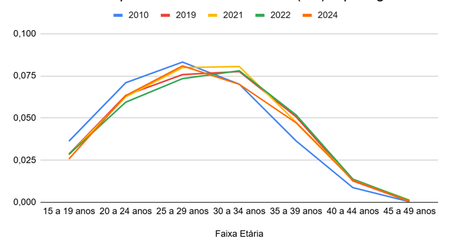
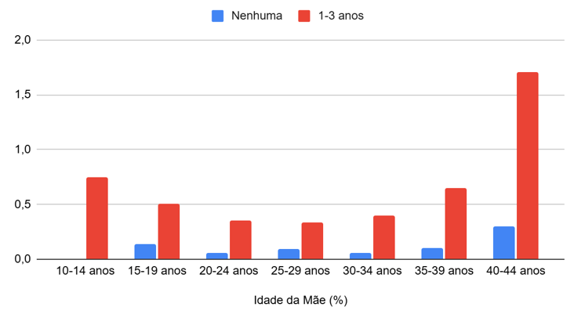
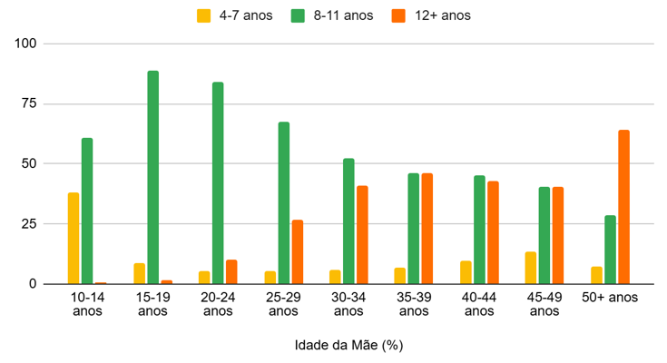
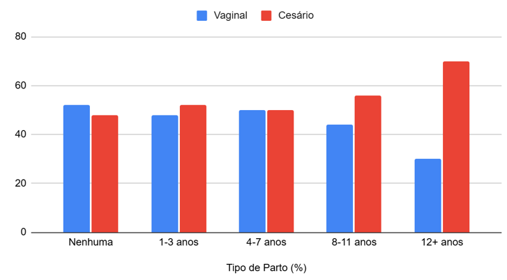

---
# Nome do arquivo PDF gerado na pasta resultado
output-file: "Nome do alocado - análise 5 e 6"
---

```{r setup}
source("rdocs/consultor3.R")
```


# Objetivo

Esse template foi criado para o alocado conseguir observar como ficaria sua análise o arquivo principal. É daqui que o gerente de projetos irá copiar a análise e inserir no documento principal que gerará o relatório estatístico.

# Análises

## Questão 2

Esta análise tem como objetivo examinar a dinâmica reprodutiva e o comportamento da fecundidade na Unidade da Federação (município de Ipatinga/MG) nos anos de 2010, 2019, 2021, 2022 e 2024. Para isso, serão utilizados dados de nascidos vivos provenientes do Tabnet -Datasus e estimativas populacionais do IBGE (Revisão 2024).

Dessa forma, serão construídos os seguintes indicadores: $TBN$ (Taxa Bruta de Natalidade),$TFG$ (Taxa de Fecundidade Geral), ${}_n f_x$ (Taxas Específicas de Fecundidade) – com respectivo gráfico, ${}_n f_x$ (Taxas Específicas de Fecundidade feminina), $TFT$ (Taxa de Fecundidade Total), $TBR$ (Taxa Bruta de Reprodução) e $TLR$ (Taxa Líquida de Reprodução), esta última utilizando a função Lx da tábua de vida.

### Letra A

#### Indicadores

Os cálculos foram realizados a partir dos nascidos vivos informados pelo SINASC e das populações projetadas pelo IBGE para Ipatinga. Os resultados estão sumarizados na tabela abaixo.

::: {#tbl-ind layout-align="center" tbl-pos="H"}
```{=latex}

\begin{tabular}{l r r r r r}
        \hline
        \textbf{Indicador} & \textbf{2010} & \textbf{2019} & \textbf{2021} & \textbf{2022} & \textbf{2024} \\
        \hline
        TBN & 13,94 & 12,39 & 12,15 & 11,64 & 11,07 \\
        TFG & 47 & 45,08 & 44,95 & 43,44 & 42,17 \\
        TFT & 1,53 & 1,55 & 1,57 & 1,53 & 1,5 \\
        TBR & 0,732 & 0,764 & 0,752 & 0,738 & 0,741 \\
        TLR & 0,87 & 0,88 & 0,88 & 0,86 & 0,73 \\
        \hline
    \end{tabular}


```
Tabela dos indicadores
:::

::: {#tbl-nfx layout-align="center" tbl-pos="H"}
```{=latex}

\begin{tabular}{l r r r r r}
        \hline
        \textbf{Faixa Etária} & \textbf{2010} & \textbf{2019} & \textbf{2021} & \textbf{2022} & \textbf{2024} \\
        \hline
        15 a 19 anos & 0,03627 & 0,02865 & 0,02819 & 0,02846 & 0,02573 \\
        20 a 24 anos & 0,07093 & 0,06346 & 0,06255 & 0,0594  & 0,06328 \\
        25 a 29 anos & 0,0832  & 0,07574 & 0,0799  & 0,07336 & 0,08091 \\
        30 a 34 anos & 0,07008 & 0,07756 & 0,08055 & 0,07803 & 0,07    \\
        35 a 39 anos & 0,03645 & 0,05072 & 0,04755 & 0,05188 & 0,04721 \\
        40 a 44 anos & 0,00872 & 0,01276 & 0,0135  & 0,0138  & 0,01311 \\
        45 a 49 anos & 0,00034 & 0,00047 & 0,00137 & 0,00101 & 0,00053 \\
        \hline
    \end{tabular}


```
Tabela de ${}_n f_x$
:::

::: {#tbl-nfxf layout-align="center" tbl-pos="H"}
```{=latex}

\begin{tabular}{l r r r r r}
        \hline
        \textbf{Faixa Etária} & \textbf{2010} & \textbf{2019} & \textbf{2021} & \textbf{2022} & \textbf{2024} \\
        \hline
        15 a 19 anos & 0,01833 & 0,01421 & 0,01167 & 0,01354 & 0,01326 \\
        20 a 24 anos & 0,03357 & 0,03183 & 0,03036 & 0,03009 & 0,03017 \\
        25 a 29 anos & 0,03959 & 0,03798 & 0,03706 & 0,03718 & 0,03886 \\
        30 a 34 anos & 0,03311 & 0,03852 & 0,04138 & 0,03585 & 0,03283 \\
        35 a 39 anos & 0,01748 & 0,02478 & 0,02311 & 0,02406 & 0,02538 \\
        40 a 44 anos & 0,00419 & 0,00521 & 0,00606 & 0,00661 & 0,00745 \\
        45 a 49 anos & 0,00022 & 0,00023 & 0,0008  & 0,00034 & 0,00032 \\
        \hline
    \end{tabular}


```
Tabela de ${}_n f_x$ feminino
:::

Analisando a [@tlb-ind], observa-se uma trajetória de declínio. A Taxa Bruta de Natalidade reduziu-se de 13,94 para 13,94 entre 2010 e 2024, indicando que o número de nascimentos em relação à população total está diminuindo progressivamente. Além disso, o comportamento da Taxa de Fecundidade Total (TFT), que se manteve sistematicamente abaixo do nível de reposição populacional (2,1 filhos por mulher). Ao atingir o patamar de 1,50 em 2024, a região consolida-se em um regime de baixa fecundidade, o que implica, no longo prazo, estreitamento da base da pirâmide etária e acelerado processo de envelhecimento populacional.

A Taxa Bruta de Reprodução (apenas nascimentos femininos) variou entre 0,73 e 0,76, sempre inferior a 1. A Taxa Líquida de Reprodução, que incorpora a mortalidade feminina até o final do período reprodutivo, apresentou valores próximos a 0,85–0,88 nos primeiros anos, mas caiu para 0,73 em 2024. Esse comportamento sinaliza que a população local não possui capacidade de auto reposição natural nas condições atuais.

#### Análise das Taxas Específicas de Fecundidade 

Com base nos valores de taxas específicas de fecundidade por grupo etário (filhos por mulher, para nascidos vivos totais), foi construído o gráfico de linhas apresentado na figura abaixo. As curvas representam a intensidade da fecundidade em cada idade materna para os cinco anos analisados.

{#fig-nfx fig-align="center"}

::: {#tbl-ibge layout-align="center" tbl-pos="H"}
```{=latex}

\begin{tabular}{l r r}
        \hline
        \textbf{Indicador} & \textbf{Base: Projeção} & \textbf{Censo 2022} \\
        \hline
        População Total & 237.501 & 227.731 \\
        Mulheres (15-49 anos) & 63.625 & 58.914 \\
        Nascidos Vivos (SINASC) & 2.764 & 2.764 \\
        Taxa Bruta de Natalidade & 11,64 & 12,13 \\
        Taxa Fecundidade Geral (TFG) & 43,44 & 46,91 \\
        Taxa de Fecundidade Total (TFT) & 1,83 & 1,65 \\
        Taxa Bruta de Reprodução (TBR) & 0,88 & 0,80 \\
        \hline
    \end{tabular}


```
Tabela de ${}_n f_x$ feminino
:::

As projeções, estas presentes na [@tbl-ibge], superestimaram a população em cerca de 4,3%, levando a uma subestimativa das taxas. Com a população real menor, a TBN sobe para 12,13 e a TFT para 1,65 filhos por mulher – ainda abaixo do nível de reposição, mas mais elevada do que as projeções indicavam. Esse achado reforça a importância de utilizar dados censitários sempre que disponíveis.

Os resultados revelam queda sustentada da fecundidade em Ipatinga, com TFT abaixo de 2,1 filhos por mulher e TLR inferior a 1, indicando tendência ao crescimento vegetativo negativo. A redução da TBN (13,9 para 11,07) e da TFG (47,00 para 42,17) alinha‑se à “fase muito baixa da fecundidade” descrita por Alves & Cavenaghi (2012), cujos determinantes são a anticoncepção, a escolaridade e a inserção feminina no trabalho (Potter et al., 2010).

A $\ref{fig-nfx}$ mostra deslocamento do pico etário: em 2010, o pico era entre os 20 e 24 anos (0,0709); a partir de 2019, desloca‑se para 25‑29 anos (0,0809 em 2024), evidenciando o adiamento da maternidade (Berquó & Cavenaghi, 2014). A fecundidade adolescente (15 a 19 anos) caiu 29% (0,0363 para 0,0257), enquanto a fecundidade após os 30 anos aumentou, especialmente no grupo 35‑39 anos (crescimento de 29%), refletindo postergação associada à maior escolaridade e profissionalização (Adhikari, 2023). Em 2021, observa‑se leve inflexão pandêmica (pico mais tardio aos 30‑34 anos), compatível com o “efeito incerteza” da COVID-19 (Silva et al., 2022). A fecundidade tardia (40‑49 anos) permanece marginal (≤0,0135). A TFT recuou de 1,53 para 1,50, mas o calendário reprodutivo alterou‑se profundamente.

A TBR (0,73 e 0,76) e a TLR (0,87 e 0,73) são inferiores a 1. A pequena diferença entre elas (0,741 contra 0,73 em 2024) mostra que a mortalidade feminina jovem é baixa, e a queda na reprodução deve-se principalmente ao comportamento reprodutivo. Desse modo, Ipatinga já se encontra em regime de fecundidade abaixo da reposição.

### Letra D

Para o ano de 2024, utilizando os dados do SINASC para Ipatinga/MG, foram analisadas duas associações:

1. entre idade da mãe (em grupos) e escolaridade;

2. entre tipo de parto e escolaridade da mãe.

As tabelas de contingência, frequências relativas, gráficos e medidas de associação são apresentados a seguir.

#### Idade da mãe X Escolaridade

{#fig-esc1 fig-align="center"}

{#fig-esc2 fig-align="center"}

::: {#tbl-cont1 layout-align="center" tbl-pos="H"}
```{=latex}

\resizebox{\textwidth}{!}{
        \begin{tabular}{l r r r r r r}
            \hline
            \textbf{Idade da Mãe} & \textbf{Nenhuma} & \textbf{1-3 anos} & \textbf{4-7 anos} & \textbf{8-11 anos} & \textbf{12+ anos} & \textbf{Total} \\
            \hline
            10-14 anos & 0  & 5     & 251    & 403     & 3      & 662    \\
            15-19 anos & 27 & 99    & 1.732  & 17.186  & 326    & 19.370 \\
            20-24 anos & 30 & 165   & 2.532  & 39.964  & 4.822  & 47.513 \\
            25-29 anos & 52 & 193   & 3.017  & 38.316  & 15.060 & 56.638 \\
            30-34 anos & 31 & 202   & 3.056  & 26.430  & 20.640 & 50.359 \\
            35-39 anos & 34 & 219   & 2.301  & 15.442  & 15.518 & 33.514 \\
            40-44 anos & 30 & 170   & 983    & 4.526   & 4.256  & 9.965  \\
            45-49 anos & 5  & 30    & 85     & 260     & 260    & 640    \\
            50+ anos   & 0  & 0     & 3      & 12      & 27     & 42     \\
            \hline
            \textbf{Total} & \textbf{209} & \textbf{1.083} & \textbf{13.960} & \textbf{142.539} & \textbf{60.912} & \textbf{218.703} \\
            \hline
        \end{tabular}
}

```
Contingência da idade da mãe pela escolaridade
:::

::: {#tbl-fq1 layout-align="center" tbl-pos="H"}
```{=latex}

\resizebox{\textwidth}{!}{
        \begin{tabular}{l r r r r r r}
            \hline
            \textbf{Idade da Mãe} & \textbf{Nenhuma} & \textbf{1-3 anos} & \textbf{4-7 anos} & \textbf{8-11 anos} & \textbf{12+ anos} & \textbf{Total} \\
            \hline
            10-14 anos & 0  & 5     & 251    & 403     & 3      & 662    \\
            15-19 anos & 27 & 99    & 1.732  & 17.186  & 326    & 19.370 \\
            20-24 anos & 30 & 165   & 2.532  & 39.964  & 4.822  & 47.513 \\
            25-29 anos & 52 & 193   & 3.017  & 38.316  & 15.060 & 56.638 \\
            30-34 anos & 31 & 202   & 3.056  & 26.430  & 20.640 & 50.359 \\
            35-39 anos & 34 & 219   & 2.301  & 15.442  & 15.518 & 33.514 \\
            40-44 anos & 30 & 170   & 983    & 4.526   & 4.256  & 9.965  \\
            45-49 anos & 5  & 30    & 85     & 260     & 260    & 640    \\
            50+ anos   & 0  & 0     & 3      & 12      & 27     & 42     \\
            \hline
            \textbf{Total} & \textbf{209} & \textbf{1.083} & \textbf{13.960} & \textbf{142.539} & \textbf{60.912} & \textbf{218.703} \\
            \hline
        \end{tabular}
}

```
Frequência Relativa das idades da mãe pela escolaridade
:::

A [@tbl-cont1] em conjunto com a $\ref{fig-esc1}$ e a $\ref{fig-esc2}$ mostram a relação entre idade materna e escolaridade. Mães adolescentes (10 a 19 anos) concentram‑se nos níveis 4 a 7 e 8 a 11 anos, com menos de 2% tendo 12+ anos. A proporção de ensino superior cresce com a idade: 10,1% aos 20‑24 anos, 26,6% aos 25 a 29, 41,0% aos 30 a 34 e 46,3% aos 35‑39 anos. Acima de 40 anos, o percentual de 12+ anos recua (42,7% aos 40 a 44, 40,6% aos 45 a 49), e aumentam as categorias de baixa escolaridade. O Qui‑Quadrado é $\chi^2$ = 4.116,5 (gl=32, p<0,001) e o coeficiente de contingência C = 0,341, indicando associação moderada – a idade explica cerca de 10% da variação educacional.

#### Tipo de Parto X Escolaridade

::: {#tbl-cont2 layout-align="center" tbl-pos="H"}
```{=latex}

\resizebox{\textwidth}{!}{
        \begin{tabular}{l r r r r r r}
            \hline
            \textbf{Tipo de Parto} & \textbf{Nenhuma} & \textbf{1-3 anos} & \textbf{4-7 anos} & \textbf{8-11 anos} & \textbf{12+ anos} & \textbf{Total} \\
            \hline
            Vaginal  & 109 & 516   & 6.966  & 62.951  & 18.295 & 88.837  \\
            Cesário  & 100 & 564   & 6.977  & 79.492  & 42.591 & 129.724 \\
            Ignorado & 0   & 3     & 17     & 96      & 26     & 142     \\
            \hline
            \textbf{Total} & \textbf{209} & \textbf{1.083} & \textbf{13.960} & \textbf{142.539} & \textbf{60.912} & \textbf{218.703} \\
            \hline
        \end{tabular}
    }

```
Contingência do tipo de parto pela escolaridade
:::

::: {#tbl-fq2 layout-align="center" tbl-pos="H"}
```{=latex}

\resizebox{\textwidth}{!}{
        \begin{tabular}{l r r r r r r}
            \hline
            \textbf{Tipo de Parto} & \textbf{Nenhuma} & \textbf{1-3 anos} & \textbf{4-7 anos} & \textbf{8-11 anos} & \textbf{12+ anos} & \textbf{Total} \\
            \hline
            Vaginal  & 109 & 516   & 6.966  & 62.951  & 18.295 & 88.837  \\
            Cesário  & 100 & 564   & 6.977  & 79.492  & 42.591 & 129.724 \\
            Ignorado & 0   & 3     & 17     & 96      & 26     & 142     \\
            \hline
            \textbf{Total} & \textbf{209} & \textbf{1.083} & \textbf{13.960} & \textbf{142.539} & \textbf{60.912} & \textbf{218.703} \\
            \hline
        \end{tabular}
    }

```
Frequência Relativa dos tipos de parto pela escolaridade
:::

{#fig-parto fig-align="center"}

Para avaliar corretamente a associação, calculam‑se as proporções de parto vaginal e cesáreo dentro de cada nível de escolaridade [@tbl-cont2]. A $\ref{fig-parto}$ evidencia que, quanto maior a escolaridade, maior a frequência de cesarianas. Entre mães sem instrução, 47,8% tiveram cesárea; entre as com nível superior, 70,0%. A razão de chances (superior vs. sem instrução) é de aproximadamente 2,55. O Qui‑Quadrado (excluindo ignorados) é $\chi^2$ ≈ 2.870,4 (gl=4, p<0,001) e o coeficiente de contingência C = 0,114, indicando associação fraca, isto é, a escolaridade explica apenas 1,3% da variação do tipo de parto.

## Análise 6

```{r}
#| label: fig-
#| fig-cap: "Gráfico "


```


::: {#quad- layout-align="center" quad-pos="H"}
```{=latex}


```

Medidas resumo da 
:::


::: {#tbl-modalidades layout-align="center" tbl-pos="H"}
```{=latex}


```


:::


$\ref{fig-}$

[@tbl-]


[**Quadro** @quad-]


